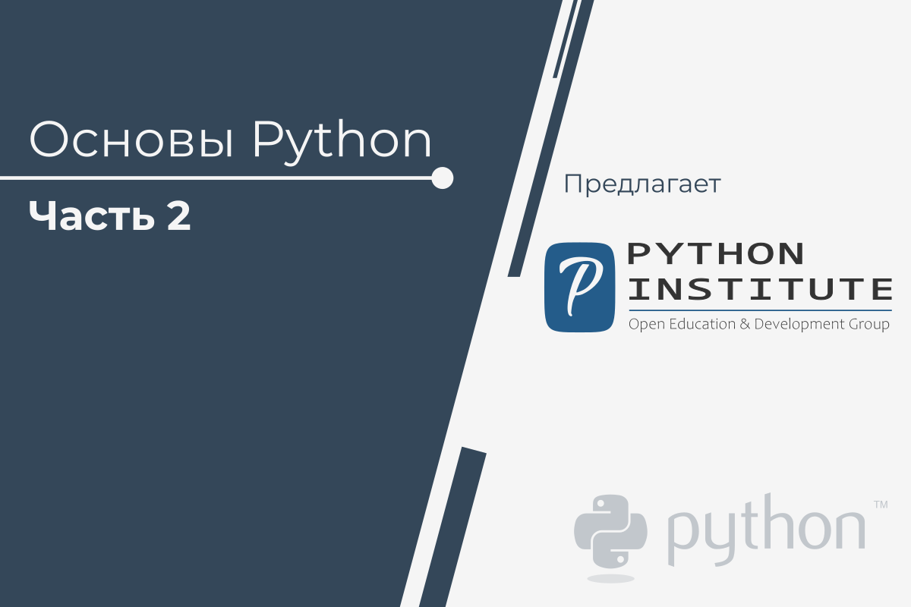

# Добро пожаловать в Основы Python 2

Этот курс **является вторым из двух курсов**, которые подготовят Вас к сертификационному экзамену [PCAP: Certified Associate in Python Programming](https://pythoninstitute.org/certification/pcap-certification-associate/) в Pearson VUE

Курс начинается там, где заканчивается _Основы Python 1_. Его основная цель - научить Вас навыкам, связанным с более **продвинутым программированием на Python**, а также **общими методами кодирования** и **объектно-ориентированным программированием** (ООП).

Курс рекомендуется для начинающих разработчиков, которые заинтересованы в карьере, связанной с **разработкой программного обеспечения**, **безопасностью**, **сетевыми технологиями** и **Интернетом Вещей** (IoT).

# Учебная программа

В этом курсе вы узнаете:

*   как применять общие методы кодирования и передовой опыт в своих проектах;
*   как обрабатывать строки;
*   как использовать объектно-ориентированное программирование в Python;
*   как импортировать и использовать модули Python, включая _math_, _random_, _platform_, _os_, _time_, _datetime_ и _calendar_;
*   как создавать и использовать собственные модули и пакеты Python;
*   как использовать механизм исключений в Python;
*   как использовать генераторы, итераторы и замыкания в Python;
*   как обрабатывать файлы.

Курс разделен на четыре модуля:

1.  **Модуль 1**  
    Модули, Пакеты и PIP
2.  **Модуль 2**  
    Строки, Методы строк и списков и Исключения
3.  **Модуль 3**  
    Объектно-Ориентированное программирование
4.  **Модуль 4**  
    Разное (генераторы, итераторы, прерывания, файловые потоки, обработка текстовых и бинарных файлов, модули _os_, _time_, _datetime_ и _calendar_)

# Зачем учить PYTHON?

Python вездесущ, люди ежедневно используют множество устройств на базе Python, осознают они это или нет. На Python написаны миллионы (ну, на самом деле миллиарды) строк кода, что означает почти неограниченные возможности для повторного использования кода и обучения на хорошо составленных примерах. Более того, существует большое и очень активное сообщество Python, которое всегда готово помочь.

Есть несколько факторов, которые делают Python отличным для обучения:

*   Его легко выучить - время, необходимое для изучения Python, меньше, чем для многих других языков; это означает, что можно быстрее начать собственно программирование;
*   Его легко использовать для написания нового программного обеспечения - часто можно писать код быстрее, используя Python;
*   Его легко получить, установить и развернуть - Python является бесплатным, открытым и мультиплатформенным; не все языки могут этим похвастаться.

Завершение этого курса может стать отправной точкой для изучения любого другого языка программирования и изучения технологий, использующих Python в качестве основы (например, Django). Курс отличается доступностью, дружелюбием и открытостью для студентов.

Первая часть началась с абсолютных основ, шаг за шагом направляя Вас к более сложным проблемам, которые будут объяснены в этой части, что делает Вас ответственным создателем программного обеспечения, способным решать различные задачи на многих должностях в IT-индустрии.

# Где используется Python?

Помните Battlefield 2, Battlefield 2142 и Battlefield Heroes - стратегии и шутеры от первого лица от EA DICE? Все эти игры используют Python для логики и управления сервером. Python часто используется для создания бесплатных игр с открытым исходным кодом, например OpenRTS, PySol, Metin 2 или Frets On Fire - известных игр, подобных Guitar Hero, написанных на pygame.

А как насчет крупных веб-сайтов и сервисов? Dropbox? UBER? Spotify? Pinterest? BuzzFeed? Да. Все они были написаны в большей или меньшей степени на Python. Другие примеры?

*   Интернет-приложения (BitTorrent, Jogger Publishing Assistant, TheCircle, TwistedMatrix)
*   3D CAD/CAM (FreeCAD, Fandango, Blender, Vintech RCAM)
*   Корпоративные приложения (Odoo, Tryton, Picalo, LinOTP 2, RESTx)
*   Графические приложения (Gnofract 4D, Gogh, imgSeek, MayaVi, VPython)
*   Мобильные приложения (Aarlogic C05/3, AppBackup, Pyroute)
*   Офисные приложения (calibre, faces, Notalon, pyspread)
*   Персональные информационные менеджеры (BitPim, Narval, Prioritize, Task Coach, WikidPad)  
    ([https://wiki.python.org/moin/PythonProjects](https://wiki.python.org/moin/PythonProjects))

Как правило, Python - отличный выбор для:

*   Веб и Интернет-разработки (например, фреймворки Django и Pyramid, микро-фреймворки Flask и Bottle).
*   Научных и числовых вычислений (например, SciPy - набор пакетов для нужд математики, науки и техники; Ipython - интерактивная оболочка, которая позволяет редактировать и записывать рабочие сессии)
*   Образования (это прекрасный язык для обучения программированию! Вот почему мы предлагаем Вам этот курс!)
*   Графических интерфейсов рабочего стола (например, wxWidgets, Kivy, Qt)
*   Разработки программного обеспечения (контроль сборки, управление и тестирование - Scons, Buildbot, Apache Gump, Roundup, Trac)
*   Бизнес-приложений (системы ERP и электронной коммерции - Odoo, Tryton)  
    ([https://www.python.org/about/apps](https://www.python.org/about/apps))

И много-много других проектов и инструментов разработки.

