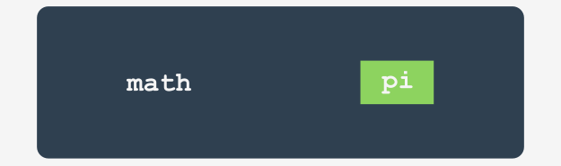

# Модули, Пакеты и PIP

В этом модуле Вы научитесь:

*   импортировать и использовать модули Python;
*   Использование некоторых самых полезных модулей Стандартной Библиотеки Python;
*   создавать и использовать пакеты Python;
*   использовать PIP (Python Installation Package) для установки и удаления готовых к использованию пакетов из PYPI.


# Что такое модуль?


Компьютерный код имеет тенденцию к росту. Можно сказать, что код, который не растет, вероятно, полностью непригоден или заброшен. Реальный, востребованный и широко используемый код постоянно развивается.

Код, который не способен удовлетворить потребности пользователей, будет быстро забыт и немедленно заменен новым, более качественным и гибким кодом. Будьте готовы к этому, и никогда не думайте, что какая-то из Ваших программ в конечном итоге завершена. Завершение является переходным состоянием и обычно проходит быстро после первого сообщения об ошибке. Сам Python является хорошим примером того, как действует это правило.

Растущий код на самом деле является растущей проблемой. Большой код всегда означает более трудное обслуживание. Поиск ошибок всегда проще, когда код меньше (точно так же, как поиск механических поломок проще, когда механизм проще и меньше).

Более того, когда ожидается, что создаваемый код будет действительно большим (Вы можете использовать общее количество строк исходного кода в качестве полезного, но не очень точного метода оценки размера кода), который Вы можете захотеть (или, скорее, Вы будете вынуждены) разделить на множество частей, параллельно реализованных несколькими, десятками или даже несколькими сотнями отдельных разработчиков.

Конечно, этого нельзя сделать, используя один большой исходный файл, который редактируется всеми программистами одновременно. Это, безусловно, приведет к впечатляющей катастрофе.


Если Вы хотите, чтобы такой программный проект был успешно завершен, у Вас должны быть средства, позволяющие Вам:

*   разделить все задачи между разработчиками;
*   объединить все созданные части в одно рабочее целое.


Например, некоторый проект можно разделить на две основные части:

*   пользовательский интерфейс (часть, которая взаимодействует с пользователем, используя виджеты и экран);
*   логика (часть, обрабатывающая данные и выдающая результаты).


Каждая из этих частей (скорее всего) может быть разделена на более мелкие и так далее. Такой процесс часто называют **декомпозицией**.

Например, если бы Вас попросили устроить свадьбу, Вы бы не все делали сами - Вы бы нашли профессионалов и разделили задачу между ними.

Как разделить часть программного обеспечения на отдельные, но взаимодействующие между собой части? Это вопрос. **Модули** - вот ответ.


# Как использовать модуль?


Так что же такое модуль? [Python Tutorial](https://docs.python.org/3/tutorial/modules.html) определяет его как **файл, содержащий определения и выражения Python**, который может быть импортирован позже и использован при необходимости.

Работа с модулями включает в себя два момента:


*   первый (вероятно, самая распространенная) происходит, когда Вы хотите использовать уже существующий модуль, написанный кем-то другим или созданный Вами самостоятельно во время работы над каким-то сложным проектом - в этом случае Вы являетесь **пользователем модуля**;
*   второй происходит, когда Вы хотите создать новый модуль либо для собственного использования, либо для облегчения жизни другим программистам - Вы являетесь **поставщиком модуля**.

Давайте рассмотрим их отдельно.


Прежде всего, модуль идентифицируется его **именем**. Если Вы хотите использовать какой-либо модуль, Вам нужно знать его имя. Довольно большое количество модулей поставляется вместе с самим Python. Вы можете думать о них как о "дополнительном оборудовании Python".


Все эти модули вместе со встроенными функциями образуют **стандартную библиотеку Python** - специальную библиотеку, в которой модули играют роль книг (можно даже сказать, что папки играют роли полок). Если Вы хотите взглянуть на полный список всех "томов", собранных в этой библиотеке, Вы можете найти его здесь: https://docs.python.org/3/library/index.html.

Каждый модуль состоит из объектов (как книга состоит из глав). Это могут быть функции, переменные, константы, классы и объекты. Если Вы знаете, как получить доступ к определенному модулю, Вы можете использовать любые объекты, которые он хранит.


Давайте начнем обсуждение с одного из наиболее часто используемых модулей с именем math. Его название говорит само за себя - модуль содержит богатую коллекцию объектов (не только функций), которые позволяют программисту эффективно реализовывать вычисления, требующие использования математических функций, таких как _sin()_ или _log()_.


# Импорт модуля


Для того чтобы использовать модуль, Вы должны его **импортировать** (думайте об этом, как о том как взять книгу с полки). Импорт модуля выполняется с помощью инструкции `import`. Примечание: `import` также является ключевым словом (со всеми вытекающими отсюда последствиями).


Предположим, Вы хотите использовать два объекта, предоставляемые модулем `math`:

*   символ (константа), представляющий точное (как можно более точное, используя арифметику с плавающей запятой) значение π (хотя использование греческих букв для именования переменных в Python возможно, этот символ называется **pi** - это более удобное решение, особенно для той части мира, в которой не будет использоваться греческая клавиатура);
*   функция с именем `sin()` (компьютерный эквивалент математической функции _синус_).


Оба этих объекта доступны в модуле `math`, но способ их использования сильно зависит от того, как был выполнен импорт.


Самый простой способ импортировать конкретный модуль - использовать инструкцию импорта следующим образом:

```python
import math
```  

Выражение содержит:

*   ключевое слово `import`;
*   **имя модуля**, который должен быть импортирован.

Инструкция может находиться где угодно в вашем коде, но она должна быть размещена **перед первым использованием любого объекта модуля**.


Если Вы хотите (или должны) импортировать более одного модуля, вы можете сделать это, повторив выражение import (предпочтительный вариант):

```python
import math
import sys
```  

Или перечислив модули после ключевого слова import, как показано ниже:

```python
import math, sys
```  


Инструкция импортирует два модуля, первый с именем `math`, а затем второй с именем `sys`.

Список модулей может быть произвольно длинным.

Для продолжения Вам необходимо ознакомиться с важным термином: **пространство имен**.

Не волнуйтесь, мы не будем вдаваться в подробности - это объяснение будет максимально коротким.

**Пространство имен** - это пространство (понимаемое в не физическом контексте), в котором существуют некоторые имена, которые не конфликтуют друг с другом (т.е. не существует двух разных объектов с одинаковым именем). Можно сказать, что каждая социальная группа является пространством имен - группа имеет тенденцию называть каждого из своих членов уникальным образом (например, родители не будут давать своим детям одинаковые имена).


Эта уникальность может быть достигнута многими способами, например, используя псевдонимы вместе с именами (это будет работать в небольшой группе, например, в классе в школе), или назначая специальные идентификаторы всем членам группы (Служба социального обеспечения США). Номер является хорошим примером такой практики.


**Внутри определенного пространства имен каждое имя должно оставаться уникальным**. Это может означать, что некоторые имена могут исчезнуть, когда любой другой объект уже известного имени входит в пространство имен. Мы покажем Вам, как это работает и как этим управлять, но сначала вернемся к импорту.

Если модуль с указанным именем **существует и доступен** (модуль фактически является **исходным файлом Python**), Python импортирует его содержимое, т.е. **все имена, определенные в модуле, становятся известными**, но они не входят в пространство имен вашего кода.

Это означает, что у Вас могут быть собственные объекты с именами `sin` или `pi`, и они не будут затронуты импортом.




В этот момент Вам может быть интересно, как получить доступ к `pi` из модуля `math`.

Чтобы сделать это, Вам нужно указать `pi` с именем его исходного модуля.

Посмотрите на код ниже, это способ, которым вы указываете имена pi и sin с именем их исходного модуля:

```
math.pi
math.sin
```

Это просто, Вы пишете:

*   **имя модуля** (например, `math`);
*   **точка**;
*   **имя объекта** (например, `pi`).

Такая форма четко указывает пространство имен, в котором существует имя.

Примечание: использование этого определения является **обязательным**, если модуль был импортирован командой `import`. Неважно, конфликтуют ли какие-либо имена из вашего кода и имена из пространства имен модуля.


Наш первый пример не будет очень сложным - мы просто хотим напечатать значение **sin(1/2π)**.

```python
import math
print(math.sin(math.pi/2))
```


Код выводит ожидаемое значение: `1.0`.


Примечание: удаление любого из двух определений сделает код ошибочным. Нет другого способа войти в пространство имен `math`, если Вы уже написали следующее:

```python
import math
```  


Теперь мы покажем, как могут сосуществовать два пространства имен (Ваше и модуля).

Посмотрите на пример.

```python
import math

def sin(x):
    if 2 * x == pi:
        return 0.99999999
    else:
        return None

pi = 3.14

print(sin(pi/2))
print(math.sin(math.pi/2))
```

Здесь мы определили наши собственные `pi` и `sin`.

Запустите программу. Код должен выводить следующее:

```
0.99999999
1.0
```


Как видите, они не влияют друг на друга.


Во втором методе синтаксис `import` точно указывает, какой объект (или объекты) модуля являются приемлемыми в коде:

```python
from math import pi
```  

Инструкция состоит из следующих элементов:

*   ключевое слово `from`;
*   **имя модуля** для (выборочного) импорта;
*   ключевое слово `import`;
*   **имя или список имен объектов**, которые импортируются в пространство имен.


Инструкция работает так:

*   перечисленные объекты (только они) **импортируются из указанного модуля**;
*   имена импортированных объектов **доступны без определения**.


Примечание: другие объекты не импортируются. Более того, Вы не можете импортировать дополнительные объекты, используя определение - ​​ как в такой строке:

```python
print(math.e)
```  

Приведет к ошибке (`e` - это число Эйлера: 2.71828...)

Давайте перепишем предыдущий скрипт, чтобы ввести использование нового метода.

```python
from math import sin, pi

print(sin(pi/2))

```

Вывод должен быть таким же, как и раньше, так как на самом деле мы использовали те же объекты: `1.0`. Скопируйте код, вставьте его в редактор и запустите программу.

Код выглядит проще? Возможно, но внешний вид - не единственный эффект такого рода импорта. Давайте покажем Вам это.


Посмотрите на код. Проанализируйте его внимательно:

```python
from math import sin, pi

print(sin(pi / 2))

pi = 3.14


def sin(x):
    if 2 * x == pi:
        return 0.99999999
    else:
        return None


print(sin(pi / 2))

```

*   строка 1: выполнить выборочный импорт;
*   строка 3: использовать импортированные объекты и получить ожидаемый результат (`1.0`);
*   строки с 5 по 12: переопределить значение `pi` и `sin` - по сути, они заменяют оригинальные (импортированные) определения в пространстве имен кода;
*   строка 15: получить значение `0.99999999`, что подтверждает наши выводы.


Давайте сделаем еще один тест. Посмотрите на код ниже:

```python
pi = 3.14


def sin(x):
    if 2 * x == pi:
        return 0.99999999
    else:
        return None


print(sin(pi / 2))

from math import sin, pi

print(sin(pi / 2))

```

Здесь мы изменили последовательность операций в коде:

*   строки с 1 по 8: определить наши собственные `pi` и `sin`;
*   строка 9: использовать их (на экране появится `0.99999999`);
*   строка 12: выполнить импорт - импортированные символы заменяют их предыдущие определения в пространстве имен;
*   строка 14: получить `1.0` в результате.


# Импорт модуля: `*`


Третий метод имеет более агрессивную форму синтаксиса `import`

```python
from module import *
```  

Как Вы можете видеть, имя объекта (или список имен объектов) заменяется одной звездочкой (`*`).

Такая инструкция **импортирует все объекты из указанного модуля**.

Это удобно? Да, так как это освобождает Вас от обязанности перечислять все имена, которые Вам нужны.

Это небезопасно? Да, это так - если Вы не знаете всех имен, предоставленных модулем, **Вы не сможете избежать конфликтов имен**. Рассматривайте это как временное решение и старайтесь не использовать его в обычном коде.


# Импорт модуля: ключевое слово `as`


Если Вы используете вариант `import module`, и Вам не нравится имя конкретного модуля (например, оно совпадает с одним из уже определенных вами объектов, поэтому определение становится проблематичным), Вы можете дать ему любое имя, которое Вам нравится - это называется **псевдонимом**.

При псевдониме модуль идентифицируется другим именем, отличным от оригинала. Это также может сократить количество уже определенных имен.

Создание псевдонима выполняется вместе с импортом модуля и требует следующей формы импорта:

```python
import module [!mark!]as[!/mark!] alias
```  

Имя "module", которое является основным именем модуля определяется как "alias", то имя, что Вы будете использовать в своем коде вместо оригинального.

Примечание: `as` - это ключевое слово.


Если Вам нужно изменить слово `math`, Вы можете представить в коде свой вариант имени так, как это показано в примере:

```python
import math as m

print(m.sin(m.pi/2))

```  

Примечание: после успешного импорта псевдонима, **оригинальное имя модуля будет недоступно** и его нельзя будет использовать.


С другой стороны, когда Вы используете метод `from module import name` и Вам нужно изменить имя объекта, Вы можете создать псевдоним для него. Это приведет к тому, что его имя будет заменено псевдонимом.

Это делается следующим образом:

```python
from module import name as alias
```  

Как было сказано ранее, первоначальное имя, используемое до назначения псевдонима становится недоступным.

Фраза `name as alias` может повторяться с использованием запятых как разделителей во множественном назначении псевдонимов, например:

```python
from module import n as a, m as b, o as c
```  


Пример может показаться немного странным, но он работает:

```python
from math import pi as PI, sin as sine

print(sine(PI/2))

```  

Теперь Вы знакомы с основами использования модулей. Сейчас мы расскажем Вам о некоторых модулях и их полезных свойствах.

  
# Основные тезисы


1. Если Вы хотите импортировать модуль целиком, Вы можете сделать это с помощью выражения `import имя_модуля`. Вы можете импортировать более одного модуля одновременно, используя список, разделенный запятыми. Например:
    
    ```python
    import mod1
    import mod2, mod3, mod4
    ```
    
    Хотя последняя форма не рекомендуется по стилистическим причинам, и лучше и красивее выразить то же в более подробной и явной форме, например:
    
    ```python
    import mod2
    import mod3
    import mod4
    
    ```  
    
2. Если модуль импортируется указанным выше способом и Вы хотите получить доступ к какой-либо из его сущностей, вам необходимо указать префикс имени сущности, используя **точечную нотацию**. Например:
    
    ```python
    import my_module
    
    result = my_module.my_function(my_module.my_data)
    
    ```  
    
    Код использует две сущности, поступающие из модуля `my_module`: функцию с именем `my_function()` и переменную с именем `my_data`. Оба имени **должны иметь префикс** `my_module`. Ни одно из имен импортированных сущностей не конфликтует с идентичными именами, существующими в пространстве имен Вашего кода.
    

3. Вам разрешено не только импортировать модуль целиком, но и импортировать из него только отдельные объекты. В этом случае импортированные объекты **не должны иметь** префикса при использовании. Например:
    
    ```python
    from module import my_function, my_data
    
    result = my_function(my_data)
    
    ```  
    
    Вышеупомянутый способ - несмотря на его привлекательность - не рекомендуется из-за опасности возникновения конфликтов с именами, полученными в результате импорта пространства имен кода.
    

4. Самая общая форма приведенного выше оператора позволяет импортировать **все сущности**, предлагаемые модулем:
    
    ```python
    from my_module import *
    
    result = my_function(my_data)
    
    ```  
    
    **Примечание**: этот вариант импорта не рекомендуется по тем же причинам, что и ранее (угроза конфликта имен здесь еще более опасна).

5. Вы можете изменить имя импортированного объекта "на лету", используя ключевое слово `as` в инструкции `import`. Например:
   
   ```python
   from module import my_function as fun, my_data as dat
   
   result = fun(dat)
   
   ```

---

**Упражнение 1**

Вы хотите вызвать функцию `make_money()`, содержащуюся в модуле с именем `mint`. Ваш код начинается со следующей строки:

```python
import mint
```  

Какова правильная форма вызова функции?

<details><summary>Проверка</summary>

```mint.make_money()```

</details>

---

**Упражнение 2**

Вы хотите вызвать функцию `make_money()`, содержащуюся в модуле с именем `mint`. Ваш код начинается со следующей строки:

```python
from mint import make_money
```  

Какова правильная форма вызова функции?

<details><summary>Проверка</summary>

```make_money()```

</details>

---

**Упражнение 3**

Вы написали функцию с именем `make_money`. Вам нужно импортировать функцию с тем же именем из модуля `mint` и Вам не хочется переименовывать какое-либо из ранее определенных имен. Какой вариант инструкции `import` может помочь Вам в решении проблемы?

<details><summary>Проверка</summary>

```python
from mint import make_money as make_more_money
```

</details>

---

**Упражнение 4**

Какая форма вызова функции `make_money` допустима, если Ваш код начинается со следующей строки?

```python
from mint import *
``` 

<details><summary>Проверка</summary>

```make_money()```

</details>


