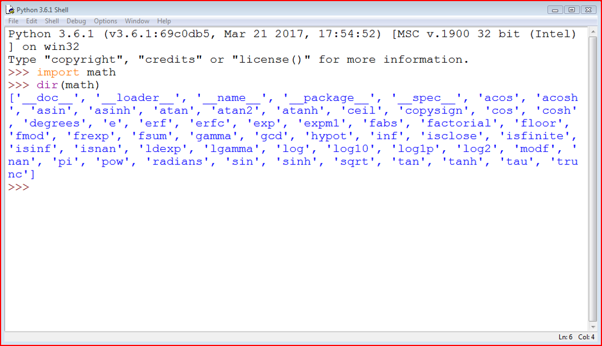
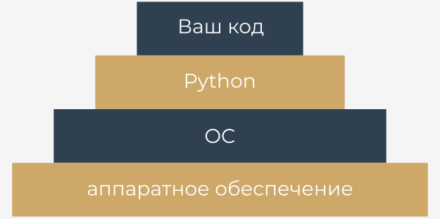
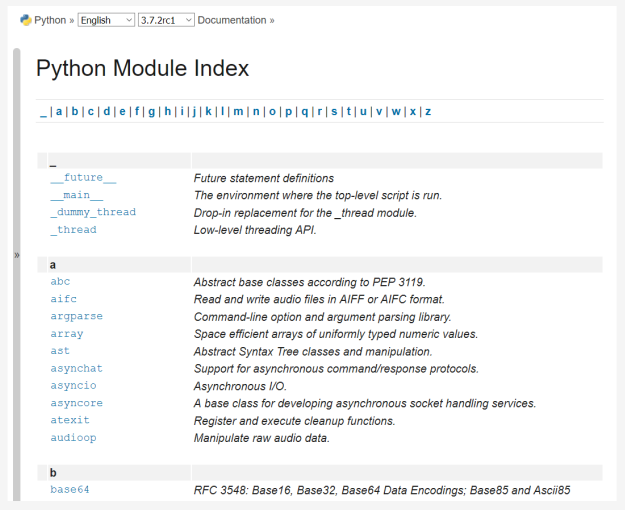

# Работа со стандартными модулями


Прежде чем мы начнем изучать некоторые стандартные модули Python, мы хотим представить Вам функцию `dir()`. Это не имеет ничего общего с командой `dir`, которую Вы знаете из консолей Windows и Unix, так как `dir()` не показывает содержимое каталога/папки на диске, но можно сказать, что-то, что она делает, похоже на результат команды - она может показать все имена, включенные в определенный модуль.

Есть одно условие: модуль должен быть заранее полностью импортирован (т.е. с помощью инструкции `import module`, так как инструкция `from module` импортирует не весь модуль).

Функция возвращает **отсортированный по алфавиту список**, содержащий имена всех объектов, доступных в модуле, которые определяются по имени, переданному функции в качестве аргумента:

```python
dir(module)
```  

Примечание: если имя модуля было псевдонимом, необходимо использовать псевдоним, а не исходное имя.

Использование функции внутри обычного скрипта не имеет особого смысла, но все же оно возможно.


Например, Вы можете запустить следующий код для печати имен всех объектов в модуле `math`:

```python
import math

for name in dir(math):
    print(name, end="\t")


```  

Приведенный пример должен показать следующий вывод:

```__doc__	__loader__	__name__	__package__	__spec__	acos	acosh	asin	asinh	atan	atan2	atanh	ceil	copysign	cos	cosh	degrees	e	erf	erfc	exp	expm1	fabs	factorial	floor	fmod	frexp	fsum	gamma	hypot	isfinite	isinf	isnan	ldexp	lgamma	log	log10	log1p	log2	modf	pi	pow	radians	sin	sinh	sqrt	tan	tanh	trunc	```


Как Вы могли заметить в начале списка есть странные имена, начинающиеся с `__`. Мы расскажем Вам больше о них, когда будем говорить о проблемах, связанных с написанием ваших собственных модулей.

Некоторые имена помогут вспомнить об уроках математики, и у Вас, вероятно, не возникнет проблем с угадыванием их значения.

Использование функции `dir()` внутри кода может показаться не очень полезным - чаще всего Вы уже знаете содержимое определенного модуля, прежде чем писать и запускать код.

К счастью, Вы можете выполнить функцию **непосредственно в консоли Python** (IDLE), не создавая и не запуская отдельный скрипт.

Вот как это можно сделать:

```python
import math
dir(math)
```  

Вот что Вы увидите в выводе:

  


# Выбранные функции из модуля `math`


Давайте начнем с быстрого просмотра некоторых функций, предоставляемых модулем `math`.

Мы выбрали их произвольно, но это не значит, что функции, которые мы здесь не упомянули, менее значимы. Погрузитесь в глубины модулей самостоятельно - у нас нет, к сожалению, времени, чтобы подробно обо всем здесь поговорить.

Первая группа функций `math` связана с тригонометрией:

*   `sin(x)` → синус от x;
*   `cos(x)` → косинус от x;
*   `tan(x)` → тангенс от x.

Все эти функции будут принимать один аргумент (измерение угла, выраженное в радианах) и возвращать соответствующий результат (будьте осторожны с `tan()` - он принимает не все аргументы).

Конечно же, есть и их обратные версии:

*   `asin(x)` → арксинус от x;
*   `acos(x)` → арккосинус от x;
*   `atan(x)` → арктангенс от x.

Эти функции принимают один аргумент и возвращают меру угла в радианах.


Для эффективной работы с измерениями угла модуль math предоставляет Вам следующие объекты:

*   `pi` → константа со значением приближенным к π;
*   `radians(x)` → функция которая конвертирует х из градусов в радианы;
*   `degrees(x)` → функция которая конвертирует х из радиан в градусы

Теперь посмотрим на код. Программа не очень сложна, но можете ли Вы предсказать ее результаты?

```python
from math import pi, radians, degrees, sin, cos, tan, asin

ad = 90
ar = radians(ad)
ad = degrees(ar)

print(ad == 90.)
print(ar == pi / 2.)
print(sin(ar) / cos(ar) == tan(ar))
print(asin(sin(ar)) == ar)

```


Помимо тригонометрических функций (перечисленных выше), модуль math также содержит набор их **гиперболических аналогов**:

*   `sinh(x)` → гиперболический синус;
*   `cosh(x)` → гиперболический косинус;
*   `tanh(x)` → гиперболический тангенс;
*   `asinh(x)` → гиперболический арксинус;
*   `acosh(x)` → гиперболический арккосинус;
*   `atanh(x)` → гиперболический арктангенс.


Другая группа функций `math` состоит из функций, связанных с **возведением в степень**:

*   `e` → константа с приближенным значением числа Эйлера (е);
*   `exp(x)` →находит значение функции e<sup>x</sup>;
*   `log(x)` → натуральный логарифм от x;
*   `log(x, b)` → логарифм от x по основанию b;
*   `log10(x)` → десятичный логарифм от х (более точные, чем `log(x, 10)`);
*   `log2(x)` → двоичный логарифм от х (более точный, чем `log(x, 2)`).

Примечание: функция `pow()`:

*   `pow(x, y)` → вычисление значения возведения в степень у числа х: x<sup>y</sup>

Это встроенная функция, и ее не нужно импортировать.

Посмотрите на код. Можете ли Вы сказать, какой будет вывод?

```python
from math import e, exp, log

print(pow(e, 1) == exp(log(e)))
print(pow(2, 2) == exp(2 * log(2)))
print(log(e, e) == exp(0))

```


Последняя группа состоит из некоторых функций общего назначения, таких как:

*   `ceil(x)` → округление до ближайшего большего числа;
*   `floor(x)` → округление до ближайшего меньшего числа (наибольшее целое число меньше или равно х);
*   `trunc(x)` → урезает значение х до целого (будьте осторожны - это не эквивалент функций ceil или floor);
*   `factorial(x)` → возвращает значение x! (x должен быть целым и положительным);
*   `hypot(x, y)` → возвращает длину гипотенузы прямоугольного треугольника с длинами катетов, равными x и y (то же самое что и `sqrt(pow(x, 2) + pow(y, 2))` но более точное).

Посмотрите код. Тщательно проанализируйте программу.

```python
from math import ceil, floor, trunc

x = 1.4
y = 2.6

print(floor(x), floor(y))
print(floor(-x), floor(-y))
print(ceil(x), ceil(y))
print(ceil(-x), ceil(-y))
print(trunc(x), trunc(y))
print(trunc(-x), trunc(-y))

```

Это демонстрирует фундаментальные различия между `ceil()`, `floor()` и `trunc()`.

Запустите программу и обратите внимание на ее вывод.

 
# Есть ли реальные случайные числа в компьютерах?


Еще один модуль, который стоит упомянуть, называется `random`.

Он предоставляет некоторые механизмы, позволяющие вам работать с **псевдослучайными числами**.

  

Обратите внимание на префикс **псевдо**. Числа, сгенерированные модулями, могут выглядеть случайными в том смысле, что вы не можете предсказать их последующие значения, но не забывайте, что все они рассчитываются с использованием очень точных алгоритмов.


Алгоритмы не случайны - они детерминированы и предсказуемы. Только те физические процессы, которые полностью выходят из-под нашего контроля (например, интенсивность космического излучения), могут быть использованы в качестве источника фактических случайных данных. Данные, полученные с помощью детерминированных компьютеров, ни в коем случае не могут быть случайными.


Генератор случайных чисел принимает значение, называемое **seed(начальное)**, обрабатывает его как входное значение, вычисляет "случайное" число на его основе (метод зависит от выбранного алгоритма) и создает **новое начальное значение**.

Длина цикла, в котором все начальные значения уникальны, может быть очень большой, но она не бесконечна - рано или поздно начальные значения начнут повторяться, и генерируемые значения также повторятся. Это нормально. Это особенность, а не ошибка.

Начальное значение, установленное во время запуска программы, определяет порядок появления сгенерированных значений.

Случайный фактор процесса может быть **увеличен путем установки начального числа с номером, взятым из текущего времени** - это может гарантировать, что каждый запуск программы будет начинаться с другого начального значения (поэтому будет использовать разные случайные числа).

К счастью, такая инициализация выполняется в Python во время импорта модуля.

# Выбранные функции из модуля `random`


## Функция `random`

Наиболее часто используемая функция с именем `random()` (не путать с названием модуля) **генерирует число с плавающей запятой `x` из диапазона `(0.0, 1.0)`** - другими словами: (0.0 <= x < 1.0).

Пример программы выдаст пять псевдослучайных значений - поскольку их значения определяются текущим (довольно непредсказуемым) начальным значением, их невозможно угадать:

```python
from random import random

for i in range(5):
    print(random())

```

Запустите программу. Вот что у нас получилось:

```
0.9535768927411208
0.5312710096244534
0.8737691983477731
0.5896799172452125
0.02116716297022092
```


## Функция `seed`

Функция `seed()` способна **установить начальное значение генератора**. Мы покажем вам два варианта его использования:

*   `seed()` - устанавливает начальное значение с использованием текущего времени;
*   `seed(int_value)` - устанавливает начальное значение с целочисленным значением `int_value`.

Мы изменили предыдущую программу - фактически, мы удалили любые следы случайности из кода:

```python
from random import random, seed

[!mark!]seed[!/mark!](0)

for i in range(5):
    print(random())


```  

Из-за того, что начальное число всегда установлено с одним и тем же значением, последовательность сгенерированных значений всегда выглядит одинаково.

Запустите программу. И вот что мы видим:

```
0.844421851525
0.75795440294
0.420571580831
0.258916750293
0.511274721369
```

А как у Вас?

Примечание: Ваши значения могут немного отличаться от наших, если Ваша система использует более или менее точную арифметику дробных чисел, но разница будет заметна далеко от десятичной запятой.


## Функции `randrange` и `randint`

Если Вам нужны целочисленные случайные значения, подойдет одна из следующих функций:

*   `randrange(end)`;
*   `randrange(beg, end)`;
*   `randrange(beg, end, step)`;
*   `randint(left, right)`.

Первые три вызова будут генерировать целое число, взятое (псевдослучайно) из диапазона (соответственно):

*   `range(end)`;
*   `range(beg, end)`;
*   `range(beg, end, step)`.

Обратите внимание на неявную **правостороннюю ассоциативность**!

Последняя функция является эквивалентом `randrange(left, right + 1)` - она генерирует целочисленное значение `i`, которое попадает в диапазон \[левое число, правое число\] (без исключения правого числа).

Посмотрите на код. Эта программа, следовательно, выведет строку, состоящую из трех нолей и либо ноль, либо единицу на четвертом месте.

```python
from random import randrange, randint

print(randrange(1), end=' ')
print(randrange(0, 1), end=' ')
print(randrange(0, 1, 1), end=' ')
print(randint(0, 1))

```  
  
Предыдущие функции имеют один важный недостаток - они могут создавать повторяющиеся значения, даже если число последующих вызовов не превышает ширину указанного диапазона.

Посмотрите на код в ниже. Скорее всего, программа выводит набор чисел, в котором некоторые элементы не являются уникальными.

```python
from random import randint

for i in range(10):
    print(randint(1, 10), end=',')

```

Вот что мы получили в одном из запусков:

```
9,4,5,4,5,8,9,4,8,4,
```


## Функции `choice` и `sample`

Как видите, это не очень хороший инструмент для генерирования чисел в лотерее. К счастью, есть лучшее решение, чем написание собственного кода для проверки уникальности "нарисованных" чисел.


Эта функция названа очень многообещающе - `choice`:

*   `choice(sequence)`;
*   `sample(sequence, elements_to_choose=1)`.

Первый вариант выбирает "случайный" элемент из входной последовательности и возвращает его.

Второй создает список (образец), состоящий из элемента `elements_to_choose` (по умолчанию `1`), "извлеченного" из входной последовательности.

Другими словами, функция выбирает некоторые элементы ввода, возвращая список с выбором. Элементы в образце расположены в случайном порядке. Примечание: elements_to_choose не должно превышать длину входной последовательности.

Посмотрите на код ниже:

```python
from random import choice, sample

lst = [1, 2, 3, 4, 5, 6, 7, 8, 9, 10]

print(choice(lst))
print(sample(lst, 5))
print(sample(lst, 10))

```

Теперь вывод программы непредсказуем. Наши результаты выглядели так:

```
4
[3, 1, 8, 9, 10]
[10, 8, 5, 1, 6, 4, 3, 9, 7, 2]
```
  
  
# Как узнать, где Вы находитесь?


Иногда бывает необходимо узнать информацию, не связанную с Python. Например, Вам может потребоваться узнать местоположение Вашей программы в более широком окружении компьютера.

Представьте себе среду вашей программы в виде пирамиды, состоящей из нескольких слоев или платформ.




Слои:

*   Ваш (работающий) код расположен вверху;
*   Python (точнее - его среда выполнения) находится прямо под ним;
*   следующий слой пирамиды заполнен ОС (операционной системой) - среда Python предоставляет некоторые из своих функций, используя сервисы операционной системы; Python, хотя и очень мощный, но не всемогущий - он вынужден использовать много помощников, если он собирается обрабатывать файлы или общаться с физическими устройствами;
*   самый нижний уровень - это аппаратное обеспечение - процессор (или процессоры), сетевые интерфейсы, устройства интерфейса пользователя (мыши, клавиатуры и т.д.) и все другие механизмы, необходимые для работы компьютера; ОС знает, как управлять им, и использует множество приемов, чтобы привести все части в единый рабочий механизм.


Это означает, что некоторые из Ваших действий (или, скорее, действий Вашей программы) должны пройти долгий путь, чтобы быть успешным - представьте, что:

*   **Ваш код** хочет создать файл, поэтому он вызывает одну из функций Python;
*   **Python** принимает запрос, реорганизует его в соответствии с требованиями локальной ОС (это все равно, что поставить отметку "утверждено" в Вашем запросе) и отправляет его (это может напоминать вам цепочку команд);
*   **ОС** проверяет, является ли запрос обоснованным и действительным (например, соответствует ли имя файла некоторым правилам синтаксиса), и пытается создать файл; такая операция, казалось бы, очень простая, не является атомарной - она состоит из множества мелких шагов, которые делает...
*   **аппаратное обеспечение**, которое отвечает за активацию устройств хранения (жесткий диск, твердотельные накопители и т.д.) для удовлетворения потребностей ОС.


Обычно Вы не знаете всей этой суеты - Вы хотите, чтобы файл был создан, и это все.

Но иногда Вы хотите узнать больше - например, имя ОС, на которой установлен Python, и некоторые характеристики, описывающие оборудование, на котором установлена ​​ОС.

Существует модуль, предоставляющий некоторые средства, позволяющие вам узнать, где Вы находитесь, и какие компоненты работают для вас. Модуль называется platform. Мы покажем Вам некоторые функции, которые он Вам предоставляет.


# Выбранные функции из модуля `platform`


## Функция `platform`

Модуль `platform` позволяет получить доступ к данным базовой платформы, т.е. к оборудованию, операционной системе и информации о версии интерпретатора.

Существует функция, которая может показать Вам все нижележащие уровни разом, также называющаяся `platform`. Она просто возвращает строку, описывающую среду; таким образом, ее вывод скорее адресован людям, чем автоматизированной обработке (Вы скоро это увидите).

Вот как Вы можете вызвать ее:

```python
platform(aliased = False, terse = False)
```

И теперь:

*   `aliased` → когда устанавливается значение `True` (или любое ненулевое значение), это может привести к тому, что функция представит альтернативные имена нижележащих уровней вместо значений по умолчанию;
*   `terse` → когда устанавливается значение `True` (или любое ненулевое значение), это может убедить функцию представить более короткую форму вывода (если возможно).

Мы запустили нашу программу с использованием трех разных платформ - вот, что мы получили:

**Intel x86 + Windows ® Vista (32 bit)**:

```
Windows-Vista-6.0.6002-SP2
Windows-Vista-6.0.6002-SP2
Windows-Vista
```


**Intel x86 + Gentoo Linux (64 bit)**:

```
Linux-3.18.62-g6-x86_64-Intel-R-_Core-TM-_i3-2330M_CPU_@_2.20GHz-with-gentoo-2.3
Linux-3.18.62-g6-x86_64-Intel-R-_Core-TM-_i3-2330M_CPU_@_2.20GHz-with-gentoo-2.3
Linux-3.18.62-g6-x86_64-Intel-R-_Core-TM-_i3-2330M_CPU_@_2.20GHz-with-glibc2.3.4
```


**Raspberry PI2 + Raspbian Linux (32 bit)**:

```
Linux-4.4.0-1-rpi2-armv7l-with-debian-9.0
Linux-4.4.0-1-rpi2-armv7l-with-debian-9.0
Linux-4.4.0-1-rpi2-armv7l-with-glibc2.9
```

Вы также можете запустить программу в IDLE на своем компьютере, чтобы проверить, какой вывод Вы получите.

```python
from platform import platform

print(platform())
print(platform(1))
print(platform(0, 1))

```
  

## Функция `machine`

Иногда Вам может потребоваться общее имя процессора, который запускает Вашу ОС вместе с Python и Вашим кодом - об этом Вам сообщит функция с именем machine(). Как и раньше, функция возвращает строку.

```python
from platform import machine

print(machine())

```

Мы снова запустили пример программы на трех разных платформах:

**Intel x86 + Windows ® Vista (32 bit)**:

```x86```


**Intel x86 + Gentoo Linux (64 bit)**:

```x86_64```


**Raspberry PI2 + Raspbian Linux (32 bit)**:

```armv7l```


## Функция `processor`

Функция `processor()` возвращает строку, заполненную именем процессора.

```python
from platform import processor

print(processor())

```

Еще раз мы запустили пример программы на трех разных платформах:

**Intel x86 + Windows ® Vista (32 bit)**:

```x86```


**Intel x86 + Gentoo Linux (64 bit)**:

```Intel(R) Core(TM) i3-2330M CPU @ 2.20GHz```


**Raspberry PI2 + Raspbian Linux (32 bit)**:

```armv7l```


Проверьте это на своем компьютере.


## Функция `system`

Функция с именем `system()` возвращает имя операционной системы в формате строки.

```python
from platform import system

print(system())

```

Наш пример платформ полученный в результате выполнения кода:

**Intel x86 + Windows ® Vista (32 bit)**:

```Windows```


**Intel x86 + Gentoo Linux (64 bit)**:

```Linux```


**Raspberry PI2 + Raspbian Linux (32 bit)**:

```Linux```


## Функция `version`

Версия операционной системы возвращается как строка при вызове функции с именем `version()`.

```python
from platform import version

print(version())

```

Запустите код и проверьте его вывод. Вот то, что мы получили:

**Intel x86 + Windows ® Vista (32 bit)**:

```6.0.6002```

**Intel x86 + Gentoo Linux (64 bit)**:

```#1 SMP PREEMPT Fri Jul 21 22:44:37 CEST 2017```

**Raspberry PI2 + Raspbian Linux (32 bit)**:

```#1 SMP Debian 4.4.6-1+rpi14 (2016-05-05)```


## Функции `python_implementation` и `python_version_tuple`

Если Вам нужно узнать, какая версия Python работает с Вашим кодом, Вы можете проверить это с помощью ряда выделенных функций - вот две из них:

*   `python_implementation()` → возвращает строку, обозначающую реализацию Python (ожидайте здесь CPython, если Вы не решите использовать неканоническую ветвь Python)
  
*   `python_version_tuple()` → возвращает кортеж из трех элементов, заполненный:
    *   **старшей** частью версии Python;
    *   **младшей** частью;
    *   номер **патча**.

```python
from platform import python_implementation, python_version_tuple

print(python_implementation())

for atr in python_version_tuple():
    print(atr)

```

Наша программа дала следующий результат:

```
CPython
3
7
7
```

Весьма вероятно, что Ваша версия Python будет другой.


  
# Индекс модулей Python


Здесь мы рассмотрели только основы модулей Python. Модули Python составляют свою собственную вселенную, в которой сам Python является всего лишь галактикой, и мы бы рискнули сказать, что изучение глубин этих модулей может занять значительно больше времени, чем знакомство с "чистым" Python.

Более того, сообщество Python во всем мире создает и поддерживает сотни дополнительных модулей, используемых в самых нишевых приложениях, таких как генетика, психология или даже астрология.

Эти модули не распространяются (и не будут распространяться) вместе с Python или по официальным каналам, что делает вселенную Python более широкой - почти бесконечной.

Вы можете прочитать обо всех стандартных модулях Python здесь: [https://docs.python.орг/3/PY-modindex.html](https://docs.python.org/3/py-modindex.html).

Не беспокойтесь - Вам понадобятся не все эти модули. Многие из них очень специфичны.

Все, что Вам нужно сделать, это найти нужные модули и научиться их использовать. Это просто.

  
  


В следующем разделе мы рассмотрим кое-что еще. Мы собираемся показать Вам, как написать свой собственный модуль.

# Основные тезисы


1. Функция под названием `dir()` может показать Вам список сущностей, содержащихся внутри импортированного модуля. Например:

    ```python
    import os
    dir(os)
    
    ```
    
    Выводит список всех инструментов модуля `os`, которые Вы можете использовать в своем коде.


2. Модуль `math` объединяет более 50 определений (функций и констант), которые выполняют математические операции (например, `sin()`, `pow()`, `factorial()`) или предоставляют важные значения (например, **π** и символ Эйлера **e**).


3. Модуль `random` группирует более 60 объектов, предназначенных для помощи в использовании псевдослучайных чисел. Не забывайте приставку "псевдо", так как реальных случайных чисел не существует, когда дело доходит до их генерации с использованием алгоритмов компьютера.


4. Модуль `platform` содержит около 70 функций, которые позволяют Вам погрузиться в основные уровни ОС и оборудования. Их использование позволяет узнать больше о среде, в которой выполняется Ваш код.


5. **Индекс модулей Python** ([https://docs.python.org/3/py-modindex.html](https://docs.python.org/3/py-modindex.html) - это управляемый сообществом каталог модулей, доступных во вселенной Python. Если Вы хотите найти модуль, соответствующий Вашим потребностям, начните поиск с него.

---

**Упражнение 1**

Каково ожидаемое значение переменной `result` после выполнения следующего кода?

```python
import math
result = math.e == math.exp(1)
```

<details><summary>Проверка</summary>

```True```

</details>

---

**Упражнение 2**

(Дополните предложение) Установка начального значения генератора с одним и тем же значением при каждом запуске вашей программы гарантирует, что...

<details><summary>Проверка</summary>

...псевдослучайные значения, выдаваемые модулем `random`, будут точно такими же.

</details>

---

**Упражнение 3**

Какую из функций модуля `platform` Вы будете использовать для определения имени процессора, работающего в Вашем компьютере.?

<details><summary>Проверка</summary>

Функцию `processor()`

</details>

---

**Упражнение 4**

Каков ожидаемый результат следующего кода?

```python
import platform

print(len(platform.python_version_tuple()))

```  

<details><summary>Проверка</summary>

```3```

</details>

