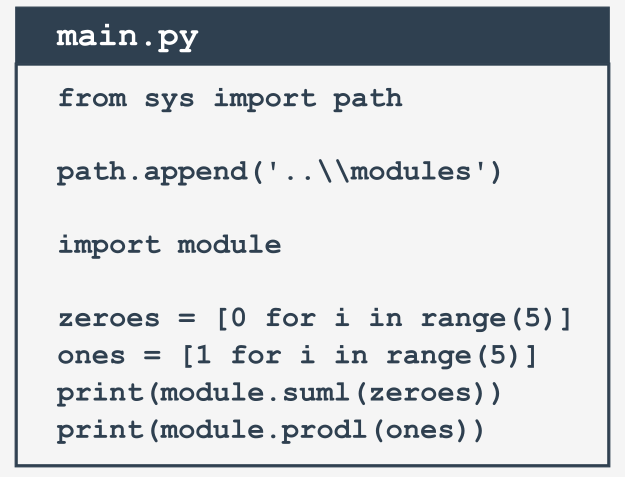

# Что такое пакет?


Написание собственных модулей мало чем отличается от написания обычных скриптов.

Есть некоторые конкретные аспекты, о которых Вы должны знать, но это определенно не так уж и трудно. Вы убедитесь в этом достаточно скоро.


Давайте суммируем некоторые важные вопросы:

*   модуль **\- это своего рода контейнер, заполненный функциями** - Вы можете упаковать столько функций, сколько хотите, в один модуль и распространять его по всему миру;
*   конечно, в целом лучше не смешивать функции с различными областями приложения в одном модуле (как в библиотеке - никто не ожидает, что научные работы будут помещены в комиксы), поэтому тщательно сгруппируйте свои функции и назовите содержащий их модуль понятно и интуитивно (например, не давайте имя `arcade_games` модулю, содержащему функции, предназначенные для разделения и форматирования жестких дисков);
*   создание множества модулей может привести к небольшому беспорядку - рано или поздно Вы захотите **сгруппировать свои модули** точно так же, как Вы ранее группировали функции. Есть ли что-то более общее чем модуль?
*   да, есть - это **пакет**; в мире модулей пакет играет ту же роль, что и папка/каталог в мире файлов.


# Ваш первый модуль: шаг 1


В этом разделе вы будете работать локально на своем компьютере. Начнем с нуля. Создайте пустой файл как тут:

  

```

```
module.py

Вам нужно два файла, чтобы повторить эти эксперименты. Одним из них будет сам модуль. Сейчас он пуст. Не волнуйтесь, вы заполните его реальным кодом.

Мы назвали файл `module.py`. Не очень креативно, но просто и понятно.


## Ваш первый модуль: шаг 2


Второй файл содержит код, использующий новый модуль. Его имя main.py.

Его содержание пока тоже очень краткое:

  
  
```python
import module

```
main.py

Примечание: **оба файла должны находиться в одной папке**. Мы настоятельно рекомендуем Вам создать новую папку для обоих файлов. Некоторые вещи тогда будут делаться намного легче.  


Запустите IDLE (или любое другое IDE, которое предпочитаете) и запустите файл `main.py`. Что Вы видите?

Вы ничего не должны видеть. Это означает, что Python успешно импортировал содержимое файла `module.py`. Неважно, что модуль пока пуст. Самый первый шаг был сделан, но прежде чем перейти к следующему шагу, мы бы хотели, чтобы Вы заглянули в папку, в которой находятся оба файла.

Заметили что-то интересное?

Появилась новая подпапка, видите ее? Ее имя `__pycache__`. Загляните внутрь. Что Вы видите?

Есть файл с именем `module.cpython-xy.pyc`, где `x` и `y` - это цифры, полученные из вашей версии Python (например, они будут `3` и `8`, если Вы используете Python 3.8).

Имя файла совпадает с именем Вашего модуля (`module` здесь). Часть после первой точки сообщает, какая реализация Python создала файл (`CPython` здесь) и номер его версии. Последняя часть (`pyc`) происходит от слов _Python_ и _compiled_.

Вы можете заглянуть внутрь файла - содержимое совершенно нечитаемо для людей. Это должно быть так, поскольку файл предназначен только для использования Python-ом.

Когда Python впервые импортирует модуль, он **переводит его содержимое в скомпилированную форму**. Файл не содержит машинного кода - это внутренний **полускомпилированный код** Python, готовый для исполнения интерпретатором Python. Поскольку такой файл не требует большого количества проверок, необходимых для файла с чистым исходным кодом, выполнение быстрее начинается и быстрее идет.

Благодаря этому каждый последующий импорт будет выполняться быстрее, чем интерпретация исходного текста с нуля.

Python может проверить, был ли изменен исходный файл модуля (в этом случае файл `pyc` будет перестроен) или нет (когда `pyc` может быть запущен сразу). Поскольку этот процесс полностью автоматический и прозрачный, Вам не нужно об этом думать.

## Ваш первый модуль: шаг 3


Теперь мы поместим кое-что в файл модуля:

  
  
```python
print("I like to be a module.")

```
module.py

Можете заметить разницу между модулем и обычным скриптом? Пока их нет.

Этот файл можно запустить как любой другой скрипт. Попробуйте сами.

Что происходит? Вы должны увидеть следующую строку в вашей консоли:

```
I like to be a module.
```


## Ваш первый модуль: шаг 4


Давайте вернемся к файлу `main.py`:

  
  
```python
import module

```
main.py

Запустите его. Что вы видите? Надеюсь, Вы видите что-то вроде этого:

```
I like to be a module.
```

Что же это означает?

Когда модуль импортируется, его содержимое **неявно выполняется Python**. Это дает модулю возможность инициализировать некоторые из его внутренних аспектов (например, он может назначать некоторые переменные с полезными значениями). Примечание: инициализация **происходит только один раз**, когда происходит первый импорт, поэтому присваивания, выполняемые модулем, не повторяются без необходимости.

Представьте себе следующий контекст:

*   Есть модуль с именем `mod1`;
*   Есть модуль с именем `mod2`, который содержит инструкцию `import mod1`;
*   Есть основной файл, который содержит инструкции `import mod1` и `import mod2`.

На первый взгляд вы можете подумать, что `mod1` будет импортирован дважды - к счастью, **происходит только первый импорт**. Python запоминает импортированные модули и молча пропускает все последующие попытки импортировать их.


Python может сделать гораздо больше. Он также создает переменную с именем `__name__`.

Кроме того, каждый исходный файл использует свою собственную, отдельную версию переменной - она не используется совместно другими модулями.

Мы покажем вам, как его использовать. Немного изменим модуль:

  
  
```python
print("I like to be a module.")
print(__name__)

```
module.py

Теперь запустите файл `module.py`. Вы должны увидеть следующие строки:

```
I like to be a module
__main__
```  

Теперь запустите файл `main.py`. И? Вы видите то же самое, что и мы?

```
I like to be a module
module
```  

Мы можем сказать, что:

*   когда Вы запускаете файл напрямую, его переменная `__name__` устанавливается в `__main__`;
*   когда файл импортируется как модуль, его переменной `__name__` присваивается имя файла (исключая `.py`).


Вот как Вы можете использовать переменную `__main__` для определения контекста, в котором был активирован Ваш код:

  
  
```python
if __name__ == "__main__":
    print("I prefer to be a module.")
else:
    print("I like to be a module.")

```
module.py

Однако есть более умный способ использования переменной. Если Вы напишете модуль, заполненный несколькими сложными функциями, Вы можете использовать его, чтобы разместить серию тестов, чтобы проверить, работают ли функции должным образом.

Каждый раз, когда Вы изменяете любую из этих функций, Вы можете просто запустить модуль, чтобы убедиться, что Ваши изменения не испортили код. Эти тесты будут опущены, когда код будет импортирован как модуль.


## Ваш первый модуль: шаг 7


Этот модуль будет содержать две простые функции, и если Вы хотите узнать, сколько раз эти функции были вызваны, Вам потребуется счетчик, инициализированный значением ноль при импорте модуля.

Вы можете сделать это так:

  
  
```python
counter = 0

if __name__ == "__main__":
    print("I prefer to be a module.")
else:
    print("I like to be a module.")

```
module.py


## Ваш первый модуль: шаг 8


Введение такой переменной абсолютно корректно, но может вызвать важные **побочные эффекты**, о которых Вы должны знать.

Посмотрите на измененный файл `main.py`:

  
  
```python
import module
print(module.counter)

```
main.py


Как видите, основной файл пытается получить доступ к переменной счетчика модуля. Это корректно? Да. Это можно использовать? Это может быть очень удобно. Это безопасно?

Зависит - если Вы доверяете пользователям Вашего модуля, то проблем нет; однако Вы можете не захотеть, чтобы остальной мир видел Вашу **личную переменную**.

В отличие от многих других языков программирования, в Python нет средств, позволяющих скрывать такие переменные от глаз пользователей модуля. Вы можете только сообщить своим пользователям, что это Ваша переменная, что они могут ее прочитать, но они не должны изменять ее ни при каких обстоятельствах.

Это делается путем добавления к имени переменной `_` (одно подчеркивание) или `__` (два подчеркивания), но помните, что это только **конвенция**. Пользователи Вашего модуля сами могут определять, подчиняться ему или нет.

Конечно, мы будем следовать конвенции. Теперь давайте поместим две функции в модуль - они будут считать сумму и произведение чисел, собранных в списке.

Кроме того, давайте добавим туда несколько украшений и удалим всё лишнее.


## Ваш первый модуль: шаг 9


Хорошо. Давайте напишем новый код в нашем файле `module.py`. Обновленный модуль готов:

```python
#!/usr/bin/env python3 

""" module.py - пример модуля Python """

__counter = 0


def suml(the_list):
    global __counter
    __counter += 1
    the_sum = 0
    for element in the_list:
        the_sum += element
    return the_sum


def prodl(the_list):
    global __counter    
    __counter += 1
    prod = 1
    for element in the_list:
        prod *= element
    return prod


if __name__ == "__main__":
    print("I prefer to be a module, but I can do some tests for you.")
    my_list = [i+1 for i in range(5)]
    print(suml(my_list) == 15)
    print(prodl(my_list) == 120)

```
module.py

Нам кажется, что некоторые элементы нуждаются в объяснении:

*   строка, начинающаяся с `#!`, имеет много имен - ее можно назвать _shabang_, _shebang_, _hashbang_, _poundbang_ или даже _hashpling_ (не спрашивайте нас, почему). Само название здесь ничего не значит - его роль важнее. С точки зрения Python, это просто **комментарий**, поскольку он начинается с `#`. Для Unix и Unix-подобных ОС (включая MacOS) такая строка **указывает ОС, как выполнять содержимое файла** (другими словами, какую программу необходимо запустить для интерпретации текста). В некоторых средах (особенно в тех, которые связаны с веб-серверами) отсутствие этой строки вызовет проблемы;
*   строка (возможно, не одна), помещаемая перед любыми инструкциями модуля (включая import), называется **строкой документа** и должна кратко объяснять назначение и содержание модуля;
*   функции, определенные внутри модуля (`suml()` и `prodl()`) доступны для импорта;
*   мы использовали переменную `__name__`, чтобы определить, когда файл запускается автономно, и воспользовались этой возможностью, чтобы выполнить несколько простых тестов.


## Ваш первый модуль: шаг 10


Теперь можно использовать обновленный модуль - вот один из способов:

  
  
```python
from module import suml, prodl

zeroes = [0 for i in range(5)]
ones = [1 for i in range(5)]
print(suml(zeroes))
print(prodl(ones))

```
main.py


## Ваш первый модуль: шаг 11


Пришло время усложнить этот пример - мы предположили, что основной файл Python находится в той же папке/каталоге, что и импортируемый модуль.

Давайте оставим это предположение и проведем следующий мысленный эксперимент:

*   мы используем операционную систему Windows ® (это предположение важно, так как от него зависит форма имени файла);
*   основной скрипт Python находится в `C:\Users\user\py\progs` под именем `main.py`;
*   модуль для импорта расположен в `C:\Users\user\py\modules`.

  


Как с этим работать?

Чтобы ответить на этот вопрос, нам нужно поговорить о **том, как Python ищет модули**. Существует специальная переменная (фактически список), в которой хранятся все местоположения (папки/каталоги), в которых выполняется поиск, чтобы найти модуль, запрошенный инструкцией импорта.

Python просматривает эти папки в том порядке, в котором они перечислены в списке - если модуль не может быть найден ни в одном из этих каталогов, импорт завершается неудачей.

В противном случае будет учитываться первая папка, содержащая модуль с нужным именем (если в какой-либо из оставшихся папок содержится модуль с таким именем, она будет проигнорирована).

Переменная называется `path` и доступна через модуль с именем `sys`. Вот как вы можете проверить его обычное значение:

```python
import sys

for p in sys.path:
    print(p)


```

Мы запустили код внутри папки `C:\User\user`, и вот, что мы получили:

```
C:\Users\user
C:\Users\user\AppData\Local\Programs\Python\Python36-32\python36.zip
C:\Users\user\AppData\Local\Programs\Python\Python36-32\DLLs
C:\Users\user\AppData\Local\Programs\Python\Python36-32\lib
C:\Users\user\AppData\Local\Programs\Python\Python36-32
C:\Users\user\AppData\Local\Programs\Python\Python36-32\lib\site-packages
```

Примечание: папка, в которой начинается выполнение, указана в первом элементе `path`.

Еще раз обратите внимание: в качестве одного из элементов path указан zip-файл - это не ошибка. Python может обрабатывать zip-файлы как обычные папки - это может сэкономить много места для хранения.

Знаете ли Вы, как мы можем решить эту проблему?

Мы можем добавить папку, содержащую модуль, в переменную `path` (она полностью модифицируемая).


## Ваш первый модуль: шаг 12


Одно из нескольких возможных решений выглядит следующим образом:

  
  
```python
from sys import path

path.append('..\\modules')

import module

zeroes = [0 for i in range(5)]
ones = [1 for i in range(5)]
print(module.suml(zeroes))
print(module.prodl(ones))

```
main.py

Примечание:

*   мы удвоили `\` внутри имени папки - знаете почему?  
      
    <details><summary>Проверка</summary>

    Поскольку обратная косая черта используется для экранирования других символов - если Вы хотите получить только одну обратную косую черту, Вы должны экранировать ее.

    </details>
    
    
*   мы использовали относительное имя папки - это будет работать, если Вы запустите файл `main.py` непосредственно из его домашней папки, и не будет работать, если текущий каталог не соответствует относительному пути; Вы всегда можете использовать абсолютный путь, например:  
      
    ```python
    path.append('C:\\Users\\user\\py\\modules')
    ```
  
*   мы использовали метод `append()` - по сути, новый путь будет занимать последний элемент в списке путей; если Вам не нравится идея, Вы можете использовать вместо него метод `insert()`.


# Ваш первый пакет: шаг 1


Представьте, что в недалеком будущем Вы и Ваши сотрудники напишете большое количество функций Python.

Ваша команда решает сгруппировать функции в отдельные модули, и это конечный результат упорядочивания:

  
  
```python
#! /usr/bin/env python3

""" module: alpha """

def funA():
    return "Alpha"

if __name__ == "__main__":
    print("I prefer to be a module.")

```
alpha.py

Примечание. Мы представили все содержимое только для модуля `alpha.py` - предположим, что все модули выглядят одинаково (они содержат одну функцию с именем `funX`, где _X_ - первая буква имени модуля).


## Ваш первый пакет: шаг 2


Внезапно кто-то замечает, что эти модули формируют свою собственную иерархию, поэтому помещать их все в плоскую структуру не будет хорошей идеей.

После некоторого обсуждения команда приходит к выводу, что модули должны быть сгруппированы. Все участники согласны с тем, что следующая древовидная структура прекрасно отражает взаимоотношения между модулями:

  


Давайте рассмотрим это снизу вверх:

*   группа `ugly` содержит два модуля: `psi` и `omega`;
*   группа `best` содержит два модуля: `sigma` и `tau`;
*   группа `good` содержит два модуля (`alpha` и `beta`) и одну подгруппу (`best`);
*   группа `extra` содержит две подгруппы (`good` и `bad`) и один модуль (`iota`).


Это выглядит плохо? Вовсе нет - тщательно проанализируйте структуру. Это похоже на что-то известное, не так ли?

Это похоже на структуру каталогов.  


## Ваш первый пакет: шаг 3


Так выглядит древовидная структура:

  


Такая структура почти является пакетом (в смысле Python). Ему не хватает мелких деталей, чтобы быть функциональным и рабочим. Сейчас мы его закончим.

Если Вы предполагаете, что `extra` - это имя **недавно созданного пакета** (его следует рассматривать как **корень пакета**), он наложит правило именования, которое позволит Вам понятно назвать каждый объект в дереве.


Например:

*   расположение функции с именем `funT()` из пакета `tau` можно описать так:  
      
    ```python
    extra.good.best.tau.funT()
    ```  
    
*   функция помеченная как:  
      
    ```python
    extra.ugly.psi.funP()
    ```
      
    идет из модуля `psi`, который хранится в подпакете `ugly` пакета `extra`.


## Ваш первый пакет: шаг 4


Есть два вопроса, на которые нужно ответить:

*   **как** преобразовать такое дерево (фактически, поддерево) в реальный **пакет** Python (другими словами, как убедить Python, что такое дерево - это не просто набор файлов, а набор модулей)?
*   **куда** поместить поддерево, чтобы сделать его доступным для Python?


На первый вопрос есть неожиданный ответ: **пакеты, как и модули, могут требовать инициализации**.

Инициализация модуля выполняется с помощью несвязанного кода (не являющегося частью какой-либо функции), расположенного внутри файла модуля. Поскольку пакет не является файлом, этот метод бесполезен для инициализации пакетов.

Вместо этого Вам нужно использовать другой прием - Python ожидает, что в папке пакета есть файл с очень уникальным именем: `__init__.py`.


Содержимое файла выполняется при **импорте** любого из модулей пакета. Если Вы не хотите никаких особых инициализаций, Вы можете оставить файл пустым, но Вы не должны его пропускать.


## Ваш первый пакет: шаг 5


Помните: **наличие файла `__init.py__`, наконец, завершает наш пакет**:

  


Примечание: это не только _корневая_ папка, которая может содержать файл `__init.py__` - Вы также можете поместить его в любую из ее подпапок (подпакетов). Это может быть полезно, если некоторые из подпакетов требуют индивидуальной обработки и специальных видов инициализации.

Теперь пришло время ответить на второй вопрос - куда поместить поддерево, чтобы сделать его доступным для Python? Ответ прост: **где угодно**. Вам нужно только убедиться, что Python знает о местонахождении пакета. Вы уже знаете, как это сделать.

Вы готовы использовать свой первый пакет.


## Ваш первый пакет: шаг 6


Предположим, что рабочая среда выглядит следующим образом:

  


Мы подготовили zip-файл, содержащий все файлы из ветки пакетов. Вы можете скачать его и использовать для своих собственных экспериментов, но не забудьте распаковать его в папку, представленную на схеме, иначе он не будет доступен для кода из основного файла.

**Загрузка** [ZIP архив с модулями и пакетами.](./assets/Modules and Packages.zip)

Вы будете продолжать свои эксперименты, используя файл `main2.py`.


## Ваш первый пакет: шаг 7


Мы собираемся получить доступ к функции `funI()` из модуля `iota` из верхней части пакета `extra`. Это заставляет нас использовать определенные имена пакетов (свяжите их с именами папок и подпапок - конвенции очень похожи).

Вот как это делается:

  
  
```python
from sys import path
path.append('..\\packages')

import extra.iota
print(extra.iota.funI())

```
main2.py

Примечание:

*   мы изменили переменную `path`, чтобы сделать ее доступной для Python;
*   `import` не указывает непосредственно на модуль, но указывает полный путь от верха пакета;

замена import extra.iota на import iota приведет к ошибке.


Следующий вариант тоже можно использовать:

  
  
```python
from sys import path
path.append('..\\packages')

from extra.iota import funI
print(funI())

```
main2.py

Обратите внимание на определенное имя модуля `iota`.


## Ваш первый пакет: шаг 8


Теперь давайте дойдем до самого конца дерева - вот как получить доступ к модулям `sigma` и `tau`.

  
  
```python
from sys import path

path.append('..\\packages')

import extra.good.best.sigma
from extra.good.best.tau import funT

print(extra.good.best.sigma.funS())
print(funT())

```
main2.py

Вы можете сделать Вашу жизнь проще, используя псевдонимы:

  
  
```python
from sys import path

path.append('..\\packages')

import extra.good.best.sigma as sig
import extra.good.alpha as alp

print(sig.funS())
print(alp.funA())

```
main2.py


## Ваш первый пакет: шаг 9


Давайте предположим, что мы заархивировали весь подкаталог, начиная с папки `extra` (включая ее), и давайте получим файл с именем `extrapack.zip`. Затем мы помещаем файл в папку `packages`.

Теперь мы можем использовать zip-файл в роли пакетов:

```python
from sys import path

path.append('..\\packages\\extrapack.zip')

import extra.good.best.sigma as sig
import extra.good.alpha as alp
from extra.iota import funI
from extra.good.beta import funB

print(sig.funS())
print(alp.funA())
print(funI())
print(funB())

```
main2.py

Если вы хотите провести свои собственные эксперименты с пакетом, который мы создали, вы можете скачать его ниже. Мы просим вас сделать это.

**Скачать** [ZIP архив Extrapack.](./assets/extrapack.zip)

Теперь Вы можете создавать модули и объединять их в пакеты. Пришло время начать совершенно другую тему - об ошибках, неудачах и сбоях.


# Основные тезисы


1. В то время как **модуль** предназначен для объединения некоторых связанных сущностей, таких как функции, переменные или константы, **пакет** представляет собой контейнер, который позволяет объединить несколько связанных модулей под одним общим именем. Такой контейнер можно распространять как есть (как пакет файлов, развернутых в поддереве каталогов), или он может быть упакован в zip-файл.


2. Во время самого первого импорта фактического модуля Python переводит свой исходный код в **полукомпилированный** формат, хранящийся внутри файлов **pyc**, и развертывает эти файлы в каталог `__pycache__`, расположенный в домашнем каталоге модуля.


3. Если Вы хотите сообщить пользователю Вашего модуля, что конкретный объект должен рассматриваться как **приватный** (т.е. не использоваться явно за пределами модуля), Вы можете пометить его имя с помощью `_` или префикс `__`. Не забывайте, что это всего лишь рекомендация, а не приказ...


4. Имена _shabang_, _shebang_, _hasbang_, _poundbang_ и _hashpling_ означают диграф, записываемый как `#!`, он используется для указания Unix-подобным ОС, как запускать исходный файл Python. Эта конвенция не действует в MS Windows.


5. Если Вы хотите убедить Python, что он должен учитывать нестандартный каталог пакета, его имя необходимо добавить в список каталогов импорта, хранящийся в переменной `path`, содержащейся в модуле `sys`.


6. Файл Python с именем `__init__.py` неявно запускается, когда пакет, содержащий его, подлежит импорту, и используется для инициализации пакета и/или его подпакетов (если есть). Файл может быть пустым, но не должен отсутствовать.

---

**Упражнение 1**

Вы хотите запретить пользователю вашего модуля запускать ваш код как обычный скрипт. Как добиться такого эффекта?

<details><summary>Проверка</summary>

```python
import sys

if __name__ == "__main__":
    print "Don't do that!"
    sys.exit()

```

</details>

---

**Упражнение 2**

Некоторые дополнительные и необходимые пакеты хранятся в каталоге `D:\Python\Project\Modules`. Напишите код, обеспечивающий просмотр каталога Python для поиска всех запрошенных модулей.

<details><summary>Проверка</summary>

```python
import sys

# Обратите внимание на двойные косые черты!
sys.path.append("D:\\Python\\Project\\Modules")

```

</details>

---

**Упражнение 3**

Каталог, упомянутый в предыдущем упражнении, содержит поддерево следующей структуры:

```
abc
 |__ def
      |__ mymodule.py
```

Предполагая, что `D:\Python\Project\Modules` был успешно добавлен в список `sys.path`, напишите директиву импорта, позволяющую использовать все сущности из `mymodule`.

<details><summary>Проверка</summary>

```
import abc.def.mymodule

```

</details>

