# Экосистема пакетов Python и как ее использовать


Python - очень мощный инструмент, и мы надеемся, что Вы уже испытали это на себе. Многие люди со всего мира так думают и регулярно используют Python для разработки того, что они могут делать во многих совершенно разных сферах деятельности. Это означает, что Python стал **междисциплинарным инструментом**, который используется в бесчисленных приложениях. Мы не можем пройти через все области, в которых Python блестяще демонстрирует свои способности, поэтому позвольте нам рассказать вам о самых впечатляющих из них.

Прежде всего, Python превратился в **лидера исследований в области искусственного интеллекта**. Интеллектуальный анализ данных, одна из самых многообещающих современных научных дисциплин, также использует Python. Математики, психологи, генетики, метеорологи, лингвисты - все эти люди уже используют Python, а если еще нет, то мы уверены, что очень скоро начнут. От этой тенденции никуда не деться.

Конечно, нет никакого смысла заставлять всех пользователей Python писать свой код с нуля, полностью изолировав их от внешнего мира и достижений других программистов. Это было бы неестественно и контрпродуктивно.

Наиболее предпочтительный и эффективный способ - дать возможность всем членам сообщества Python свободно обмениваться кодами и опытом. В этой модели никого не заставляют начинать работу с нуля, так как высока вероятность, что кто-то другой работал над той же (или очень похожей) задачей.

Как Вы знаете, Python создавался как программное обеспечение с открытым исходным кодом, и это также служит приглашением для всех программистов поддерживать всю экосистему Python как открытую, дружелюбную и бесплатную среду. Чтобы модель работала и развивалась, необходимо предоставить некоторые дополнительные инструменты, которые помогут создателям публиковать, поддерживать свой код и заботиться о нем.


Эти же инструменты должны помочь пользователям использовать код, как уже существующий, так и новый, появляющийся каждый день. Благодаря этому писать новый код для решения новых задач - это не то же самое, что строить новый дом, начиная с фундамента.

Более того, программист может изменять чужой код, чтобы адаптировать его к своим потребностям и, по сути, создать совершенно новый продукт, который может использовать другой разработчик. Кажется, что этому процессу нет конца. К счастью.

Чтобы заставить этот мир вращаться, необходимо создать и поддерживать в движении две основные сущности: **централизованный репозиторий** со всеми доступными пакетами программного обеспечения; и инструмент, позволяющий пользователям **получить доступ к репозиторию**. Обе эти сущности уже существуют и могут быть использованы в любое время.


Репозиторий (или для краткости _repo_), который мы упоминали ранее, называется **PyPI** (сокращенно от Python Package Index) и поддерживается рабочей группой под названием Packaging Working Group, часть Python Software Foundation, основной задачей которой является поддержка разработчиков Python в эффективном распространении кода.

Вот их веб-сайт:  
[https://wiki.python.org/psf/PackagingWG](https://wiki.python.org/psf/PackagingWG).


Веб-сайт PyPI (администрируемый PWG) находится по адресу:  
[https://pypi.org/](https://pypi.org/).


Когда мы ненадолго заглянули туда в начале июля 2021 года, мы обнаружили, что PyPI является домом для 315 000 проектов, состоящих из более чем 4 500 000 файлов, которыми управляют 520 000 пользователей.

Эти три числа сами по себе ясно показывают мощь сообщества Python и важность сотрудничества разработчиков.


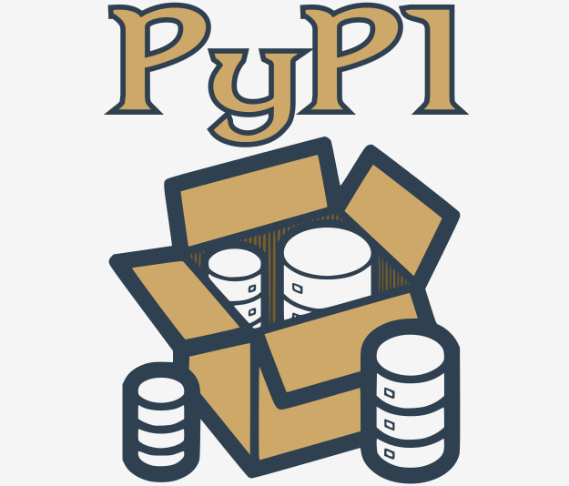


Мы должны отметить, что PyPI - не единственный существующий репозиторий Python. Напротив, их очень много, созданных для проектов и возглавляемых множеством больших и малых сообществ Python. Вполне вероятно, что когда-нибудь Вы и Ваши коллеги захотите **создать свои собственные репозитории**.

Как бы то ни было, PyPI - самый важный репозиторий Python в мире. Если мы немного изменим классическое высказывание, мы сможем заявить, что "все дороги Python ведут к PyPl", и это вовсе не преувеличение.


# Репозиторий PyPI: сырный магазин


Репозиторий PyPI иногда называют **сырным магазин**. Серьезно.

Вам это кажется немного странным? Не волнуйтесь, все это полностью безобидно.

Мы называем репозиторий магазином, потому что Вы приходите туда по тем же причинам, по которым Вы ходите в другие магазины: чтобы удовлетворить свои потребности. Если хотите сыра, идите в сырный магазин. Если Вам нужна программа, Вы идете в магазин программного обеспечения. К счастью, на этом аналогия заканчивается - Вам не нужны деньги, чтобы получить какое-то программное обеспечение из репозитария.

PyPI полностью бесплатен, и Вы можете просто выбрать код и использовать его - Вы не встретите ни кассира, ни охранника. Конечно, это не освобождает Вас от вежливости и честности. Вы должны соблюдать все условия лицензирования, поэтому не забудьте их прочитать.

"Хорошо, - скажете вы, - теперь в магазине все чисто, но какое отношение сыр имеет к Python?"

"Сырная лавка" - один из самых известных эскизов Монти Пайтона. На нем изображено сюрреалистическое приключение англичанина, пытающегося купить сыр. К сожалению, в магазине, который он посещает (нескромно названном Ye National Cheese Emporium), вообще нет сыра.

Конечно, это должно быть иронично. Как Вы уже знаете, в PyPI есть много программного обеспечения, и оно доступно круглосуточно и без выходных. Он имеет полное право называть себя _Ye International Python Software Emporium_.


PyPI - очень специфический магазин, и не только потому, что он предлагает все свои продукты бесплатно. Для этого также требуется специальный инструмент.

К счастью, этот инструмент также бесплатный, поэтому если Вы хотите создать свой собственный цифровой чизбургер, используя товары, предлагаемые PyPI Shop, Вам понадобится бесплатный инструмент под названием _pip_.

Нет, Вы не ослышались. Просто _pip_. Это, конечно, еще одна аббревиатура, но ее природа более сложна, чем ранее упомянутый PyPI, поскольку это пример рекурсивной аббревиатуры, что означает, что аббревиатура относится к самой себе, а это означает, что объяснение будет бесконечным.

Почему? Поскольку _pip_ означает _"pip installs packages"_, а _pip_ внутри _"pip installs packages"_ означает _"Pip устанавливает пакеты"_ и...

На этом остановимся. Спасибо за сотрудничество.

Кстати, есть еще несколько очень известных рекурсивных сокращений. Одно из них - _Linux_, его можно интерпретировать как _"Linux - это не Unix"_.


# Как установить _pip_


Теперь следует задать вопрос: как получить подходящий для сыра нож? Другими словами, как убедиться, что _pip_ установлен и готов к работе?

Самый точный ответ - "зависит от". Серьезно.

Некоторые установщики Python поставляются с _pip_, некоторые - нет. Более того, это зависит не только от используемой вами ОС, хотя это очень важный фактор.

Начнем с MS Windows.


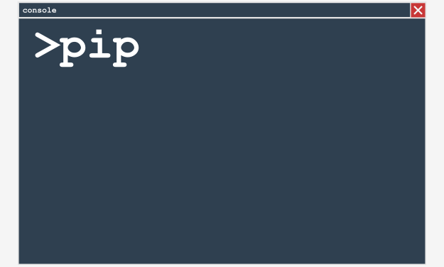


# _pip_ в MS Windows


Установщик MS Windows Python уже содержит _pip_, поэтому никаких других шагов для его установки предпринимать не нужно. К сожалению, если переменная PATH настроена неправильно, _pip_ может быть недоступен.

Чтобы убедиться, что мы не ввели Вас в заблуждение, попробуйте сделать следующее:

*   откройте консоль Windows (_CMD_ или _PowerShell_, какую хотите)
*   выполните следующую команду:  
      
    ```bash
    pip --version
    ```  
    
*   при самом оптимистичном сценарии (а мы действительно этого хотим) Вы увидите что-то вроде этого:


    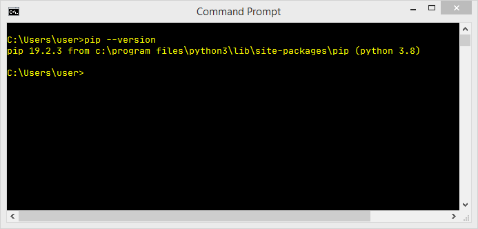


*   отсутствие этого сообщения может означать, что переменная PATH либо неправильно указывает на расположение бинарных файлов Python, либо вообще не указывает на него; например, наша переменная PATH содержит следующую подстроку:  
      
    ```
    C:\Program Files\Python3\Scripts\;C:\Program Files\Python3\;
    ```  
    
*   Самый простой способ перенастроить переменную PATH - это **переустановить Python**, указав установщику установить ее за Вас.


# _pip_ в Linux


Различные дистрибутивы Linux могут вести себя по-разному, когда дело доходит до использования _pip_. Некоторые из них (например, _Gentoo_), которые тесно связаны с Python и используют его внутри, могут иметь предустановленный _pip_ и сразу же готовы к работе.

Не забывайте, что некоторые дистрибутивы могут одновременно использовать более одной версии Python, например, Python 2 и Python 3 сосуществуют бок о бок. Такие системы могут запускать Python 2 как версию по умолчанию, и может потребоваться явно указать имя программы как python3. В этом случае может быть два разных элемента _pip_, обозначенных как _pip_ (или _pip2_) и _pip3_. Внимательно проверяйте это.

Откройте окно терминала и введите следующую команду:

```bash
pip --version
```


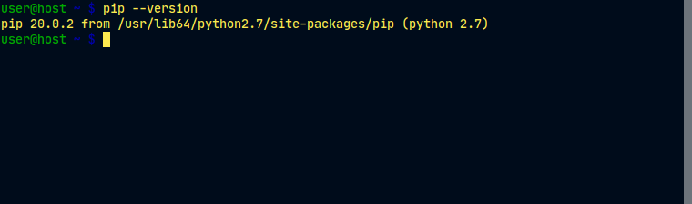


Ответ, аналогичный показанному на предыдущем рисунке, определяет, что Вы запустили _pip_ из Python 2, поэтому следующая попытка должна выглядеть следующим образом:

```bash
pip3 --version
```


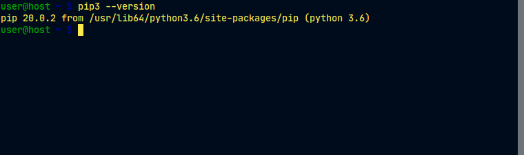


Как видите, теперь мы уверены, что используем подходящую версию _pip_.


К сожалению, в некоторых дистрибутивах Linux не предустановлен _pip_, даже если сам Python установлен по умолчанию (некоторые версии Ubuntu могут вести себя подобным образом). В этом случае у Вас есть две возможности:

*   установить _pip_ как системный пакет с использованием специального менеджера пакетов (например, _apt_ в Debian-подобных системах)
*   установить _pip_ используя внутренние механизмы Python.

Первое однозначно лучше. Хотя есть несколько умных скриптов, которые могут загружать и устанавливать _pip_, игнорируя ОС, мы не рекомендуем Вам их использовать. Этот метод может доставить неприятности.


Посмотрите - мы пытались запустить _pip3_, но у нас ничего не вышло. Наша ОС (на этот раз мы использовали _Ubuntu Budgie_) предложила использовать _apt_ для установки пакета с именем _python3-pip_:

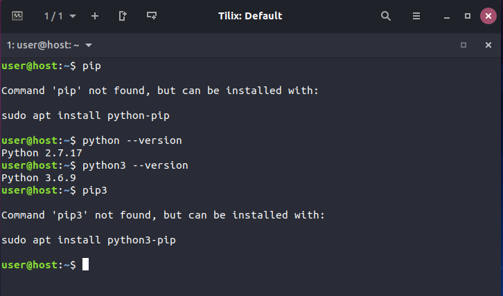


Это хороший совет, и мы собираемся ему следовать, но следует отметить, что для этого нам потребуются права администратора. Не забывайте, что разные дистрибутивы Linux могут использовать разные менеджеры пакетов (например, это может быть _pacman_, если Вы используете Arch Linux, или _yum_, используемый дистрибутивами, производными от Red Hat).

В любом случае все эти методы должны иметь установленный и работающий _pip_ (или _pip3_).


Посмотрите, что произошло, когда мы последовали предложению ОС:

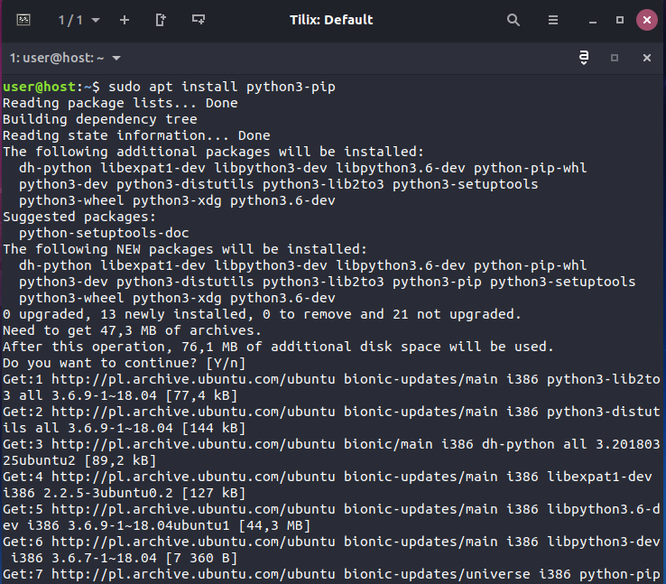


Как видите, ОС решила установить не только сам _pip_, но и пару дополнительных компонентов, необходимых для _pip_. Это нормально - не пугайтесь.


Когда _apt_ завершит свою работу, мы, наконец, сможем использовать _pip3_:

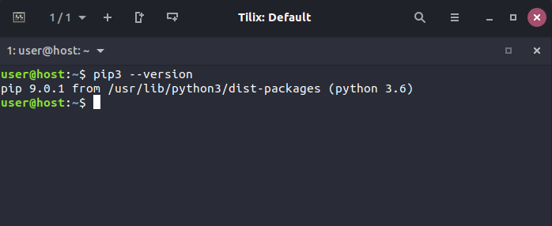


Если Вы пользователь Mac и установили Python 3 с помощью установщика _brew_, _pip_ уже присутствует в Вашей системе и готов к работе. Проверьте это, выполнив упомянутую ранее команду:

```bash
pip3 --version
```

И дождитесь ответа.


Вот что мы видим:

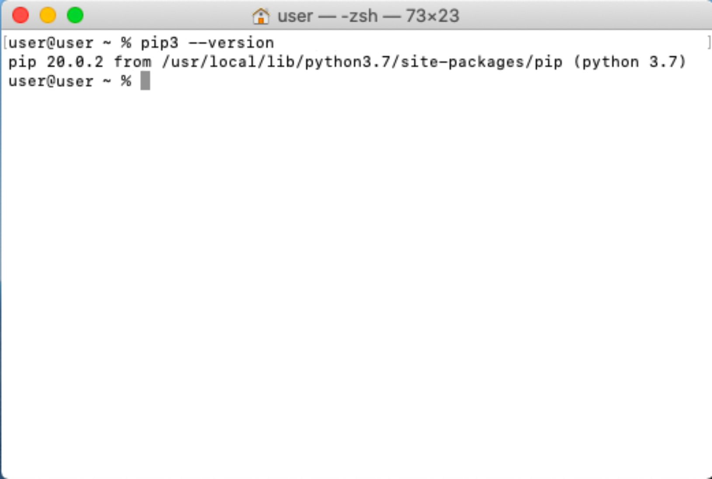


# Зависимости


Теперь, когда мы уверены, что _pip_ находится в нашем распоряжении, мы собираемся ограничить наше внимание только MS Windows, поскольку его поведение (должно быть) одинаково во всех ОС, но прежде чем мы начнем, нам нужно объяснить важную проблему и рассказать вам о **зависимостях**.

Представьте, что Вы создали блестящее приложение Python под названием _redsuspenders_, способное предсказывать курсы валют с точностью 99% (кстати, если Вы умеете это делать, немедленно свяжитесь с нами).

Конечно, Вы использовали некоторый существующий код для достижения этой цели - например, Ваше приложение импортирует пакет с именем _nyse_, содержащий некоторые важные функции и классы. Более того, пакет _nyse_ импортирует другой пакет с именем _wallstreet_, а пакет _wallstreet_ импортирует два других важных пакета с именем _bull_ и _bear_.

Как Вы, наверное, уже догадались, связи между этими пакетами имеют решающее значение, и если кто-то решит использовать Ваш код (но помните, мы уже поставили на него), они также должны будут убедиться, что все необходимые пакеты на месте.

Короче говоря, мы можем сказать, что **зависимость - это явление, которое возникает каждый раз, когда Вы собираетесь использовать часть программного обеспечения, которое полагается на другое программное обеспечение**. Обратите внимание, что зависимость может включать (и обычно включает) более одного уровня разработки программного обеспечения.

Означает ли это, что потенциальный пользователь пакета _nyse_ обязан отслеживать все зависимости и вручную устанавливать все необходимые пакеты? Это было бы ужасно, правда?

Да, это определенно ужасно, поэтому не стоит удивляться тому, что процесс усердного выполнения всех последующих требований имеет собственное название и называется _адом зависимостей_.

Что с этим делать? Неужели каждый пользователь обречен на ад, чтобы запустить код в первый раз?

К счастью, нет - _pip_ может сделать все это за Вас. Он может обнаруживать, идентифицировать и разрешать все зависимости. Более того, он может делать это самым умным способом, избегая ненужных загрузок и переустановок.


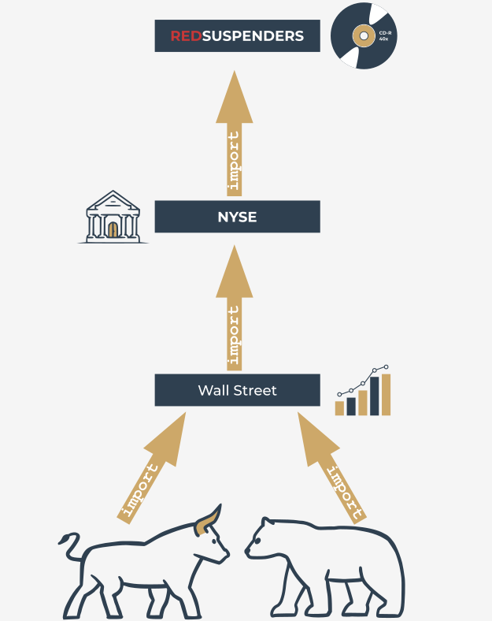


# Как пользоваться _pip_


Теперь мы готовы спросить _pip_, что он может для нас сделать. Давайте сделаем это - выполните следующую команду:

```bash
pip help
```

И дождитесь ответа _pip_. Вот как это выглядит:

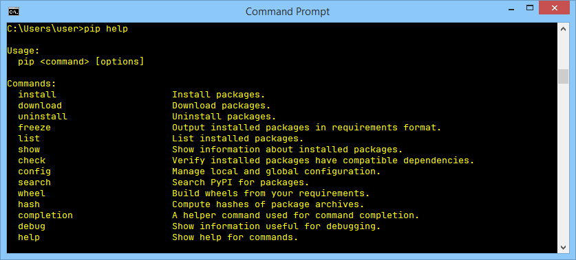


Не забывайте, что Вам может потребоваться заменить _pip_ на _pip3_, если этого требует Ваша среда.

Список, созданный _pip_, суммирует все доступные операции, и последняя из них - это `help`, которую мы только что использовали.

Если Вы хотите узнать больше о любой из перечисленных операций, Вы можете использовать следующую форму вызова _pip_:

```bash
pip help operation
```


Например, строка:

```bash
pip help install
```

Покажет Вам подробную информацию об использовании и параметризации команды `install`.

Если Вы хотите узнать, какие пакеты Python уже установлены, Вы можете использовать операцию `list` - точно так же:

```bash
pip list
```

Результат, который Вы увидите, довольно непредсказуем. Не удивляйтесь, если содержимое вашего экрана будет совершенно другим. Наше выглядят следующим образом:

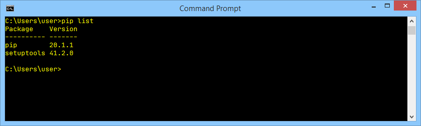


Как видите, в списке есть два столбца: в одном отображается имя установленного пакета, а в другом - версия пакета. Мы не можем предсказать состояние Вашей установки Python.

Единственное, что мы знаем наверняка, это то, что Ваш список содержит две строки, которые мы видим в нашем списке: _pip_ и _setuptools_. Это происходит потому, что ОС убеждена, что пользователю, которому нужен pip, скорее всего, скоро понадобятся _setuptools_. Это не так.


Список _pip_ не очень информативен, и может случиться так, что он не удовлетворит Ваше любопытство. К счастью, есть команда, которая может рассказать вам больше о любом из установленных пакетов (обратите внимание на слово **установлен**). Синтаксис команды выглядит следующим образом:

```bash
pip show package_name
```

Мы собираемся использовать это немного обманчиво - мы хотим убедить _pip_ признаться в чем-то о себе. Вот это делается:

```bash
pip show pip
```

Выглядит немного странно, правда? Несмотря на это, он работает нормально, и самопрезентация _pip_ выглядит последовательной и актуальной.:

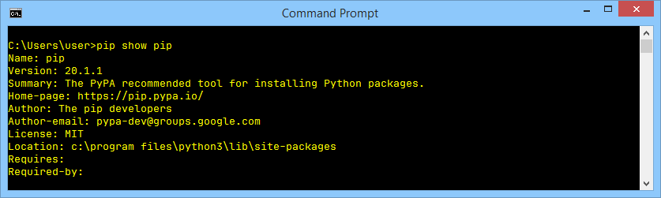


Вы можете спросить, откуда эти данные? _pip_ действительно такой проницательный? Вовсе нет - информация, отображаемая на экране, берется изнутри показываемого пакета. Другими словами, создатель пакета обязан снабдить его всеми необходимыми данными (или, точнее, метаданными).

Посмотрите на две строки в нижней части вывода. Они показывают:

*   какие пакеты необходимы для успешного использования пакета (`Requires:`)
*   для каких пакетов требуется пакет для успешного использования (`Required-by:`)

Как видите, оба свойства пусты. Не стесняйтесь попробовать использовать команду `show` по отношению к любому другому установленному пакету.


Сила _pip_ заключается в том, что на самом деле это вход во вселенную программного обеспечения Python. Благодаря ему Вы можете просматривать и устанавливать любой из сотен готовых пакетов, собранных в репозиториях PyPI. Не забывайте, что _pip_ не может хранить весь контент PyPI локально (в этом нет необходимости и было бы неэкономично).

Фактически, _pip_ использует Интернет для запроса PyPI и загрузки необходимых данных. Это означает, что у Вас должно быть работающее сетевое соединение всякий раз, когда Вы собираетесь запрашивать у _pip_ что-либо, что может включать прямое взаимодействие с инфраструктурой PyPI.

Один из этих случаев имеет место, когда Вы хотите выполнить поиск в PyPI, чтобы найти нужный пакет. Такой поиск инициируется следующей командой:

```bash
pip search anystring
```

Предоставленное Вами `anystring` будет найдено в:

*   названиях всех пакетов;
*   всех строках всех пакетов.

Помните, что некоторые поисковые запросы могут генерировать настоящий поток данных, поэтому постарайтесь быть как можно более конкретными. Например, невинно выглядящий запрос вроде этого:

```bash
pip search pip
```

Дает более 100 строк результатов (попробуйте сами - не верьте нам на слово). Кстати, поиск нечувствителен к регистру.

Если Вы не являетесь поклонником чтения в консоли, Вы можете использовать альтернативный способ просмотра содержимого PyPI, предлагаемый поисковой системой, доступный по адресу [https://pypi.org/search](https://pypi.org/search) .


Предполагая, что Ваш поиск успешен (или Вы решили установить определенный пакет с уже известным именем), Вы можете использовать pip для установки пакета на свой компьютер.

Сейчас могут быть реализованы два возможных сценария:

*   Вы хотите установить новый пакет только для себя - он не будет доступен ни одному другому пользователю (аккаунту), существующему на Вашем компьютере; эта процедура является единственной доступной, если Вы не можете повысить свои права и действовать как системный администратор;
*   Вы решили установить новый пакет для всей системы - у Вас есть права администратора, и Вы не боитесь их использовать.

Чтобы различать эти два действия, pip использует специальный параметр с именем `--user` (обратите внимание на двойной дефис). Наличие этой опции указывает pip действовать локально от имени вашего (неадминистративного) пользователя.

Если Вы не добавите это, pip будет считать, что Вы системный администратор, и ничего не сделает, чтобы Вас исправить, если Вы сами не исправитесь.

В нашем случае мы собираемся установить пакет под названием pygame - это обьемная и сложная библиотека, позволяющая программистам разрабатывать компьютерные игры с использованием Python.

Проект находится в разработке с 2000 года, так что это зрелый и надежный фрагмент кода. Если Вы хотите узнать больше о проекте и о сообществе, которое его возглавляет, посетите [https://www.pygame.org](https://www.pygame.org).

Если Вы системный администратор, Вы можете установить pygame с помощью следующей команды:

```bash
pip install pygame
```

Если Вы не являетесь администратором или не хотите увеличивать занимаемое Вашей ОС место, устанавливая pygame в масштабе всей системы, Вы можете установить его только для себя:

```bash
pip install --user pygame
```

Вам решать, какую из вышеперечисленных процедур Вы хотите провести.

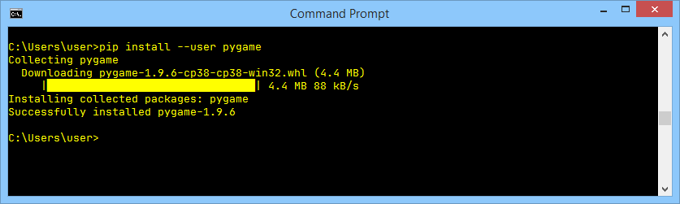


У pip есть привычка проигрывать причудливую текстовую анимацию, показывающую прогресс установки, поэтому внимательно следите за экраном - не пропустите шоу! Если процесс прошел успешно, Вы увидите что-то вроде этого:

Мы рекомендуем Вам использовать:

```bash
pip show pygame
```

и

```bash
pip list
```

Чтобы получить больше информации о том, что на самом деле произошло.


# Как пользоваться pip: простая тестовая программа


Теперь, когда _pygame_ наконец доступен, мы можем попробовать использовать его в очень простой тестовой программе.

```python
import pygame

run = True
width = 400
height = 100
pygame.init()
screen = pygame.display.set_mode((width, height))
font = pygame.font.SysFont(None, 48)
text = font.render("Welcome to pygame", True, (255, 255, 255))
screen.blit(text, ((width - text.get_width()) // 2, (height - text.get_height()) // 2))
pygame.display.flip()
while run:
    for event in pygame.event.get():
        if event.type == pygame.QUIT\
        or event.type == pygame.MOUSEBUTTONUP\
        or event.type == pygame.KEYUP:
            run = False

```

Прокомментируем вкратце.

*   строка 1: импортировать _pygame_, чтобы он работал на нас;
*   строка 3: программа будет работать, пока переменная `run` имеет значение `True`;
*   строки 4 и 5: задать размеры окна;
*   строка 6: настроить среду _pygame_;
*   строка 7: подготовить окно приложения и установить его размер;
*   строка 8: создать объект, представляющий шрифт по умолчанию размером 48 пунктов;
*   строка 9: создать объект, представляющий данный текст - текст будет сглаженным (`True`) и белым (`255,255,255`)
*   строка 10: вставить текст в (в настоящее время невидимый) экранный буфер;
*   строка 11: перевернуть экранные буферы, чтобы текст стал видимым;
*   строка 12: здесь начинается главный цикл _pygame_;
*   строка 13: получить список ожидающих событий _pygame_;
*   строки с 14 по 16: проверить, закрыл ли пользователь окно, щелкнул ли где-нибудь внутри него или нажал какую-либо клавишу;
*   строка 15: если да, прекратить выполнение кода.

  
Это то, что мы ожидаем от нашего впечатляющего кода:

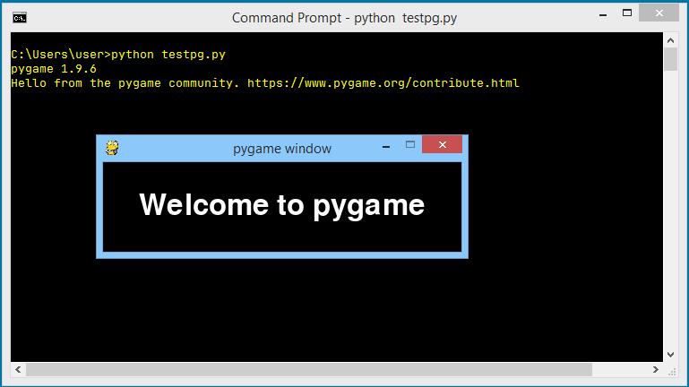


У `pip install` есть две важные дополнительные способности:

*   он может **обновить** локально установленный пакет - например, если Вы хотите убедиться, что используете последнюю версию определенного пакета, Вы можете выполнить следующую команду:  
      
    ```bash
    pip install -U package_name
    ```
      
    где `-U` означает обновление. Примечание: в этой форме команды используется параметр `--user` для той же цели, что и ранее;
  
*   он может **установить выбранную пользователем версию** пакета (по умолчанию _pip_ устанавливает **самую новую** доступную версию); чтобы сделать это, Вы должны использовать следующий синтаксис:  
      
    ```bash
    pip install package_name==package_version
    ```
      
    (обратите внимание на двойной знак равенства) например,  
      
    ```bash
    pip install pygame==1.9.2
    ```  


Если какие-либо из установленных пакетов **больше не нужны** и Вы хотите от них избавиться, _pip_ также будет полезен. Его команда `uninstall` выполнит все необходимые шаги.

Требуемый синтаксис ясен и прост:

```bash
pip uninstall package_name
```

Таким образом, если Вам больше не нужен _pygame_, Вы можете выполнить следующую команду:

```bash
pip uninstall pygame
```

_Pip_ захочет узнать, уверены ли Вы в своем выборе - будьте готовы дать правильный ответ.


Процесс выглядит так:

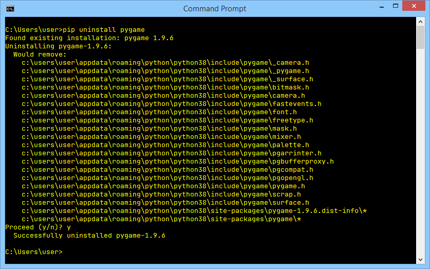


# Используйте _pip_!


Возможности _pip_ на этом не заканчиваются, но представленного нами набора команд достаточно, чтобы начать успешно управлять пакетами, которые не являются частью обычной установки Python.

Мы надеемся, что побудили Вас провести собственные эксперименты с _pip_ и вселенной пакетов Python. PyPI предлагает Вам погрузиться в его обширные ресурсы.

Некоторые говорят, что одно из самых важных достоинств программирования - это **лень**. Не поймите нас неправильно - мы не хотим, чтобы Вы весь день спали на диване и мечтали о коде Python.

Ленивый программист - это программист, который ищет существующие решения и анализирует доступный код, прежде чем начать разрабатывать собственное программное обеспечение с нуля.

Вот почему существуют PyPI и _pip_ - используйте их!


# Основные тезисы


1. **Репозиторий** (или для краткости **repo**), предназначенный для сбора и обмена бесплатным кодом Python, существует и работает под названием **Python Package Index** (**PyPI**), хотя вполне вероятно, что Вы встретите очень часто встречающееся название **The Cheese Shop**. Сайт магазина доступен по адресу [https://pypi.org/](https://pypi.org/).


2. Чтобы использовать The Cheese Shop, был создан специализированный инструмент под названием **pip** (_**p**ip **i**nstalls **p**ackages_, а _pip_ означает... впрочем, это неважно). Поскольку pip не может быть развернут как часть стандартной установки Python, возможно, Вам придется установить его вручную. Pip - это консольный инструмент.


3. Чтобы проверить версию pip, необходимо выполнить следующие команды:
    
    ```bash
    pip --version
    ```  
    
    или
    
    ```bash
    pip3 --version
    ```  
    
    Проверьте сами, что из этого работает для вас в среде вашей ОС.
    

4. Список основных команд **pip** выглядит следующим образом:

   *   `pip help operation` – показывает краткое описание _pip_;
   *   `pip list` – показывает список установленных на данный момент пакетов;
   *   `pip show package_name` – показывает информацию о _package_name_, включая зависимости пакета;
   *   `pip search anystring` – выполняет поиск в каталогах PyPI, чтобы найти пакеты, имена которых содержат _anystring_;
   *   `pip install name` – устанавливает _name_ в масштабе всей системы (ожидайте проблем, если у Вас нет прав администратора);
   *   `pip install --user name` – устанавливает _name_ только для Вас; ни один другой пользователь платформы не сможет его использовать;
   *   `pip install -U name` – обновляет ранее установленный пакет;
   *   `pip uninstall name` – удаляет ранее установленный пакет.

---

**Упражнение 1**

Откуда взялось название _The Cheese Shop_?

<details><summary>Проверка</summary>

Это отсылка к одноименному скетчу _Монти Пайтон_.

</details>

---

**Упражнение 2**

Почему Вы должны следить за тем, который из _pip_ и _pip3_ работает у Вас?

<details><summary>Проверка</summary>

Когда Python 2 и Python 3 сосуществуют в Вашей ОС, вполне вероятно, что _pip_ идентифицирует экземпляр pip, работающий только с пакетами Python 2.

</details>

---

**Упражнение 3**

Как определить, с чем работает Ваш _pip_: с Python 2 или Python 3?

<details><summary>Проверка</summary>

`pip --version` даст ответ на этот вопрос.

</details>


**Упражнение 4**

К сожалению, у Вас нет прав администратора. Что нужно сделать, чтобы установить пакет в масштабе всей системы?

<details><summary>Проверка</summary>

Вы должны попросить об этом своего _системного администратора_ - не пытайтесь взломать Вашу ОС!

</details>


# Поздравляем! Вы завершили _Основы Python 2: Модуль 1_.


Отличная работа! Вы дошли до конца Модуля 1 и завершили важный этап в своем образовании по программированию на Python. Вот краткое изложение задач, которые Вы рассмотрели и с которыми ознакомились в Модуле 1:

*   работа с модулями Python; импорт, создание и использование модулей;
*   с использованием выбранных модулей Python STL (_math_, _random_ и _platform_)
*   создание и использование пакетов в Python;
*   PIP (Python Package Installer).


Теперь Вы готовы пройти тест по модулю и выполнить последнее задание: экзамен к Модулю 1, который поможет Вам оценить то, что Вы уже изучили.


