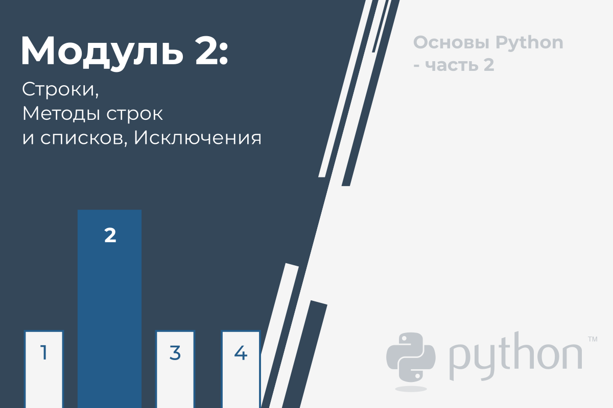
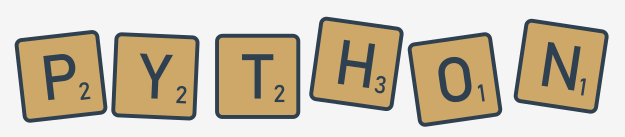
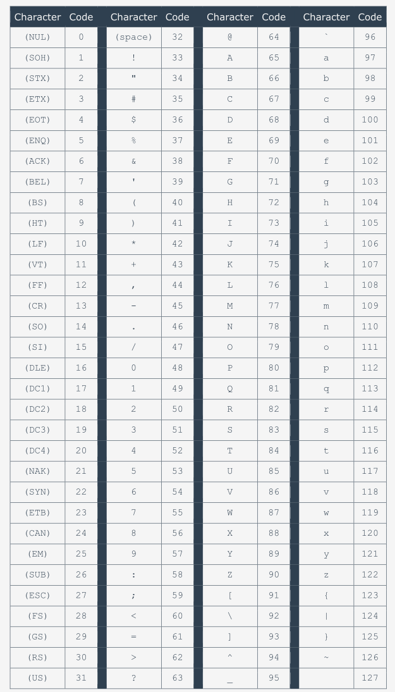
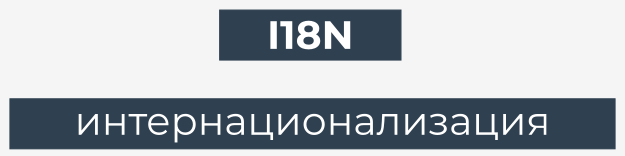
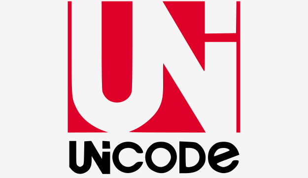
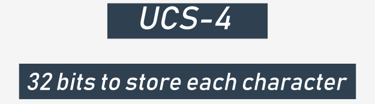
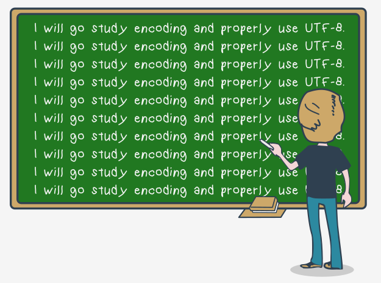

# Строки, Методы строк и списков, Исключения

В этом модуле вы узнаете о:

*   Символах, строках и стандартах кодирования;
*   Строках и списках, их сходствах и различиях;
*   Методах списков;
*   Методах строк;
*   Обработке ошибок выполнения;
*   Управлении потоком ошибок с помощью try и except;
*   Иерархии исключений.

# Как компьютеры понимают отдельные символы

С самого начала курса Вы написали несколько интересных программ, но все они обработали только один вид данных - числа. Как Вы знаете, (Вы можете видеть это везде), многие компьютерные данные не являются числами: имена, фамилии, адреса, названия, стихи, научные статьи, электронные письма, судебные решения, признания в любви и многое, многое другое.

  

Все эти данные должны храниться, вводиться, выводиться, просматриваться и преобразовываться современными компьютерами, как и любые другие данные, независимо от того, являются ли они односимвольными или многотомными энциклопедиями.

Как это возможно?

Как Вы можете сделать это в Python? Это то, что мы сейчас обсудим. Давайте начнем с того, как компьютеры понимают отдельные символы.

**Компьютеры хранят символы в виде чисел**. Каждый символ, используемый компьютером, соответствует уникальному номеру, и наоборот. Это распределение должно включать больше символов, чем Вы могли ожидать. Многие из них невидимы для людей, но необходимы для компьютеров.

Некоторые из этих символов называются **белыми символами (пробелами)**, некоторые называются **управляющими символами**, поскольку их целью является управление устройствами ввода/вывода.

Примером белого символа, который полностью невидим невооруженным глазом, является специальный код или пара кодов (разные операционные системы могут по-разному относиться к этой проблеме), которые используются для обозначения концов строк в текстовых файлах.

Люди не видят этот знак (или эти знаки), но могут наблюдать эффект от их использования в случае прерывания линий.

Мы можем создать практически любое количество пар символ-число, но жизнь в мире, в котором каждый тип компьютера использует разную кодировку символов, была бы не очень удобной. Эта система привела к необходимости введения универсального и общепринятого стандарта, применяемого (почти) всеми компьютерами и операционными системами во всем мире.

Есть стандарт **ASCII** (сокращенно **Американский стандартный код для обмена информацией**), является наиболее широко используемым, и можно предположить, что почти все современные устройства (например, компьютеры, принтеры, мобильные телефоны, планшеты и т.д.) используют этот код.

Код предоставляет место для **256 различных символов**, но нас интересуют только первые 128. Если Вы хотите увидеть, как строится код, посмотрите на таблицу ниже. Нажмите на таблицу, чтобы увеличить ее. Посмотрите на нее внимательно - есть некоторые интересные факты. Посмотрите на код наиболее распространенного символа - _пробел_. Это _32_.

  
  

Теперь проверьте код строчной буквы _a_. Это _97_. А теперь найдите заглавную букву _A_. Ее код _65_. Теперь посчитайте разницу между кодом _a_ и _A_. Это равно _32_. Это код _пробела_. Интересно, не правда ли?

Также обратите внимание, что буквы расположены в том же порядке, что и в латинском алфавите.  

# I18N

Конечно, латинского алфавита недостаточно для всего человечества. Пользователи этого алфавита находятся в меньшинстве. Необходимо было придумать что-то более гибкое и емкое, чем ASCII, что-то, что могло бы сделать все программное обеспечение в мире поддающимся **интернационализации**, потому что разные языки используют совершенно разные алфавиты, и иногда эти алфавиты не такие простые как латинский.

Слово _Internationalization - интернационализация_ обычно сокращается до **I18N**.

Почему именно так? Посмотрите внимательно - в начале слова есть _I_, затем _18_ разных букв и _N_ в конце.

Несмотря на слегка юмористическое происхождение, этот термин официально используется во многих документах и стандартах.

**Программное обеспечение I18N** является стандартом в настоящее время. Каждая программа должна быть написана так, чтобы ее можно было использовать по всему миру, среди разных культур, языков и алфавитов.

**Классическая форма кода ASCII использует восемь битов для каждого знака**. Восемь битов означают 256 разных символов. Первые 128 используются для стандартного латинского алфавита (как заглавные, так и строчные буквы). Можно ли перенести все остальные национальные символы, используемые во всем мире, в оставшиеся 128 позиций?

Нет. Это не так.

## Кодовые позиции и кодовые страницы

Теперь нам нужен новый термин: **кодовая позиция**.

Кодовая позиция - это **число, которое создает символ**. Например, _32_ - это кодовая позиция, которая создает _пробел_ в кодировке ASCII. Можно сказать, что стандартный код ASCII состоит из 128 кодовых позиций.

Поскольку стандарт ASCII занимает 128 из 256 возможных кодовых позиций, Вы можете использовать только оставшиеся 128.

Этого недостаточно для всех возможных языков, но может быть достаточно для одного языка или для небольшой группы похожих языков.

Можно ли **определить верхнюю половину кодов по-разному для разных языков**? Да, можно. Такая концепция называется **кодовой страницей**.

Кодовая страница - это **стандарт для использования верхних 128 кодовых позиций для хранения определенных национальных символов**. Например, существуют разные кодовые страницы для Западной Европы и Восточной Европы, кириллицы и греческого алфавита, арабского и иврита и т.д.

Это означает, что одна и та же кодовая позиция может содержать разные символы при использовании на разных кодовых страницах.

Например, кодовая позиция _200_ определят Č (буква, используемая некоторыми славянскими языками) при использовании кодовой страницей ИСО/МЭК 8859-2, и составляет &x428; (кириллица) при использовании кодовой страницы ISO/IEC 8859-5.

Следовательно, чтобы определить значение конкретной кодовой позиции, Вы должны знать целевую кодовую страницу.

Другими словами, кодовые позиции, полученные из кода концепции страницы, неоднозначны.

# Unicode

Кодовые страницы помогли компьютерной индустрии решить проблемы I18N в течение некоторого времени, но вскоре выяснилось, что они не будут постоянным решением.

Концепция, которая решила проблему в долгосрочной перспективе, был **Unicode**.

  

**Unicode назначает уникальные (однозначные) символы (буквы, дефисы, иероглифы и т.д.) Более чем миллиону кодовых точек**. Первые 128 кодовых точек Unicode идентичны ASCII, а первые 256 кодовых точек Unicode идентичны кодовой странице ISO/IEC 8859-1 (кодовая страница, предназначенная для западноевропейских языков).

## UCS-4

Стандарт Unicode ничего не говорит о том, как кодировать и хранить символы в памяти и файлах. Он только называет все доступные символы и назначает их плоскостям (группа символов схожего происхождения, приложения или природы).

  

Существует более одного стандарта, описывающего методы, используемые для реализации Unicode на реальных компьютерах и компьютерных системах хранения. Наиболее общим из них является **UCS-4**.

Название происходит от **универсального набора символов**.

**UCS-4 использует 32 бита (четыре байта) для хранения каждого символа**, а код - это просто уникальный номер кодовых точек Unicode. Файл, содержащий кодированный в UCS-4 текст, может начинаться с BOM (метки порядка байтов), непечатаемой комбинации битов, объявляющих природу содержимого файла. Некоторые утилиты могут требовать этого.

Как видите, UCS-4 является довольно расточительным стандартом - он увеличивает размер текста в четыре раза по сравнению со стандартным ASCII. К счастью, существуют более разумные формы кодирования текстов в Юникоде.

## UTF-8

Одним из наиболее часто используемых является **UTF-8**.

Название происходит от **формата преобразования Unicode**.

Концепция очень умная. **UTF-8 использует столько битов для каждой кодовой точки, сколько необходимо для их представления**.

  

Например:

*   все латинские символы (и все стандартные символы ASCII) занимают восемь битов;
*   нелатинские символы занимают 16 бит;
*   Идеографы CJK (Китай-Япония-Корея) занимают 24 бита.

Из-за особенностей метода, используемого UTF-8 для хранения кодовых точек, нет необходимости использовать спецификацию, но некоторые инструменты ищут ее при чтении файла, и многие редакторы настраивают ее во время сохранения.

Python 3 полностью поддерживает Unicode и UTF-8:

*   вы можете использовать символы в кодировке Unicode/UTF-8 для именования переменных и других объектов;
*   вы можете использовать их во время всего ввода и вывода.

Это означает, что Python3 полностью интернационализирован.

# Основные тезисы

1. Компьютеры хранят символы в виде чисел. Существует несколько возможных способов кодирования символов, но лишь некоторые из них получили всемирную популярность и широко используются в IT: это **ASCII** (используется в основном для кодирования латинского алфавита и некоторых его производных). и **UNICODE** (способный кодировать практически все алфавиты, используемые людьми).

2. Число, соответствующее определенному символу, называется **кодовой позицией**.

3. UNICODE использует разные способы кодирования, когда дело доходит до хранения символов с использованием файлов или памяти компьютера: два из них - **UCS-4** и **UTF-8** (последний является наиболее распространенным, поскольку он тратит меньше места в памяти).

---

**Упражнение 1**

Что такое BOM?

Проверка

**BOM** (Byte Order Mark) - это специальная комбинация битов, объявляющая кодировку, используемую содержимым файла (например, UCS-4 или UTF-B).

  

---

**Упражнение 2**

Python 3 интернационализирован?

Проверка

Да, он полностью интернационализирован - мы можем использовать символы UNICODE внутри нашего кода, читать их со ввода и отправлять на вывод.

