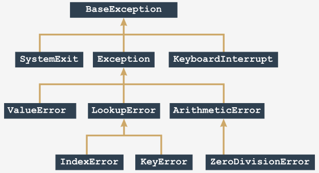

# Исключения


Python 3 определяет **63 встроенных исключения**, и все они образуют **древовидную иерархию**, хотя дерево немного странное, поскольку его корень расположен на сверху.

Некоторые из встроенных исключений носят более общий характер (они включают в себя другие исключения), в то время как другие являются конкретными (они представляют только себя). Можно сказать, что **чем ближе к корню находится исключение, тем более общим (абстрактным) оно является**. В свою очередь, исключения, расположенные на концах ветвей (мы можем назвать их **листьями**), являются конкретными.

Посмотрите на рисунок:

  


Он показывает небольшой раздел полного дерева исключений. Давайте начнем рассматривать дерево с листа ZeroDivisionError.


Примечание:

*   `ZeroDivisionError` - это частный случай более общего класса исключений с именем ArithmeticError;
*   `ArithmeticError` - это частный случай более общего класса исключений с именем Exception;
*   `Exception` - это частный случай более общего класса с именем BaseException.

Мы можем описать это следующим образом (обратите внимание на направление стрелок - они всегда указывают на более общий объект):

```
BaseException  
↑  
Exception  
↑  
ArithmeticError  
↑  
ZeroDivisionError
```

Мы собираемся показать Вам, как работает это обобщение. Давайте начнем с очень простого кода.

```python
try:
    y = 1 / 0
except ZeroDivisionError:
    print("Ой...")

print("Конец.")

```

Посмотрите на код. Это простой пример для того, чтобы начать. Запустите его.

Результат, который мы ожидаем увидеть, выглядит следующим образом:

```
Ой...
Конец.
```

Теперь посмотрите на код ниже:

```python
try:
    y = 1 / 0
except [!mark!]ArithmeticError[!/mark!]:
    print("Ой...")

print("Конец.")

```

Что изменилось в нем - мы заменили `ZeroDivisionError` на `ArithmeticError`.

Как мы уже знаем, `ArithmeticError` - общий класс, который включает в себя (среди прочих) исключение `ZeroDivisionError`.

Таким образом, вывод кода остается неизменным. Протестируйте его.

Это также означает, что замена имени исключения на `Exception` или `BaseException` не меняет поведения программы.


Подведем итоги:

*   каждое возникшее исключение **попадает в первую соответствующую ветвь**;
*   соответствующая ветвь необязательно должна точно указывать одно и то же исключение - достаточно, чтобы исключение было **более общим** (более абстрактным), чем созданное.


Посмотрите на код. Что в нем происходит?

```python
try:
    y = 1 / 0
except ZeroDivisionError:
    print("Деление на ноль!")
except ArithmeticError:
    print("Арифметическая ошибка!")

print("Конец.")

```

Первая подходящая ветвь - содержащая `ZeroDivisionError`. Это означает, что консоль покажет:

```
Деление на ноль!
Конец.
```

Изменится ли что-нибудь, если мы поменяем местами две ветви `except`?

```python
try:
    y = 1 / 0
except ArithmeticError:
    print("Арифметическая ошибка!")
except ZeroDivisionError:
    print("Деление на ноль!")

print("Конец.")

```

Произошли радикальные изменения - теперь вывод кода выглядит так:

```
Арифметическая ошибка!
Конец.
```

Почему, если возникшее исключение такое же, как и раньше?

Исключение то же самое, но более общее исключение теперь находится первым в списке - оно также перехватит все деления на ноль. Это также означает, что нет никаких шансов, что какое-либо исключение попадет в ветку `ZeroDivisionError`. Эта ветка теперь совершенно нерабочая.

Помните:

*   порядок ветвей имеет значение!
*   не ставьте более общие исключения перед более конкретными;
*   это сделает последние недоступными и бесполезными;
*   кроме того, это сделает Ваш код тяжелым и непоследовательным;
*   Python не будет генерировать никаких сообщений об ошибках по этому поводу.


Если Вы хотите **обрабатывать два или более исключений**, Вы можете использовать следующий синтаксис:

```python
try:
    :
except ([!mark!]exc1, exc2[!/mark!]):
    :

```

Вы просто должны поместить все имена задействованных исключений в список через запятую и не забыть скобки.


Если **исключение возникает внутри функции**, его можно обработать:

*   внутри функции;
*   вне функции.


Давайте начнем с первого варианта - посмотрите на код.

```python
def bad_fun(n):
    try:
        return 1 / n
    except ArithmeticError:
        print("Арифметическая ошибка!")
    return None

bad_fun(0)

print("Конец.")

```

Исключение `ZeroDivisionError` (являющееся частным случаем класса исключений `ArithmeticError`) возникает внутри функции `badfun()`, и оно не покидает функцию - сама функция заботится об этом.

Вывод программы:

```
Арифметическая ошибка!
Конец.
```

Также возможно обрабатывать исключение **вне функции**. Давайте попробуем.

Посмотрите на код ниже:

```python
def bad_fun(n):
    return 1 / n

try:
    bad_fun(0)
except ArithmeticError:
    print("Что произошло? Возникло исключение!")

print("Конец.")

```

Проблема должна быть решена тем, что вызывает исключение.

Программа выводит:

```
Что произошло? Возникло исключение!
Конец.
```


Примечание. Возникшее **исключение может выходить за границы функций и модулей** и перемещаться по цепочке вызовов в поисках соответствующего выражения `except`, способного его обработать.

Если такого выражения нет, исключение остается необработанным и Python решает проблему стандартным способом, **завершая код и отправляя диагностическое сообщение**.

Теперь мы собираемся приостановить это обсуждение, поскольку хотим представить Вам совершенно новую инструкцию Python.


Инструкция `raise` вызывает указанное исключение с именем `exc` как если бы она была вызвана обычным способом:

```python
raise exc
```  

Примечание: `raise` - это ключевое слово.

Инструкция позволяет Вам:

*   **имитировать вызов реальных исключений** (например, для проверки стратегии обработки);
*   частично **обработать исключение** и переложить на другую часть кода ответственность за завершение обработки (разделение задач).

Посмотрите на код. Вот как Вы можете использовать это на практике.

```python
def badFun(n):
    raise ZeroDivisionError


try:
    badFun(0)
except ArithmeticError:
    print("Что произошло? Возникла ошибка!")

print("Конец.")

```

Вывод программы остается неизменным.

Таким образом, Вы можете **протестировать свою процедуру обработки исключений**, не заставляя код делать глупости.


Инструкция `raise` может также использоваться следующим образом (обратите внимание на отсутствие названия исключения):

```python
raise
``` 

Есть одно серьезное ограничение: этот вид инструкции `raise` может использоваться **только внутри ветви `except`**; использование его в любом другом контексте приводит к ошибке.


Инструкция немедленно вызовет то же исключение, что и обрабатываемое в настоящий момент.


Благодаря этому Вы можете распределять обработку исключений по различным частям кода.

Посмотрите на код. Запустите его - мы увидим это в действии.

```python
def bad_fun(n):
    try:
        return n / 0
    except:
        print("Я снова это сделал!")
        raise


try:
    bad_fun(0)
except ArithmeticError:
    print("Я вижу!")

print("Конец.")

```

`ZeroDivisionError` вызвано дважды:

*   первый раз - внутри блока `try` (это вызвано фактическим делением на ноль);
*   второй - внутри блока `except` с помощью инструкции `raise`.


По сути, код выводит:

```
Я снова это сделал!
Я вижу!
Конец.
```

Сейчас хороший момент, чтобы показать Вам еще одну инструкцию Python с именем `assert`. Это ключевое слово.

```python
assert expression
```  

Как оно работает?

*   оно считает выражение;
*   если выражение оценивается как `True`, или ненулевое числовое значение, или непустая строка, или любое другое значение, отличное от `None`, оно ничего не делает;
*   в противном случае оно автоматически и сразу вызывает исключение с именем `AssertionError` (в этом случае мы говорим, что утверждение неверно).


Как это можно использовать?

*   Вы можете захотеть поместить его в свой код, где Вы хотите быть **абсолютно защищенными от явно неправильных данных**, и когда Вы не совсем уверены, что данные были тщательно проверены ранее (например, внутри функции используется кем-то еще);
*   вызов исключения `AssertionError` защищает Ваш код от получения недопустимых результатов и четко показывает природу ошибки;
*   **`assert` не заменяет исключений и не проверяет данные**, является их дополнением.


Если исключения и проверка данных похожи на осторожное вождение, `assert` может играть роль подушки безопасности.


Давайте посмотрим инструкцию `assert` в действии. Посмотрите на код. Запустите его.

```python
import math

x = float(input("Введите число: "))
assert x >= 0.0

x = math.sqrt(x)

print(x)

```

Программа работает без сбоев, если Вы введете правильное числовое значение, большее или равное нулю, в противном случае она останавливается и выдает следующее сообщение:

```
Traceback (most recent call last):
  File ".main.py", line 4, in 
    assert x >= 0.0
AssertionError
```
  
  
# Основные тезисы


1. Вы не можете добавить более одной анонимной (безымянной) ветки `except` после названных.
    
    ```python
    :
    # Код, который всегда работает без сбоев.
    :
    try:
        :
        # Рискованный код.
        :
    except Except_1:
        # Кризисное управление происходит здесь.
    except Except_2:
        # Спасаем мир здесь.
    except:
        # Все остальные ошибки обрабатываются здесь.
    :
    # Возвращение к нормальному выполнению.
    :
    ```

2. Все предопределенные исключения Python образуют иерархию, т.е. некоторые из них являются более общими (`BaseException` является наиболее общим), в то время как другие более или менее конкретны (например, `IndexError` более конкретно, чем `LookupError`).
    
    Не следует помещать более конкретные исключения под более общими исключениями внутри той же последовательности ветвей `except`. Например, Вы можете сделать так:
    
    ```python
    try:
        # Рискованный код.
    except IndexError:
        # Обработка неправильно составленных списков
    except LookupError:
        # Работа с другими ошибками поиска
    
    ```
    
    но не делайте так (если Вы не уверены, что хотите, чтобы какая-то часть вашего кода была бесполезной)
    
    ```python
    try:
        # Рискованный код.
    except LookupError:
        # DРабота с ошибками поиска
    except IndexError:
        # Этот блок никогда не выполнится 
    
    ```

3. Оператор `raise ExceptionName` может вызывать исключение по запросу. Тот же оператор, но без _ExceptionName_, может использоваться **только** внутри ветви `try` и вызывает то же исключение, которое в настоящее время обрабатывается.


4. Оператор `assert expression` оценивает _expression_ и вызывает исключение `AssertError`, когда _expression_ равно нулю, пустой строке или `None`. Вы можете использовать его для защиты некоторых критических частей вашего кода от разрушительных данных.


---

**Упражнение 1**

Каков ожидаемый вывод следующего кода?

```python
try:
    print(1/0)
except ZeroDivisionError:
    print("zero")
except ArithmeticError:
    print("arith")
except:
    print("some")

```

<details><summary>Проверка</summary>

```
zero
```

</details>

---

**Упражнение 2**

Каков ожидаемый вывод следующего кода?

```python
try:
    print(1/0)
except ArithmeticError:
    print("arith")
except ZeroDivisionError:
    print("zero")
except:
    print("some")

```

<details><summary>Проверка</summary>

```
arith
```

</details>

---

**Упражнение 3**

Каков ожидаемый вывод следующего кода?

```python
def foo(x):
    assert x
    return 1/x


try:
    print(foo(0))
except ZeroDivisionError:
    print("zero")
except:
    print("some")

```

<details><summary>Проверка</summary>

```
some
```

</details>


