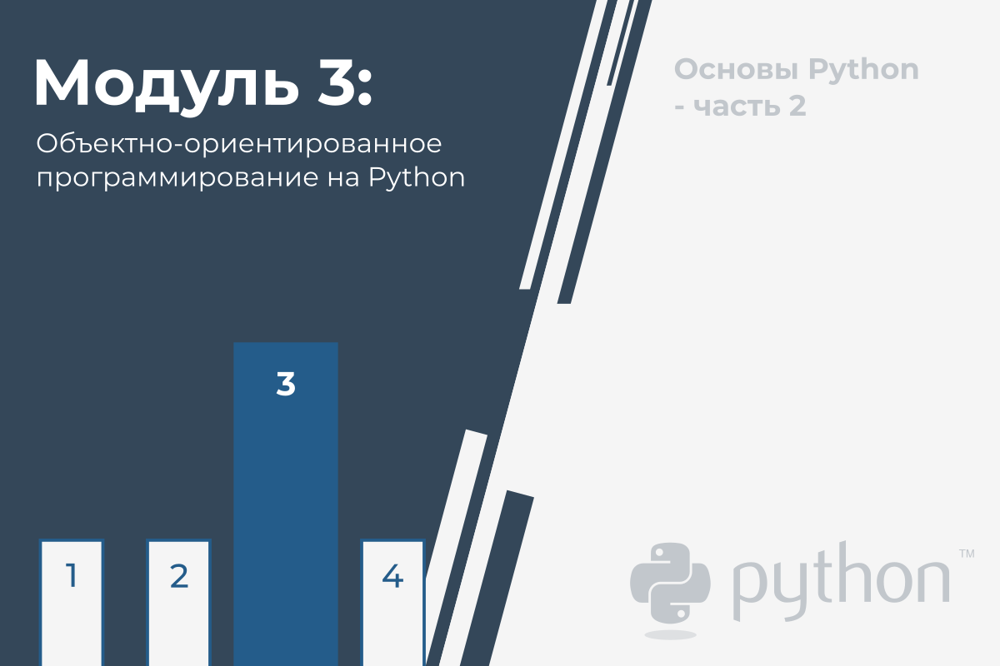
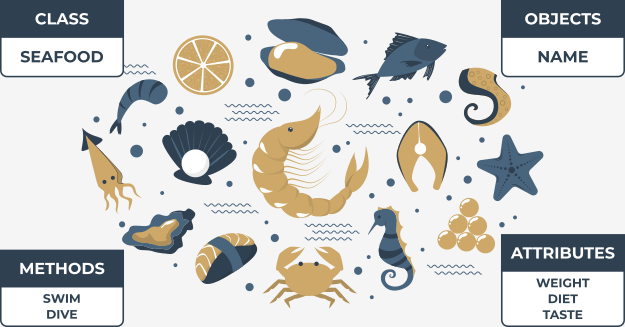
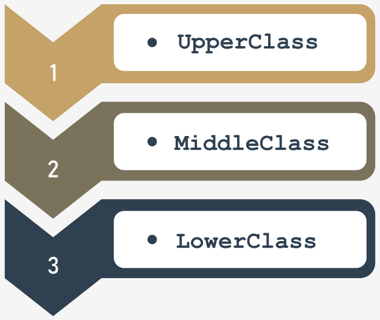
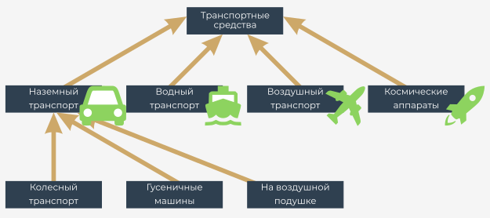
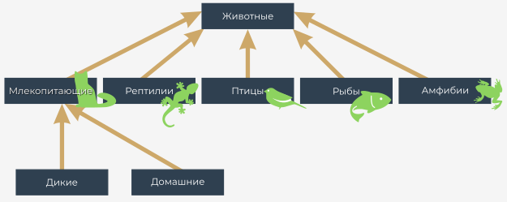
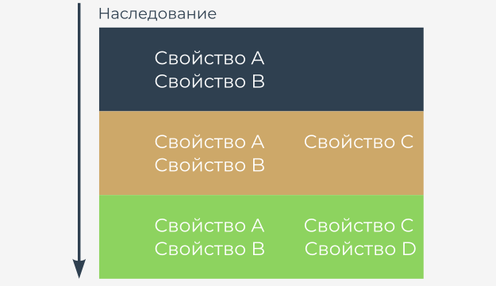
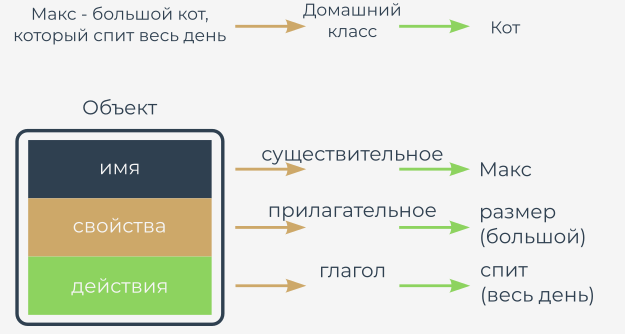

# Объектно-ориентированное программирование

В этом модуле Вы познакомитесь с:

*   Базовыми концепциями объектно-ориентированного программирования (OOП);
*   Различиями между процедурным и объектным подходами (мотивация и выгоды);
*   Классами, объектами, свойствами и методами;
*   Проектированием повторно используемых классов и создание объектов;
*   Наследованием и полиморфизмом;
*   Исключениями как объектами.





# Основные понятия объектно-ориентированного метода


Давайте сделаем шаг за пределы компьютерного программирования, и компьютеров в целом и обсудим вопросы объектного программирования.

Почти все программы и методы, которые Вы использовали до сих пор, подпадают под процедурный стиль программирования. Следует признать, что Вы использовали некоторые встроенные объекты, но, ссылаясь на них, мы только что упомянули абсолютный минимум.

Процедурный стиль программирования был доминирующим подходом в разработке программного обеспечения в течение десятилетий, и он все еще используется сегодня. Более того, он не исчезнет в будущем, так как он работает очень хорошо для конкретных типов проектов (как правило, не очень сложных и не больших, но есть много исключений из этого правила).

Объектный подход довольно молод (намного моложе процедурного) и особенно полезен, когда применяется к большим и сложным проектам, выполняемым большими командами, состоящими из множества разработчиков.

Такое понимание структуры проекта облегчает многие важные задачи, например, деление проекта на маленькие, независимые части и независимую разработку различных элементов проекта.

**Python - это универсальный инструмент как для объектного, так и для процедурного программирования**. Это может быть успешно использовано в обеих сферах.


Кроме того, Вы можете создавать множество полезных приложений, даже если Вы ничего не знаете о классах и объектах, но Вы должны помнить, что некоторые проблемы (например, обработка графического интерфейса пользователя) могут потребовать объектного метода.

К счастью, объектное программирование относительно простое.





# Процедурный и объектно-ориентированный подходы

В **процедурном подходе** можно различить два отдельных и совершенно разных мира: **мир данных и мир кода**. Мир данных заполнен переменными различного рода, а мир кода населен кодом, сгруппированным в модули и функции.

Функции могут использовать данные, но не наоборот. Кроме того, функции могут злоупотреблять данными, то есть использовать значение недопустимым образом (например, когда функция синуса получает баланс банковского счета в качестве параметра).

В прошлом мы говорили, что данные не могут использовать функции. Но так ли это? Существуют ли какие-то особые виды данных, которые могут использовать функции?

Да, есть - они называются методами. Это функции, которые вызываются из данных, а не наравне с ними. Если Вы видите это различие, Вы сделали первый шаг в объектном программировании.

**Объектный подход** предлагает совершенно другой способ мышления. Данные и код объединены в одном мире, но разделены на классы.

Каждый **класс подобен рецепту, который можно использовать, когда вы хотите создать полезный объект** (отсюда и название подхода). Вы можете создать столько объектов, сколько Вам нужно для решения Вашей задачи.

Каждый объект имеет набор характеристик (они называются свойствами или атрибутами - мы будем использовать оба слова как синонимы) и способен выполнять набор действий (которые называются методами).

Рецепты могут быть изменены, если они не подходят для конкретных целей и, по сути, могут быть созданы новые классы. Эти новые классы наследуют свойства и методы от оригиналов и обычно добавляют некоторые новые, создавая новые, более специфические инструменты.


**Объекты - это воплощения** идей, выраженных в классах, например, чизкейк на тарелке - воплощение идеи, выраженной в рецепте, напечатанном в старой кулинарной книге.

Объекты взаимодействуют друг с другом, обмениваясь данными или активируя свои методы. Правильно сконструированный класс (и, следовательно, его объекты) способен защищать важные данные и скрывать их от несанкционированных изменений.

Между данными и кодом нет четкой границы: они живут как единое целое в объектах.

Все эти понятия не так абстрактны, как Вы можете сначала подумать. Напротив, все они взяты из опыта реальной жизни и, следовательно, чрезвычайно полезны в компьютерном программировании: они не создают искусственную жизнь - они **отражают реальные факты, отношения и обстоятельства**.





# Иерархии классов

Слово _класс_ имеет много значений, но не все они совместимы с идеями, которые мы хотим обсудить здесь. _Класс_, который нас интересует, похож на _категорию_, как результат точно определенного сходства.

Мы попытаемся показать несколько классов, которые являются хорошими примерами этой концепции.




Давайте немного посмотрим на транспортные средства. Все существующие транспортные средства (и те, которые еще не существуют) **связаны одной важной функцией**: способностью двигаться. Вы можете утверждать, что собака тоже двигается; собака - это транспортное средство? Нет, это не так. Мы должны улучшить определение, то есть обогатить его другими критериями, отличающими транспортные средства от других предметов и создающими более прочную связь. Давайте рассмотрим следующие обстоятельства: транспортные средства - это искусственно созданные объекты, используемые для перевозки, движимые силами природы, и управляемые людьми.

Исходя из этого определения, собака не является транспортным средством.

Класс _транспортные средства_ очень широк. Слишком широк. Мы должны определить еще несколько **специализированных классов**. Специализированные классы - это **подклассы**. Класс _транспортные средства_ станет **суперклассом** для них всех.


Примечание: **иерархия растет сверху вниз, как корни деревьев, а не ветви**. Самый общий и самый широкий класс всегда находится вверху (суперкласс), а его потомки расположены ниже (подклассы).

К настоящему времени Вы, вероятно, можете указать на некоторые потенциальные подклассы для суперкласса _транспортные средства_. Есть много возможных классификаций. Мы выбрали подклассы на основе среды и говорим, что есть (как минимум) четыре подкласса:

*   наземные транспортные средства;
*   водные транспортные средства;
*   воздушные транспортные средства;
*   космические аппараты.

В этом примере мы обсудим только первый подкласс - наземные транспортные средства. Если Вы хотите, можете продолжить с оставшимися классами.

Наземные транспортные средства могут быть дополнительно разделены в зависимости от метода, которым они воздействуют на землю. Итак, мы можем перечислить:

*   колесные транспортные средства;
*   гусеничные машины;
*   транспортные средства на воздушной подушке.

Иерархия, которую мы создали, иллюстрируется рисунком.

Обратите внимание на направление стрелок - они всегда указывают на суперкласс. Класс верхнего уровня является исключением - он не имеет своего суперкласса.

Еще один пример - иерархия таксономического царства животных.

Можно сказать, что все _животные_ (наш класс верхнего уровня) можно разделить на пять подклассов:

*   млекопитающие;
*   рептилии;
*   птицы;
*   рыбы;
*   амфибии.

Мы возьмем первый для дальнейшего анализа.

Мы определили следующие подклассы:

*   дикие млекопитающие;
*   одомашненные млекопитающие.

  
  


Попробуйте расширить иерархию так, как Вы хотите, и найдите подходящее место для людей.


# Что такое объект?

Класс (среди прочих определений) - это **набор объектов**. Объект - это **существо, принадлежащее классу**.

Объект - это **воплощение требований, черт и качеств, присвоенных определенному классу**. Это может показаться простым, но обратите внимание на следующие важные обстоятельства. Классы образуют иерархию. Это может означать, что объект, принадлежащий определенному классу, принадлежит всем суперклассам одновременно. Это также может означать, что любой объект, принадлежащий суперклассу, может не принадлежать ни одному из его подклассов.

Например: любой личный автомобиль - это объект, принадлежащий к классу _колесных транспортных средств_. Это также означает, что один и тот же автомобиль принадлежит всем суперклассам своего домашнего класса; следовательно, он также является членом класса _транспортное средство_. Ваша собака (или Ваша кошка) является объектом, включенным в класс _одомашненных млекопитающих_, что явно означает, что он также включен в класс _животные_.

Каждый **подкласс является более специализированным** (или более конкретным), чем его суперкласс. И наоборот, каждый **суперкласс является более общим** (более абстрактным), чем любой из его подклассов. Обратите внимание, что мы предположили, что у класса может быть только один суперкласс - это не всегда так, но мы обсудим эту проблему чуть позже.


# Наследование

Давайте определим одну из фундаментальных концепций объектного программирования, названную **наследование**. Любой объект, связанный с определенным уровнем иерархии классов, **наследует все черты (а также требования и качества), определенные внутри любого из суперклассов**.

Класс объекта может определять новые черты (а также требования и качества), которые будут наследоваться любым из его суперклассов.

  


У Вас не должно возникнуть проблем с сопоставлением этого правила с конкретными примерами, не важно, относятся они к животным или к транспортным средствам.


# Что есть у объекта?

Конвенция объектно-ориентированного программирования предполагает, что **каждый существующий объект может быть снабжен тремя группами атрибутов**:

*   объект имеет **имя**, которое однозначно идентифицирует его в своем домашнем пространстве имен (хотя могут быть и некоторые анонимные объекты);
*   объект имеет **набор отдельных свойств**, которые делают его оригинальным, уникальным или выдающимся (хотя некоторые объекты могут вообще не иметь свойств);
*   объект обладает **набором способностей для выполнения определенных действий**, способных изменить сам объект или некоторые другие объекты.


Есть подсказка (хотя она не всегда работает), которая может помочь вам определить любую из трех сфер выше. Всякий раз, когда Вы описываете объект и используете:

*   существительное - вы, вероятно, определяете имя объекта;
*   прилагательное - вы, вероятно, определяете свойство объекта;
*   глагол - вы, вероятно, определяете действие объекта.

Хорошим примером должны служить две типовые фразы:

*   Розовый Кадиллак быстро поехал.  
      
    Имя объекта = Кадиллак  
    Домашний класс = колесное транспортное средство  
    Свойство = цвет (розовый)  
    Действие = поехал (быстро)


  
*   Макс - большой кот, который спит весь день.  
      
    Имя объекта = Макс  
    Класс = кот  
    Свойство = размер (большой)  
    Действие = спит (весь день)  
      
    
  
  


# Ваш первый класс


Объектное программирование - это **искусство определения и расширения классов**. Класс - это модель очень специфической части реальности, отражающая свойства и действия, встречающиеся в реальном мире.

Классы, определенные в начале, являются слишком общими и неточными, чтобы охватить как можно большее количество реальных случаев.

Нет никаких препятствий для определения новых, более точных подклассов. Они унаследуют все от своего суперкласса, поэтому работа, затраченная на его создание, не пропадет даром.

Новый класс может добавлять новые свойства и новые действия, и поэтому может быть более полезным в конкретных приложениях. Очевидно, что он может использоваться в качестве суперкласса для любого количества вновь создаваемых подклассов.

Процесс необязательно должен иметь конец. Вы можете создать столько классов, сколько вам нужно.


Определенный вами класс не имеет ничего общего с объектом: **существование класса не означает, что любой из совместимых объектов будет создан автоматически**. Сам класс не может создать объект - Вы должны создать его самостоятельно, и Python позволяет Вам сделать это.

Пришло время определить самый простой класс и создать объект. Посмотрите на пример ниже:

```python
class TheSimplestClass:
    pass

```

Мы определили класс. Класс довольно простой: у него нет ни свойств, ни деятельности. На самом деле он **пуст**, но пока это не имеет значения. Чем проще класс, тем лучше для наших целей.

**Определение начинается с ключевого слова `class`**. За ключевым словом следует идентификатор, **который будет называть класс** (примечание: не путайте его с именем объекта - это две разные вещи).

Затем Вы добавляете **двоеточие** (`:`), поскольку классы, как и функции, образуют собственный вложенный блок. Содержимое внутри блока определяет все свойства и действия класса.

Ключевое слово `pass` заполняет класс ничем в нашем случае. Он не содержит никаких методов или свойств.


## Ваш первый объект

Вновь определенный класс становится инструментом, способным создавать новые объекты. Инструмент должен использоваться явно по требованию.

Представьте, что Вы хотите создать один (ровно один) объект класса `TheSimplestClass`.

Для этого Вам нужно назначить переменную для хранения вновь созданного объекта этого класса и одновременно создать объект.

Вы делаете это следующим образом:

```python
my_first_object = TheSimplestClass()

```

Примечание:

*   имя класса пытается сделать вид, что это функция - вы это видите? Мы скоро это обсудим;
*   вновь созданный объект оснащен всем, что приносит класс; так как этот класс совершенно пустой, объект тоже пустой.


Акт создания объекта выбранного класса также называется **экземпляром** (поскольку объект становится **экземпляром класса**).

Давайте ненадолго оставим классы в покое, так как сейчас мы скажем Вам несколько слов о _стеках_. Мы знаем, что концепция классов и объектов может быть еще не полностью ясна. Не волнуйтесь, мы все объясним очень скоро.


# Основные тезисы


1. **класс** - это идея (более или менее абстрактная), которую можно использовать для создания ряда воплощений - такое воплощение называется **объектом**.


2. Когда класс является производным от другого класса, их отношение называется **наследованием**. Класс, производный от другого класса, называется **подклассом**. Вторая сторона этого отношения называется **суперклассом**. Способ представить такое отношение - это **диаграмма наследования**, где:

   *   суперклассы всегда представлены **над** их подклассами;
   *   отношения между классами показаны стрелками, направленными **от подкласса к его суперклассу**.


3. Объекты имеют:

   *   **Имя**, которое их идентифицирует и позволяет нам различать их;
   *   Набор **свойств** (может быть пустым)
   *   Набор **методов** (также может быть пустым)


4. Чтобы определить класс Python, Вам нужно использовать ключевое слово `class`. Например:
    
    ```python
    class This_Is_A_Class:
         pass
    
    ```

5. Чтобы создать объект определенного ранее класса, Вам нужно использовать класс, как если бы он был функцией. Например:
    
    ```python
    this_is_an_object = This_Is_A_Class()
    
    ```

---

**Упражнение 1**

Если мы предположим, что питоны, гадюки и кобры являются подклассами одного и того же суперкласса, как бы Вы его назвали?

<details><summary>Проверка</summary>

Змея, рептилия, позвоночное, животное – все эти ответы приемлемы.

</details>  

---

**Упражнение 2**

Попробуйте назвать несколько подклассов класса Питон.

<details><summary>Проверка</summary>

Индийский питон, африканский каменный питон, шаровидный питон, бирманский питон - список длинный.

</details>  

---

**Упражнение 3**

Можно ли назвать один из Ваших классов просто "class"?

<details><summary>Проверка</summary>

Нет, нельзя – class - это ключевое слово!

</details>  


