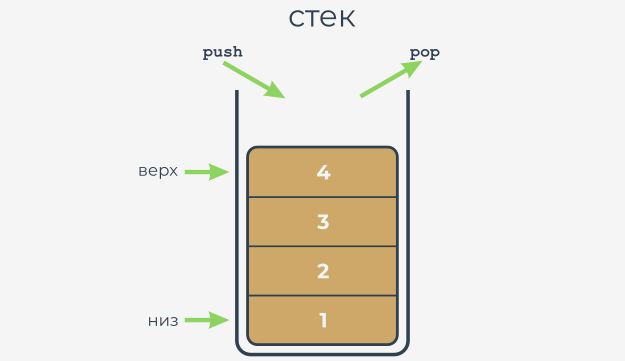
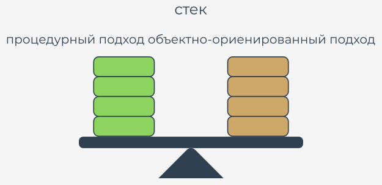

# Что такое стек?


**Стек - это структура, разработанная для очень специфического хранения данных**. Представьте себе стопку монет. Вы не можете положить монету нигде, кроме как на вершине стека. Точно так же Вы не можете получить монету из стека из любого места, кроме вершины стека. Если Вы хотите получить монету, лежащую на дне, Вы должны убрать все монеты с более высоких уровней.

Альтернативное имя для стека (но только в терминологии IT) - **LIFO**. Это аббревиатура для очень четкого описания поведения стека: **Last In - First Out**. Монета, которая пришла последней в стек, уйдет первой.

**Стек - это объект** с двумя элементарными операциями, условно именуемыми **push** (когда новый элемент помещается сверху) и **pop** (когда существующий элемент убирается сверху).

Стеки очень часто используются во многих классических алгоритмах, и трудно представить реализацию многих широко используемых инструментов без использования стеков.

  
  


Давайте реализуем стек в Python. Это будет очень простой стек, и мы покажем Вам, как это сделать, используя два независимых подхода: процедурный и объектный.

Давайте начнем с первого.


# Стек - процедурный подход


Сначала Вы должны решить, как хранить значения, которые поступят в стек. Мы предлагаем использовать самые простые методы и **список** для этой работы. Предположим, что размер стека никак не ограничен. Предположим также, что последний элемент списка хранит верхний элемент.

Сам стек уже создан:

```python
stack = []

```  

Мы готовы **определить функцию, которая помещает значение в стек**. Вот предпосылки для этого:

*   имя функции - `push`;
*   функция получает один параметр (это значение для помещения в стек);
*   функция ничего не возвращает;
*   функция добавляет значение параметра в конец стека.


Вот как мы это сделали - посмотрите:

```python
def push(val):
    stack.append(val)

```

Теперь пришло время функции **извлечь значение из стека**. Вот как Вы можете это сделать:

*   название функции - `pop`;
*   функция не получает никаких параметров;
*   функция возвращает значение, взятое из стека;
*   функция считывает значение с вершины стека и удаляет его.

Вот наша функция:

```python
def pop():
    val = stack[-1]
    del stack[-1]
    return val

```

Примечание: функция не проверяет наличие какого-либо элемента в стеке.

Давайте соберем все части вместе, чтобы привести стек в движение. **Полная программа** помещает три числа в стек, получает их из него и выводит их значения на экран.

```python
stack = []

def push(val):
    stack.append(val)


def pop():
    val = stack[-1]
    del stack[-1]
    return val

push(3)
push(2)
push(1)

print(pop())
print(pop())
print(pop())

```

Программа выводит следующий текст на экран:

```
1
2
3
```

Проверьте это.

  
# Стек - процедурный подход против объектно-ориентированного подхода

Процедурный стек готов. Конечно, есть некоторые слабые стороны, и реализация может быть улучшена многими способами (использование исключений для работы - хорошая идея), но в целом стек полностью реализован, и Вы можете использовать его, если хотите.

Но чем чаще Вы его используете, тем больше у Вас будет недостатков. Вот некоторые из них:

*   основная переменная (список стека) очень **уязвима**; любой может изменить его неконтролируемым образом, фактически разрушив стек; это не означает, что это было сделано злонамеренно - наоборот, это может произойти в результате небрежности, например, когда кто-то путает имена переменных; представьте, что Вы случайно написали что-то вроде этого:  
          
    ```python
    stack[0] = 0
    ```
    
    Функционирование стека будет полностью дезорганизовано;
  
*   может также случиться, что однажды Вам понадобится более одного стека; Вам придется создать еще один список для хранения стека и, возможно, другие функции `push` и `pop`;
  
*   может также случиться так, что Вам понадобятся не только функции `push` и `pop`, но и некоторые другие средства; Вы, конечно, можете их реализовать, но попытайтесь представить, что произойдет, если у Вас будут десятки отдельно реализованных стеков.


Объектный подход обеспечивает решение для каждой из вышеуказанных проблем. Давайте сначала назовем их:

*   возможность скрывать (защищать) выбранные значения от несанкционированного доступа называется **инкапсуляцией; к инкапсулированным значениям нельзя получить доступ или изменить их, если Вы хотите их использовать**;
  
*   когда у Вас есть класс, реализующий все необходимое поведение стека, Вы можете создать столько стеков, сколько захотите; Вам не нужно копировать какую-либо часть кода;
  
*   возможность обогащать стек новыми функциями происходит от наследования; Вы можете создать новый класс (подкласс), который наследует все существующие черты от суперкласса, и добавляет некоторые новые.




Давайте теперь напишем совершенно новую реализацию стека с нуля. На этот раз мы будем использовать объектный подход, шаг за шагом ведя вас в мир объектного программирования.


# Стек - объектный подход

Конечно, основная идея остается прежней. Мы будем использовать список в качестве хранилища в стеке. Нам нужно только знать, как поместить список в класс.

Давайте начнем с абсолютного начала - так начинается стек в технологии объектного программирования:

```python
class Stack:
```  

Теперь мы ожидаем от него двух вещей:

*   мы хотим, чтобы у класса было **одно свойство в качестве хранилища стека** - мы должны **"установить" список внутри каждого объекта класса** (примечание: у каждого объекта должен быть свой собственный список - список не должен использоваться в разных стеках);
*   и мы хотим, чтобы **список был скрыт** от глаз пользователей класса.


Как это сделать?

В отличие от других языков программирования, в Python нет средств, позволяющих Вам объявить такое свойство просто так.

Вместо этого вам нужно добавить конкретное утверждение или инструкцию. Свойства должны быть добавлены в класс вручную.


Как гарантировать, что такое действие происходит каждый раз, когда создается новый стек?

Есть простой способ сделать это - Вы должны **оборудовать класс определенной функцией** - ее специфика двойственная:

*   она должен быть строго названа;
*   она вызывается неявно, когда создается новый объект.


Такая функция называется **конструктором**, поскольку ее общее назначение - **создать новый объект**. Конструктор должен знать все о структуре объекта и выполнять все необходимые инициализации.

Давайте добавим очень простой конструктор в новый класс. Посмотрите на фрагмент:

```python
class Stack:
    def [!mark!]__init__[!/mark!](self):
        print("Hi!")


stack_object = Stack()

```

А теперь:

*   имя конструктора всегда `__init__`;
*   он должен иметь **хотя бы один параметр** (мы обсудим это позже); параметр используется для представления вновь созданного объекта - вы можете использовать этот параметр для управления объектом и для обогащения его необходимыми свойствами; Вы скоро этим воспользуетесь;
*   примечание: обязательный параметр обычно называется `self` - это всего лишь **соглашение, но Вы должны следовать ему** - это упрощает процесс чтения и понимания Вашего кода.


Посмотрите на код. Запустите его.

```python
class Stack:    # определение класса Stack
    def __init__(self):    # определение конструирующей функции
        print("Hi!")

stackObject = Stack()    # создание объекта

```

Вот его вывод:

```
Hi!
```


Обратите внимание - нет никаких следов вызова конструктора внутри кода. Он был вызван неявно и автоматически. Давайте используем это сейчас.


Любые изменения, внесенные Вами в конструктор, который изменяет состояние параметра `self`, будут отражать вновь созданный объект.

Это означает, что Вы можете добавить любое свойство к объекту, и оно будет оставаться там до тех пор, пока объект не завершит свою жизнь или свойство не будет явно удалено.

Теперь давайте **добавим только одно свойство в новый объект** - список для стека. Мы назовем его `stackList`.

Так же, как здесь:

```python
class Stack:
    def __init__(self):
        [!mark!]self.stack_list = [][!/mark!]


stack_object = Stack()
print(len(stack_object.stack_list))

```

Примечание:

*   мы использовали **точечную нотацию**, как при вызове методов; это общее соглашение для доступа к свойствам объекта - вам нужно дать имя объекту, поставить точку (`.`) после него и указать имя нужного свойства; не используйте скобки! Вы не хотите вызывать метод - Вы хотите **получить доступ к свойству**;
*   если Вы устанавливаете значение свойства в первый раз (как в конструкторе), Вы создаете его; с этого момента объект получил свойство и готов использовать его значение;
*   мы сделали что-то большее в коде - мы попытались получить доступ к свойству `stackList` вне класса сразу после создания объекта; мы хотим проверить текущую длину стека - добились ли мы успеха?


Да - код дает следующий вывод:

```
0
```


Это не то, чего мы хотим от стека. Мы предпочитаем, чтобы `stackList` был **скрыт от внешнего мира**. Это возможно?

Да, и это просто, но не интуитивно понятно.


Посмотрите - мы добавили два подчеркивания перед именем `stackList` - ничего больше:

```python
class Stack:
    def __init__(self):
        self.[!mark!]__[!/mark!]stack_list = []

stack_object = Stack()
print(len(stack_object.[!mark!]__[!/mark!]stack_list))

```

Изменение делает программу ошибочной.

Почему?


Если у какого-либо компонента класса есть **имя, начинающееся с двух символов подчеркивания (`__`), он становится скрытым** - это означает, что к нему можно получить доступ только из класса.

Вы не можете видеть это из внешнего мира. Вот как Python реализует концепцию **инкапсуляции**.

Запустите программу, чтобы проверить наши предположения - должно возникнуть исключение `AttributeError`.


Теперь пришло время для двух функций (методов), реализующих операции _push_ и _pop_. Python предполагает, что такая функция (активность класса) должна быть **погружена в тело класса** - как конструктор.

Мы хотим вызвать эти функции для значений `push` и `pop`. Это означает, что они оба должны быть доступны для каждого пользователя класса (в отличие от ранее созданного списка, который скрыт от пользователей обычного класса).

Такой компонент называется **публичным**, поэтому его имя **не должно начинаться с двух (или более) подчеркиваний**. Есть еще одно требование - **имя должно содержать не более одного завершающего подчеркивания**. Поскольку ни одно подчеркивание не полностью соответствует требованию, Вы можете предположить, что имя является приемлемым.

Сами функции просты. Посмотрите:

```python
class Stack:
    def __init__(self):
        self.__stackList = []


    def push(self, val):
        self.__stackList.append(val)


    def pop(self):
        val = self.__stackList[-1]
        del self.__stackList[-1]
        return val


stackObject = Stack()

stackObject.push(3)
stackObject.push(2)
stackObject.push(1)

print(stackObject.pop())
print(stackObject.pop())
print(stackObject.pop())

```

Однако в коде есть что-то действительно странное. Функции выглядят знакомо, но у них больше параметров, чем у их процедурных аналогов.

Здесь обе функции имеют параметр с именем `self` в первой позиции списка параметров.

Это нужно? Да, это нужно.


Все методы должны иметь этот параметр. Он играет ту же роль, что и первый параметр конструктора.

**Он позволяет методу получать доступ к объектам (свойствам и действиям/методам), выполняемым фактическим объектом**. Вы не можете опустить это. Каждый раз, когда Python вызывает метод, он неявно отправляет текущий объект в качестве первого аргумента.

Это означает, что метод **обязан иметь хотя бы один параметр, который используется самим Python** - Вы не имеете на это никакого влияния.


Если вашему методу вообще не нужны параметры, этот должен быть указан в любом случае. Если он предназначен для обработки только одного параметра, Вам нужно указать два, а роль первого остается той же.

Есть еще одна вещь, требующая объяснения - способ вызова методов из переменной `__stackList`.

К счастью, это намного проще, чем кажется:

*   на первом этапе объект доставляется как единое целое; → `self`;
*   затем вам нужно попасть в список `__stackList` → `self.__stackList`;
*   с `__stackList` готовым к использованию, Вы можете выполнить третий и последний шаг → `self.__stackList.append(Val)`.


Объявление класса завершено, и все его компоненты перечислены. Класс готов к использованию.


Наличие такого класса открывает некоторые новые возможности. Например, теперь Вы можете иметь более одного стека, который ведет себя одинаково. Каждый стек будет иметь свою собственную копию личных данных, но будет использовать один и тот же набор методов.

Это именно то, что мы хотим для этого примера.

Проанализируйте код:

```python
class Stack:
    def __init__(self):
        self.__stackList = []

    def push(self, val):
        self.__stackList.append(val)

    def pop(self):
        val = self.__stackList[-1]
        del self.__stackList[-1]
        return val


stackObject1 = Stack()
stackObject2 = Stack()

stackObject1.push(3)
stackObject2.push(stackObject1.pop())

print(stackObject2.pop())

```

**Два стека созданы из одного базового класса**. Они работают **независимо**. Вы можете сделать их больше, если хотите.

Запустите код и посмотрите, что произойдет. Проведите свои собственные эксперименты.


Проанализируйте код ниже - мы создали три объекта класса `Stack`. Далее мы их перемешали. Попробуйте предсказать значение, выводимое на экран.

```python
class Stack:
    def __init__(self):
        self.__stack_list = []

    def push(self, val):
        self.__stack_list.append(val)

    def pop(self):
        val = self.__stack_list[-1]
        del self.__stack_list[-1]
        return val


little_stack = Stack()
another_stack = Stack()
funny_stack = Stack()

little_stack.push(1)
another_stack.push(little_stack.pop() + 1)
funny_stack.push(another_stack.pop() - 2)

print(funny_stack.pop())

```

Итак, каков результат? Запустите программу и проверьте, были ли Вы правы.


Теперь давайте пойдем немного дальше. Давайте **добавим новый класс для обработки стеков**.

Новый класс должен иметь возможность **оценивать сумму всех элементов, хранящихся в данный момент в стеке**.

Мы не хотим изменять ранее определенный стек. Он уже достаточно хорош в своих приложениях, и мы не хотим, чтобы это каким-либо образом изменилось. Мы хотим новый стек с новыми возможностями. Другими словами, мы хотим создать подкласс уже существующего класса `Stack`.

Первый шаг прост: просто **определите новый подкласс, указывающий на класс, который будет использоваться в качестве суперкласса**.

Вот как это выглядит:

```python
class AddingStack(Stack):
    pass
```

Класс еще не определил новый компонент, но это не значит, что он пуст. **Он получает все компоненты, определенные его суперклассом** - имя суперкласса записывается после двоеточия непосредственно после имени нового класса.

Это то, что мы хотим от нового стека:

*   мы хотим, чтобы метод `push` не только помещал значение в стек, но и добавлял значение в переменную `sum`;
*   мы хотим, чтобы функция `pop` не только извлекала значение из стека, но и вычитала значение из переменной `sum`.


Во-первых, давайте добавим новую переменную в класс. Это будет **скрытая переменная**, такая как список стеков. Мы не хотим, чтобы кто-либо манипулировал значением `sum`.

Как Вы уже знаете, добавление нового свойства в класс выполняется конструктором. Вы уже знаете, как это сделать, но внутри конструктора есть нечто действительно интригующее. Посмотрите:

```python
class AddingStack(Stack):
    def __init__(self):
        Stack.__init__(self)
        self.__sum = 0

```

Вторая строка тела конструктора создает свойство с именем `__sum` - оно будет хранить сумму всех значений стека.

Но строка перед этим выглядит иначе. Что она делает? Это действительно необходимо? Да, это так.


В отличие от многих других языков, Python заставляет Вас **явно вызывать конструктор суперкласса**. Пропуск этой точки будет иметь пагубные последствия - объект будет лишен списка `__stackList`. Такой стек не будет работать должным образом.

Это единственный раз, когда Вы можете явно вызывать любой из доступных конструкторов - это можно сделать внутри конструктора суперкласса.


Обратите внимание на синтаксис:

*   Вы указываете имя суперкласса (это класс, конструктор которого Вы хотите запустить);
*   Вы ставите точку (`.`) после него;
*   Вы указываете имя конструктора;
*   Вы должны указать на объект (экземпляр класса), который должен быть инициализирован конструктором - вот почему Вы должны указать аргумент и использовать переменную `self` здесь;

    Примечание: **вызов любого метода (включая конструкторы) извне класса никогда не требует, чтобы Вы поместили аргумент `self` в список аргументов** - вызов метода изнутри Класс требует явного использования аргумента `self`, и он должен быть первым в списке.


Примечание. Обычно рекомендуется вызывать конструктор суперкласса перед любыми другими инициализациями, которые Вы хотите выполнить внутри подкласса. Это правило, которому мы следовали во фрагменте.

```python
class Stack:
    def __init__(self):
        self.__stack_list = []

    def push(self, val):
        self.__stack_list.append(val)

    def pop(self):
        val = self.__stack_list[-1]
        del self.__stack_list[-1]
        return val


class AddingStack(Stack):
    def __init__(self):
        Stack.__init__(self)
        self.__sum = 0

```
  

Во-вторых, давайте добавим два метода. Но позвольте спросить Вас: это действительно добавляет? У нас уже есть эти методы в суперклассе. Можем ли мы сделать что-то подобное?

Да, мы можем. Это означает, что мы собираемся **изменить функциональность методов, а не их имена**. Можно сказать более точно, что интерфейс (способ обработки объектов) класса остается неизменным при одновременном изменении реализации.

Давайте начнем с реализации функции `push`. Вот, что мы ожидаем от нее:

*   добавить значение в переменную `__sum`;
*   поместить значение в стек.


Примечание: второе действие уже реализовано внутри суперкласса - так что мы можем использовать это. Кроме того, мы должны использовать его, так как нет другого способа получить доступ к переменной `__stackList`.

Вот как выглядит метод `push` в подклассе:

```python
def push(self, val):
    self.__sum += val
    Stack.push(self, val)

```

Обратите внимание, как мы вызывали предыдущую реализацию метода `push` (который доступен в суперклассе):

*   мы должны указать имя суперкласса; это необходимо для того, чтобы четко указать класс, содержащий метод, чтобы не путать его с любой другой функцией с тем же именем;
*   мы должны указать целевой объект и передать его в качестве первого аргумента (он неявно добавляется к вызову в этом контексте.)

Мы говорим, что метод `push` был переопределен - то же имя, что и в суперклассе, теперь представляет другую функциональность.


Это новая функция `pop`:

```python
def pop(self):
    val = Stack.pop(self)
    self.__sum -= val
    return val

```

К этому моменту мы определили переменную `__sum`, но мы не предоставили метод для получения ее значения. Кажется, он скрыт. Как мы можем раскрыть его и сделать так, чтобы он по-прежнему защищал переменную от изменений?

Мы должны определить новый метод. Мы назовем его `getSum`. Его единственной задачей будет **вернуть значение `__sum`**.

Вот он:

```python
def get_sum(self):
    return self.__sum

```

Итак, давайте посмотрим на программу, в которой представлен полный код класса. Мы можем проверить его работу сейчас, и мы делаем это с помощью нескольких дополнительных строк кода.

```python
class Stack:
    def __init__(self):
        self.__stack_list = []

    def push(self, val):
        self.__stack_list.append(val)

    def pop(self):
        val = self.__stack_list[-1]
        del self.__stack_list[-1]
        return val


class AddingStack(Stack):
    def __init__(self):
        Stack.__init__(self)
        self.__sum = 0

    def get_sum(self):
        return self.__sum

    def push(self, val):
        self.__sum += val
        Stack.push(self, val)

    def pop(self):
        val = Stack.pop(self)
        self.__sum -= val
        return val


stack_object = AddingStack()

for i in range(5):
    stack_object.push(i)
print(stack_object.get_sum())

for i in range(5):
    print(stack_object.pop())

```

Как видите, мы добавляем в стек пять последующих значений, выводим их сумму и убираем их все из стека.

Хорошо, это было очень краткое введение в объектное программирование Python. В ближайшее время мы расскажем вам обо всем подробнее.


# Основные тезисы


1. **Стек** - это объект, предназначенный для хранения данных с использованием модели **LIFO**. Стек обычно выполняет как минимум две операции с именами **push()** и **pop()**.


2. Реализация стека в процедурной модели порождает несколько проблем, которые могут быть решены с помощью методов, предлагаемых **ООП** (**О**бъектно **O**риентированное **П**программирование):


3. **Метод** класса на самом деле является функцией, объявленной внутри класса и имеющей доступ ко всем компонентам класса.


4. Часть класса Python, отвечающая за создание новых объектов, называется **конструктором** и реализована как метод с именем `__init__`.


5. Каждое объявление метода класса должно содержать по крайней мере один параметр (всегда первый), обычно называемый `self`, и используется объектами для идентификации себя.


6. Если мы хотим скрыть какие-либо компоненты класса от внешнего мира, мы должны начинать его имя с `__`. Такие компоненты называются **частными**.

---

**Упражнение 1**

Предполагая, что существует класс с именем `Snake`, напишите самую первую строку объявления класса `Python`, указав, что новый класс на самом деле является подклассом `Snake`.

<details><summary>Проверка</summary>

```python
class Python(Snakes):
```

</details>

---

**Упражнение 2**

В следующем объявлении чего-то не хватает - чего?

```python
class Snakes
    def __init__():
        self.sound = 'Sssssss'

```

<details><summary>Проверка</summary>

В конструкторе `__init__()` отсутствует обязательный параметр (мы должны назвать его `self`, чтобы соответствовать стандартам ).

</details>

---

**Упражнение 3**

Измените код, чтобы гарантировать, что свойство `venomous` является частным.

```python
class Snakes
    def __init__(self):
        self.venomous = True

```

<details><summary>Проверка</summary>

Код должен выглядеть следующим образом:  
  
```python
class Snakes
    def __init__(self):
        self.__venomous = True

```

</details>
 
