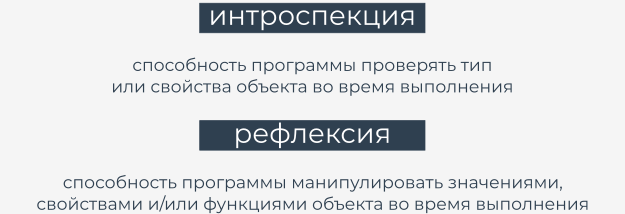

# Методы подробно

Давайте обобщим все факты, касающиеся использования методов в классах Python.

Как Вы уже знаете, **метод - это функция, встроенная в класс**.

Существует одно фундаментальное требование - у метода **должен быть хотя бы один параметр** (не существует методов без параметров - метод можно вызывать без аргумента, но нельзя объявлять без параметров).  

Первый (или единственный) параметр обычно называется `self`. Мы предлагаем вам следовать соглашению - оно обычно используется, и Вы будете создавать проблемы, используя для него другие названия.

Имя `self` указывает на назначение параметра - **идентифицирует объект, для которого вызывается метод**.

Если Вы собираетесь вызывать метод, Вы не должны передавать аргумент для параметра `self` - Python установит его за Вас.

Пример показывает разницу.

```python
class Classy:
    def method(self):
        print("method")

obj = Classy()
obj.method()

```

Код выводит:

```
method
```


Обратите внимание, как мы создали объект - мы **обработали имя класса как функцию**, возвращая только что созданный объект класса.


Если Вы хотите, чтобы метод принимал параметры, отличные от `self`, Вам нужно:

*   поместить их после `self` в определении метода;
*   передать их во время вызова без указания `self` (как ранее).


Как здесь:

```python
class Classy:
    def method(self, par):
        print("method:", par)

obj = Classy()
obj.method(1)
obj.method(2)
obj.method(3)

```

Вывод кода:

```
method: 1
method: 2
method: 3
```

Параметр `self` используется **для получения доступа к экземпляру объекта и переменным класса**.

В примере показаны оба способа использования `self`:

```python
class Classy:
    varia = 2
    def method(self):
        print(self.varia, self.var)


obj = Classy()
obj.var = 3
obj.method()

```  

Вывод кода:

```
2 3
```

Параметр `self` также используется **в вызове других методов объекта/класса изнутри класса**.

Как показано в примере ниже:

```python
class Classy:
    def other(self):
        print("other")

    def method(self):
        print("method")
        self.other()


obj = Classy()
obj.method()

```

Вывод кода:

```
method
other
```


Если Вы назовете такой метод: `__init__`, он не будет обычным методом - это будет **конструктор**.

Если у класса есть конструктор, он вызывается автоматически и неявно, когда создается экземпляр объекта класса.

Конструктор:

*   обязан **иметь параметр `self`** (он устанавливается автоматически, как обычно);
*   **может (но не обязательно) иметь больше параметров**, чем просто `self`; в этом случае способ использования имени класса для создания объекта должен отражать определение `__init__`;
*   **можно использовать для настройки объекта**, то есть для правильной инициализации его внутреннего состояния, создания переменных экземпляра, создания экземпляров любых других объектов, если они необходимы, и т.д.


Посмотрите на код. В примере показан очень простой конструктор в работе.

```python
class Classy:
    def __init__(self, value):
        self.var = value


obj1 = Classy("object")

print(obj1.var)

```

Запустите его. Вывод кода:

```
object
```

Обратите внимание, что конструктор:

*   **не может вернуть значение**, так как он предназначен для возвращения вновь созданного объекта и ничего больше;
*   **нельзя вызывать напрямую ни из объекта, ни из класса** (Вы можете вызвать конструктор из любого из суперклассов объекта, но мы обсудим эту проблему позже).


Поскольку `__init__` является методом, а метод является функцией, Вы можете выполнять те же приемы с конструкторами/методами, что и с обычными функциями.

Пример показывает, как определить конструктор со значением аргумента по умолчанию. Проверьте это.

```python
class Classy:
    def __init__(self, value = None):
        self.var = value


obj_1 = Classy("object")
obj_2 = Classy()

print(obj_1.var)
print(obj_2.var)

```

Код выводит:

```
object
None
```

Все, что мы сказали о **манипулировании именами свойств**, относится и к именам методов - метод, имя которого начинается с `__`, частично скрыт.

В примере показан этот эффект:

```python
class Classy:
    def visible(self):
        print("visible")
    
    def __hidden(self):
        print("hidden")


obj = Classy()
obj.visible()

try:
    obj.__hidden()
except:
    print("failed")

obj._Classy__hidden()

```

Вывод кода:

```
visible
failed
hidden
```

Запустите программу и протестируйте ее.


# Внутренняя жизнь классов и объектов

Каждый класс Python и каждый объект Python предварительно оснащены набором полезных атрибутов, которые можно использовать для проверки его возможностей.

Вы уже знаете один из них - это свойство `__dict__`.

Давайте посмотрим, как это работает с методами.

```python
class Classy:
    varia = 1
    def __init__(self):
        self.var = 2

    def method(self):
        pass

    def __hidden(self):
        pass


obj = Classy()

print(obj.__dict__)
print(Classy.__dict__)

```

Запустите его, чтобы увидеть, что он выводит. Внимательно проверьте вывод.

Найдите все определенные методы и атрибуты. Найдите контекст, в котором они существуют: внутри объекта или внутри класса.


# Внутренняя жизнь классов и объектов: продолжение

`__dict__` - это словарь. Стоит упомянуть еще одно встроенное свойство: `__name__`, которое является строкой.

Свойство содержит **имя класса**. В этом нет ничего захватывающего, просто строка.

Примечание. Атрибут `__name__` отсутствует в объекте - **он существует только внутри классов**.


Если Вы хотите **найти класс определенного объекта**, Вы можете использовать функцию с именем `type()`, которая способна (среди прочего) найти класс, который использовался для создания экземпляров любого объекта.

Посмотрите код, запустите его и убедитесь сами.

```python
class Classy:
    pass


print(Classy.__name__)
obj = Classy()
print(type(obj).__name__)

```

Код выводит:

```
Classy
Classy
```

Примечание. Подобное утверждение:

```python
print(obj .__name__)
```
  
приведет к ошибке.


`__module__` также является строкой - она **хранит имя модуля, который содержит определение класса**.

Давайте проверим это - запустите код.

```python
class Classy:
    pass


print(Classy.__module__)
obj = Classy()
print(obj.__module__)

```

Код выводит:

```
__main__
__main__
```


Как Вы знаете, любой модуль с именем `__main__` на самом деле является не модулем, а файлом, **запущенным в данный момент.**


`__bases__` - это кортеж. **Кортеж содержит классы** (не имена классов), которые являются прямыми суперклассами для класса.

Порядок такой же, как и в определении класса.

Мы покажем Вам только очень простой пример, поскольку мы хотим подчеркнуть**, как работает наследование**.

Более того, мы покажем Вам, как использовать этот атрибут, когда будем обсуждать объектные аспекты исключений.

Примечание. **только классы имеют этот атрибут**, объекты - нет.

Мы определили функцию с именем `printbases()`, предназначенную для четкого представления содержимого кортежа.

Посмотрите на код. Проанализируйте его и запустите.

```python
class SuperOne:
    pass


class SuperTwo:
    pass


class Sub(SuperOne, SuperTwo):
    pass


def printBases(cls):
    print('( ', end='')

    for x in cls.__bases__:
        print(x.__name__, end=' ')
    print(')')


printBases(SuperOne)
printBases(SuperTwo)
printBases(Sub)

```

Код выведет:

```
( object )
( object )
( SuperOne SuperTwo )
```

Примечание: **класс без явных суперклассов указывает на объект** (предопределенный класс Python) в качестве его прямого предка.


# Отражение и интроспекция

Все эти средства позволяют программисту выполнять два важных действия, характерных для многих целевых языков. Это:

*   **интроспекция**, которая позволяет программе проверять тип или свойства объекта во время выполнения;
*   **отражение**, которое идет еще дальше и представляет собой способность программы манипулировать значениями, свойствами и/или функциями объекта во время выполнения.

Другими словами, Вам не нужно знать полное определение класса/объекта, чтобы манипулировать объектом, поскольку объект и/или его класс содержат метаданные, позволяющие распознавать его функции во время выполнения программы.


  


# Исследование классов

Что Вы можете узнать о классах в Python? Ответ прост - все.

Как отражение, так и интроспекция позволяют программисту делать что угодно с каждым объектом, независимо от того, откуда он.

Проанализируйте код.

```python
class MyClass:
    pass


obj = MyClass()
obj.a = 1
obj.b = 2
obj.i = 3
obj.ireal = 3.5
obj.integer = 4
obj.z = 5


def incIntsI(obj):
    for name in obj.__dict__.keys():
        if name.startswith('i'):
            val = getattr(obj, name)
            if isinstance(val, int):
                setattr(obj, name, val + 1)


print(obj.__dict__)
incIntsI(obj)
print(obj.__dict__)

```

Функция с именем `incIntsI()` получает объект любого класса, сканирует его содержимое, чтобы найти все целочисленные атрибуты с именами, начинающимися с i и увеличивает их на единицу.

Невозможно? Вовсе нет!

Вот как это работает:

*   строка 1: определение очень простой класса...
*   строки с 3 по 10: ... и заполнение его некоторыми атрибутами;
*   строка 12: это наша функция!
*   строка 13: сканирование атрибута `__dict__`, поиск имен всех атрибутов;
*   строка 14: если имя начинается с i...
*   строка 15: ...использование функции `getattr()`, чтобы получить ее текущее значение;

    примечание: `getattr()` принимает два аргумента: объект и имя его свойства (в виде строки) и возвращает значение текущего атрибута;
  
*   строка 16: проверка, имеет ли значение тип `integer`, и использует для этого функцию `isinstance()` (мы обсудим это позже);
*   строка 17: если проверка прошла успешно, увеличение значение свойства, используя функцию `setattr()`;
 
    функция принимает три аргумента: объект, имя свойства (в виде строки) и новое значение свойства.

Вывод кода:

```
{'a': 1, 'integer': 4, 'b': 2, 'i': 3, 'z': 5, 'ireal': 3.5}
{'a': 1, 'integer': 5, 'b': 2, 'i': 4, 'z': 5, 'ireal': 3.5}
```

Вот и все!

  
# Основные тезисы

1. Метод - это функция, встроенная в класс. Первый (или единственный) параметр каждого метода обычно называется `self`, который предназначен для идентификации объекта, для которого вызывается метод, чтобы получить доступ к свойствам объекта или вызвать его методы.


2. Если класс содержит **конструктор** (метод с именем `__init__`), конструктор не может возвращать никакого значения и не может быть вызван напрямую.


3. Все классы (но не объекты) содержат свойство с именем `__name__`, в котором хранится имя класса. Кроме того, свойство с именем `__module__` хранит имя модуля, в котором был объявлен класс, а свойство с именем `__bases__` представляет собой кортеж, содержащий суперклассы класса.
    
    Например:
    
    ```python
    class Sample:
        def __init__(self):
            self.name = Sample.__name__
        def myself(self):
            print("My name is " + self.name + " living in a " + Sample.__module__)
    
    
    obj = Sample()
    obj.myself()
    
    ```
    
    Код выводит:
    
    ```
    My name is Sample living in a __main__
    ```


---

**Упражнение 1**

Объявление класса `Snake` приведено ниже. Дополните класс методом с именем `increment()`, добавив `1` к свойству `__victors`.  
  
```python
class Snake:
    def __init__(self):
        self.victims = 0

```

<details><summary>Проверка</summary>

```python
class Snake:
    def __init__(self):
        self.victims = 0

    def increment(self):
        self.victims += 1

```

</details>

---

**Упражнение 2**

Переопределите конструктор класса `Snake`, чтобы он имел параметр для инициализации поля `victim` значением, переданным объекту во время создания.

  
<details><summary>Проверка</summary>

```python
class Snake:
    def __init__(self, victims):
        self.victims = victims

```

</details>

---

**Упражнение 3**

Можете предсказать вывод следующего кода?

```python
class Snake:
    pass


class Python(Snake):
    pass


print(Python.__name__, 'is a', Snake.__name__)
print(Python.__bases__[0].__name__, 'can be a', Python.__name__)

```

<details><summary>Проверка</summary>

```
Python is a Snake
Snake can be a Python
```

</details>


