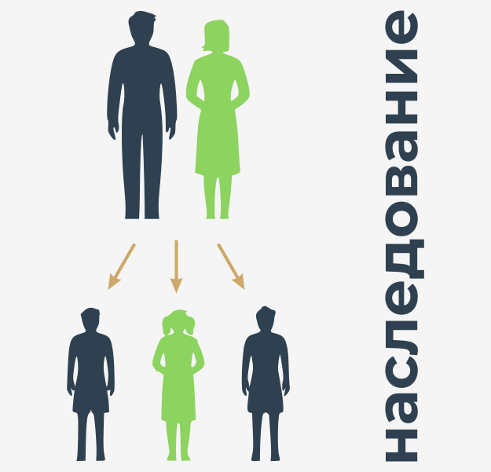
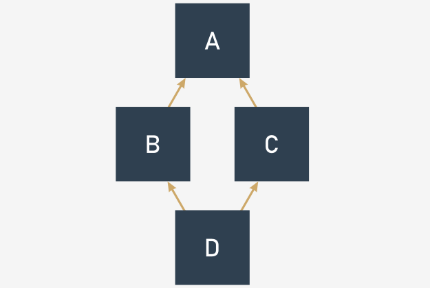

# Наследование - что и как?

Прежде чем мы начнем говорить о наследовании, мы хотим представить новый, удобный механизм, используемый классами и объектами Python - это **способ, которым объект может представить себя**.

Давайте начнем с примера.

```python
class Star:
    def __init__(self, name, galaxy):
        self.name = name
        self.galaxy = galaxy


sun = Star("Sun", "Milky Way")
print(sun)

```

Программа выводит только одну строку текста, которая в нашем случае выглядит следующим образом:

```
<__main__.Star object at 0x7f1074cc7c50>
```

Если Вы запустите тот же код на своем компьютере, Вы увидите нечто очень похожее, хотя шестнадцатеричное число (подстрока, начинающаяся с `0x`) будет другим, так как это просто внутренний идентификатор объекта, используемый Python, и вряд ли он будет выглядеть одинаково, когда один и тот же код будет запущен в другой среде.

Как видите, распечатка здесь не очень полезна, и что-то более конкретное или что-то более красивое может быть более предпочтительным.

К счастью, Python предлагает именно такую функцию.

Когда Python требует, чтобы какой-либо класс/объект был представлен в виде строки (помещение объекта в качестве аргумента в вызове функции `print()` соответствует этому условию), он пытается вызвать метод с именем `__str__()` из объекта и использовать возвращаемую строку.

Метод `__str__()` по умолчанию возвращает предыдущую строку - безобразно и не очень информативно. Вы можете изменить его, просто **определив свой собственный метод с этим именем**.

Мы только что сделали это - посмотрите на код.

```python
class Star:
    def __init__(self, name, galaxy):
        self.name = name
        self.galaxy = galaxy

    def __str__(self):
        return self.name + ' in ' + self.galaxy


sun = Star("Sun", "Milky Way")
print(sun)

```

Этот новый метод `__str__()` создает строку, состоящую из названий звезд и галактик - ничего особенного, но вывод теперь выглядит немного лучше, не так ли?

Можете угадать вывод? Запустите код, чтобы проверить, были ли Вы правы.

Термин наследование старше, чем компьютерное программирование, и он описывает обычную практику передачи различного имущества от одного человека другому после смерти первого человека. Термин в том случае, когда он связан с компьютерным программированием, имеет совершенно другое значение.





Давайте определим термин для наших целей:

Наследование - это распространенная практика (в объектном программировании) передачи **атрибутов и методов из суперкласса (определенного и существующего) во вновь созданный класс, называемый подклассом**.

Другими словами, наследование - это **способ создания нового класса не с нуля, а с использованием уже определенного набора признаков**. Новый класс наследует (и это ключевая особенность) все уже существующее оборудование, но можно добавить несколько новых, если это необходимо.

Благодаря этому можно **создавать более специализированные (более конкретные) классы**, используя некоторые наборы предопределенных общих правил и поведения.


Наиболее важным фактором процесса является отношение между суперклассом и всеми его подклассами (примечание: если _B_ является подклассом _A_ и _C_ является подклассом _B_, это также означает, что _C_ является подклассом _A_, так как отношение полностью транзитивно).

Очень простой пример **двухуровневого наследования** представлен здесь:

```python
class Vehicle:
    pass


class LandVehicle(Vehicle):
    pass


class TrackedVehicle(LandVehicle):
    pass

```

Все представленные классы пока пусты, так как мы собираемся показать Вам, как работают взаимоотношения между супер- и подклассами. Мы скоро наполним их содержанием.

Мы можем сказать, что:

*   Класс `Vehicle` - суперкласс для обоих классов `LandVehicle` и `TrackedVehicle`;
*   Класс `LandVehicle` - подкласс `Vehicle` и суперкласс для `TrackedVehicle`;
*   Класс `TrackedVehicle` - подкласс обоих классов `Vehicle` и `LandVehicle`.

Приведенные выше знания получены при чтении кода (другими словами, мы знаем это, потому что видим его).

Знает ли это Python? Можно ли спросить его об этом? Да, можно.


# Наследование: `issubclass()`

Python предлагает функцию, которая способна **идентифицировать отношения между двумя классами**, и, хотя ее диагностика не очень сложна, она может **проверить, является ли определенный класс подклассом любого другого класса**.

Вот как это выглядит:

```python
issubclass(ClassOne, ClassTwo)
```  

Функция возвращает `True`, если `ClassOne` является подклассом `ClassTwo` или `False` в противном случае.

Давайте посмотрим на это в действии - это может Вас удивить. Посмотрите код. Прочитайте внимательно.

```python
class Vehicle:
    pass


class LandVehicle(Vehicle):
    pass


class TrackedVehicle(LandVehicle):
    pass


for cls1 in [Vehicle, LandVehicle, TrackedVehicle]:
    for cls2 in [Vehicle, LandVehicle, TrackedVehicle]:
        print(issubclass(cls1, cls2), end="\t")
    print()

```

Есть два вложенных цикла. Их цель - **проверить все возможные упорядоченные пары классов и распечатать результаты проверки, чтобы определить, соответствует ли пара отношению подкласс-суперкласс**.

Запустите код. Программа выдает следующий вывод:

```
True	False	False	
True	True	False	
True	True	True	
```

Давайте сделаем результат более читабельным:

| ↓ Подкласс класса → | Vehicle | LandVehicle | TrackedVehicle |
|---------------------|---------|-------------|----------------|
| Vehicle             | True    | True        | True           |
| LandVehicle         | False   | True        | True           |
| TrackedVehicle      | False   | False       | True           |


Необходимо сделать одно важное замечание: **каждый класс считается подклассом самого себя**.


# Наследование: `isinstance()`

Как Вы уже знаете, **объект является воплощением класса**. Это означает, что объект похож на торт, испеченный по рецепту, который включен в класс.

Это может вызвать некоторые важные проблемы.

Давайте предположим, что у Вас есть торт (например, в качестве аргумента, переданного вашей функции). Вы хотите знать, какой рецепт был использован для его приготовления. Зачем? Потому что Вы хотите знать, чего от него ожидать, например, содержит ли он орехи или нет, что является важной информацией для некоторых людей.

Точно так же это может иметь решающее значение, если объект имеет (или не имеет) определенные характеристики. Другими словами, **является ли он объектом определенного класса или нет**.

Этот факт может быть обнаружен функцией с именем `isinstance()`:

```python
isinstance(objectName, ClassName)
```  

Функция возвращает `True`, если объект является экземпляром класса, или `False` в противном случае.

**Наличие экземпляра класса означает, что объект (торт) был приготовлен с использованием рецепта, содержащегося либо в классе, либо в одном из его суперклассов**.

Не забывайте: если подкласс содержит хотя бы то же оборудование, что и любой из его суперклассов, это означает, что объекты подкласса могут делать то же самое, что и объекты, производные от суперкласса, т.е. это экземпляр его домашнего класса и любой из его суперклассов.

Давайте проверим это. Проанализируйте код.

```python
class Vehicle:
    pass


class LandVehicle(Vehicle):
    pass


class TrackedVehicle(LandVehicle):
    pass


my_vehicle = Vehicle()
my_land_vehicle = LandVehicle()
my_tracked_vehicle = TrackedVehicle()

for obj in [my_vehicle, my_land_vehicle, my_tracked_vehicle]:
    for cls in [Vehicle, LandVehicle, TrackedVehicle]:
        print(isinstance(obj, cls), end="\t")
    print()

```

Мы создали три объекта, по одному для каждого из классов. Затем, используя два вложенных цикла, мы проверяем все возможные пары объектов-классов, **чтобы выяснить, являются ли объекты экземплярами классов**.

Запустите код.

Вот что мы получаем:

```
True	False	False	
True	True	False	
True	True	True	
```

Давайте сделаем результат еще более читабельным:

| ↓ Наследование от → | Vehicle | LandVehicle | TrackedVehicle |
|---------------------|---------|-------------|----------------|
| Vehicle             | True    | False       | False          |
| LandVehicle         | True    | True        | False          |
| TrackedVehicle      | True    | True        | True           |


Таблица подтверждает наши ожидания?


# Наследование: оператор `is`

Также стоит упомянуть оператор Python, так как он относится непосредственно к объектам - вот он:

```python
objectOne is objectTwo
```  

**Оператор `is` проверяет, ссылаются ли две переменные (`objectOne` и `objectTwo`) на один и тот же объект**.

Не забывайте, что переменные **хранят не сами объекты, а только дескрипторы, указывающие на внутреннюю память Python**.

Присвоение значения переменной объекта другой переменной не копирует объект, а только его дескриптор. Вот почему такой оператор, как `is`, может быть очень полезен в определенных обстоятельствах.

Посмотрите на код.

```python
class SampleClass:
    def __init__(self, val):
        self.val = val


object_1 = SampleClass(0)
object_2 = SampleClass(2)
object_3 = object_1
object_3.val += 1

print(object_1 is object_2)
print(object_2 is object_3)
print(object_3 is object_1)
print(object_1.val, object_2.val, object_3.val)

string_1 = "Mary had a little "
string_2 = "Mary had a little lamb"
string_1 += "lamb"

print(string_1 == string_2, string_1 is string_2)

```

Давайте проанализируем его:


*   есть очень простой класс, оснащенный простым конструктором, создающим только одно свойство. Класс используется для создания двух объектов. Затем первая присваивается другой переменной, а ее свойство `val` увеличивается на единицу;
*   после этого оператор `is` применяется три раза для проверки всех возможных пар объектов, и все значения свойств `val` также печатаются;
*   последняя часть кода выполняет другой эксперимент. После трех назначений обе строки содержат одинаковые тексты, но **эти тексты хранятся в разных объектах**.

Код выводит:

```
False
False
True
1 2 1
True False
```

Результаты доказывают, что `ob1` и `ob3` фактически являются одними и теми же объектами, в то время как `str1` и `str2` не являются, несмотря на их одинаковое содержание.


# Как Python находит свойства и методы

Теперь мы рассмотрим, как Python работает с унаследованными методами.

Посмотрите на пример.

```python
class Super:
    def __init__(self, name):
        self.name = name

    def __str__(self):
        return "My name is " + self.name + "."


class Sub(Super):
    def __init__(self, name):
        Super.__init__(self, name)


obj = Sub("Andy")

print(obj)

```

Давайте проанализируем это:

*   есть класс с именем `Super`, который определяет свой собственный конструктор, используемый для назначения свойства объекта, с именем `name`;
*   класс также определяет метод `__str__()`, который позволяет классу представлять свою идентичность в виде открытого текста;
*   затем класс используется в качестве основы для создания подкласса с именем `Sub`. Класс `Sub` определяет свой собственный конструктор, который вызывает его из суперкласса. Обратите внимание, как мы это сделали: `Super.__init__(self, name)`;
*   мы явно назвали суперкласс и указали на метод для вызова `__init__()`, предоставив все необходимые аргументы;
*   мы создали экземпляр одного объекта класса `Sub` и распечатали его.

Код выводит:

```
My name is Andy.
```

Примечание. Поскольку в классе `Sub` нет метода `__str__()`, печатная строка должна создаваться в классе `Super`. Это означает, что метод `__str__()` был унаследован классом `Sub`.


Посмотрите на код. Мы изменили его, чтобы показать Вам другой метод доступа к любому объекту, определенному внутри суперкласса.

```python
class Super:
    def __init__(self, name):
        self.name = name

    def __str__(self):
        return "My name is " + self.name + "."


class Sub(Super):
    def __init__(self, name):
        super().__init__(name)


obj = Sub("Andy")

print(obj)

```

В последнем примере мы явно назвали суперкласс. В этом примере мы используем функцию `super()`, которая **обращается к суперклассу без необходимости знать его имя**:

```python
super().__init__(name)
```  

Функция `super()` создает контекст, в котором Вам не нужно (более того, Вы не должны) передавать аргумент `self` вызываемому методу - вот почему можно активировать суперкласс конструктор, использующий только один аргумент.

Примечание: Вы можете использовать этот механизм не только для **вызова конструктора суперкласса, но и для получения доступа к любым ресурсам, доступным внутри суперкласса**.


Давайте попробуем сделать нечто подобное, но со свойствами (точнее: с **переменными класса**).

Посмотрите на пример.

```python
# Проверка свойств: переменные класса.
class Super:
    supVar = 1


class Sub(Super):
    subVar = 2


obj = Sub()

print(obj.subVar)
print(obj.supVar)

```

Как видите, класс `Super` определяет одну переменную класса с именем `supVar`, а класс `Sub` определяет переменную с именем `subVar`.

Обе эти переменные видны внутри объекта класса `Sub` - вот почему код выводит:

```
2
1
```

Тот же эффект можно наблюдать с **переменными экземпляра** - взгляните на второй пример.

```python
# Проверка свойств: переменные объекта.
class Super:
    def __init__(self):
        self.supVar = 11


class Sub(Super):
    def __init__(self):
        super().__init__()
        self.subVar = 12


obj = Sub()

print(obj.subVar)
print(obj.supVar)

```

Конструктор класса `Sub` создает переменную экземпляра с именем `subVar`, а конструктор `Super` делает то же самое с переменной с именем `supVar`. Как и ранее, обе переменные доступны из объекта класса `Sub`.

Вывод программы:

```
12
11
```

Примечание: существование переменной `supVar`, очевидно, обусловлено вызовом конструктора класса `Super`. Отказ от этого приведет к отсутствию переменной в созданном объекте (попробуйте сами).


Теперь можно сформулировать общее утверждение, описывающее поведение Python.

Когда Вы пытаетесь получить доступ к любым компонентам объекта, Python попытается (в следующем порядке):

*   найти его **внутри самого объекта**;
*   найти его **во всех классах**, участвующих в линии наследования объекта снизу вверх.

Если вышеперечисленные попытки не удались, возникает **исключение (`AttributeError`)**.


Первое условие может потребовать дополнительного внимания. Как Вы знаете, все объекты, производные от определенного класса, могут иметь разные наборы атрибутов, и некоторые атрибуты могут быть добавлены к объекту спустя долгое время после создания объекта.

Пример суммирует это в **трехуровневой линии наследования**. Проанализируйте это внимательно.

```python
class Level1:
    variable_1 = 100
    def __init__(self):
        self.var_1 = 101

    def fun_1(self):
        return 102


class Level2(Level1):
    variable_2 = 200
    def __init__(self):
        super().__init__()
        self.var_2 = 201
    
    def fun_2(self):
        return 202


class Level3(Level2):
    variable_3 = 300
    def __init__(self):
        super().__init__()
        self.var_3 = 301

    def fun_3(self):
        return 302


obj = Level3()

print(obj.variable_1, obj.var_1, obj.fun_1())
print(obj.variable_2, obj.var_2, obj.fun_2())
print(obj.variable_3, obj.var_3, obj.fun_3())

```

Все комментарии, которые мы сделали до сих пор, относятся к **одиночному наследованию**, когда подкласс имеет ровно один суперкласс. Это наиболее распространенная ситуация (и рекомендуемая тоже).

Python, однако, предлагает гораздо больше здесь. В следующих уроках мы покажем Вам несколько примеров **множественного наследования**.


**Множественное наследование происходит, когда в классе есть более одного суперкласса**.

Синтаксически, такое наследование представляется в виде списка разделенных запятыми суперклассов, заключенных в круглые скобки после нового имени класса - как здесь:

```python
class SuperA:
    var_a = 10
    def fun_a(self):
        return 11


class SuperB:
    var_b = 20
    def fun_b(self):
        return 21


class Sub([!mark!]SuperA, SuperB[!/mark!]):
    pass

obj = Sub()

print(obj.var_a, obj.fun_a())
print(obj.var_b, obj.fun_b())

```

Класс `Sub` имеет два суперкласса: `SuperA` и `SuperB`. Это означает, что класс `Sub` **наследует все предложения, предлагаемые как `SuperA`, так и `SuperB`**.

Код дает следующее:

```
10 11
20 21
```

Теперь пришло время ввести новый термин - **переопределение**.

Как Вы думаете, что произойдет, если более чем один из суперклассов определяет сущность с определенным именем?

Давайте проанализируем пример.

```python
class Level1:
    var = 100
    def fun(self):
        return 101


class Level2(Level1):
    var = 200
    def fun(self):
        return 201


class Level3(Level2):
    pass


obj = Level3()

print(obj.var, obj.fun())

```

Оба класса: `Level1` и `Level2` определяют метод с именем `fun()` и свойство с именем `var`. Означает ли это, что объект класса `Level3` сможет получить доступ к двум копиям каждого объекта? Вовсе нет.

**Объект, определенный позже (в смысле наследования), переопределяет тот же объект, определенный ранее**. Вот почему код дает следующий вывод:

```
200 201
```

Как видите, переменная класса `var` и метод `fun()` из класса `Level2` переопределяют объекты с одинаковыми именами, полученные из класса `Level1`.

Эту функцию можно намеренно использовать для изменения поведения классов по умолчанию (или ранее определенного), когда любой из его классов должен действовать не так, как его предок.

Можно также сказать, что **Python ищет объекты снизу вверх** и полностью удовлетворен первым объектом с желаемым именем.

Как это работает, когда у класса есть два предка, предлагающих один и тот же объект, и они лежат на одном уровне? Другими словами, что Вы должны ожидать, когда класс появляется с использованием множественного наследования? Давайте посмотрим на это.

```python
class Left:
    var = "L"
    var_left = "LL"
    def fun(self):
        return "Left"


class Right:
    var = "R"
    var_right = "RR"
    def fun(self):
        return "Right"


class Sub(Left, Right):
    pass


obj = Sub()

print(obj.var, obj.var_left, obj.var_right, obj.fun())

```

Класс `Sub` наследует признаки от двух суперклассов, `Left` и `Right` (эти имена имеют смысл).

Нет сомнений, что переменная класса `varRight` происходит из класса `Right`, а `varLeft` происходит от `Left` соответственно.

Это понятно. Но откуда взялся `var`? Можно ли это угадать? Та же проблема встречается с методом `fun()` - будет ли он вызываться из `Left` или из `Right`? Давайте запустим программу - ее вывод:

```
L LL RR Left
```

Это доказывает, что оба неясных случая имеют решение внутри класса `Left`. Достаточно ли этого, чтобы сформулировать общее правило? Да, это так.

Можно сказать, что **Python ищет компоненты объекта** в следующем порядке:

*   **внутри самого объекта**;
*   **в его суперклассах**, снизу вверх;
*   если в конкретном пути наследования находится несколько классов, Python сканирует их слева направо.

Вам нужно что-нибудь еще? Просто внесите небольшую поправку в код - замените: `class Sub (Left, Right):` на: `class Sub (Right, Left):`, затем снова запустите программу, и посмотрите, что получится.

Что Вы видите сейчас? Вы должны увидеть:

```
R LL RR Right
```

Вы видите то же самое или что-то другое?


# Как построить иерархию классов

Построение иерархии классов - это не просто искусство ради искусства.

Если Вы разделяете проблему между классами и решаете, какой из них должен быть расположен вверху, а какой - внизу иерархии, Вам необходимо тщательно проанализировать проблему, но прежде чем мы покажем Вам, как это делать (и как этого не делать) мы хотим подчеркнуть интересный эффект. В этом нет ничего необычного (это просто следствие общих правил, представленных ранее), но помните, что это может быть ключом к пониманию того, как работают некоторые коды, и как этот эффект можно использовать для создания гибкого набора классов.

Посмотрите на код.

```python
class One:
    def do_it(self):
        print("do_it from One")

    def doanything(self):
        self.do_it()


class Two(One):
    def do_it(self):
        print("do_it from Two")


one = One()
two = Two()

one.doanything()
two.doanything()

```

Давайте проанализируем его:

*   есть два класса с именами `One` и `Two`, а `Two` является производным от `One`. Ничего особенного. Тем не менее, одна вещь, на которую стоит обраить внимание - метод `doit()`.
*   метод `doit()` **определен дважды**: первоначально внутри `One`, а затем внутри `Two`. Суть примера заключается в том, что он **вызывается только один раз** - внутри `One`.

Вопрос в том, какой из двух методов будет вызываться последними двумя строками кода?

Первый вызов кажется простым, и на самом деле он прост - вызов `doanything()` из объекта с именем `one`, очевидно, активирует первый из методов.

Второй вызов требует некоторого внимания. Это также просто, если Вы помните, как Python находит компоненты класса. Второй вызов запустит `doit()` в форме, существующей внутри класса `Two`, независимо от того, что вызов происходит внутри класса `One`.

По сути, код производит следующий вывод:

```
do_it from One
do_it from Two
```

Примечание: ситуация, в которой **подкласс может изменять свое поведение суперкласса (как в примере), называется полиморфизмом**. Слово происходит от греческого (polys: "многие, много" и morphe: "форма"), что означает, что один и тот же класс может принимать различные формы в зависимости от переопределений, сделанных любым из его подклассов.

Метод, переопределенный в любом из суперклассов и изменяющий поведение суперкласса, называется **виртуальным**.

Другими словами, ни один класс не дается раз и навсегда. Поведение каждого класса может быть изменено в любое время любым из его подклассов.

Мы собираемся показать вам, **как использовать полиморфизм для повышения гибкости класса**.

Посмотрите на пример.

```python
import time

class TrackedVehicle:
    def control_track(left, stop):
        pass

    def turn(left):
        control_track(left, True)
        time.sleep(0.25)
        control_track(left, False)


class WheeledVehicle:
    def turn_front_wheels(left, on):
        pass

    def turn(left):
        turn_front_wheels(left, True)
        time.sleep(0.25)
        turn_front_wheels(left, False)

```

Это похоже на что-нибудь? Да, конечно. Это относится к примеру, показанному в начале модуля, когда мы говорили об общих концепциях объективного программирования.

Это может выглядеть странно, но мы никоим образом не использовали наследование - просто чтобы показать Вам, что оно не ограничивает нас, и нам удалось получить свое.

Мы определили два отдельных класса, способных производить два разных типа наземных транспортных средств. Основное различие между ними заключается в том, как они поворачиваются. Колесное транспортное средство просто поворачивает передние колеса (как правило). Гусеничный автомобиль должен остановить один из траков.

Можете ли вы пройтись по коду?

*   отслеживаемое транспортное средство выполняет поворот, останавливаясь и двигаясь по одной из своих дорожек (это выполняется методом `controltrack()`, который будет реализован позже);
*   колесное транспортное средство поворачивается, когда его передние колеса поворачиваются (это выполняется методом `turnfrontwheels()`);
*   метод `turn()` использует метод, подходящий для каждого конкретного транспортного средства.

Видите ли Вы, **что не так с кодом**?

Методы `turn()` выглядят слишком похожими, чтобы оставлять их в такой форме.

Давайте перестроим код - мы собираемся ввести суперкласс, чтобы собрать все похожие аспекты управления транспортными средствами, перенеся все особенности в подклассы.


Посмотрите на код еще раз.

```python
import time

class Vehicle:
    def change_direction(left, on):
        pass

    def turn(left):
        change_direction(left, True)
        time.sleep(0.25)
        change_direction(left, False)


class TrackedVehicle(Vehicle):
    def control_track(left, stop):
        pass

    def change_direction(left, on):
        control_track(left, on)


class WheeledVehicle(Vehicle):
    def turn_front_wheels(left, on):
        pass

    def change_direction(left, on):
        turn_front_wheels(left, on)

```

Вот что мы сделали:

*   мы определили суперкласс с именем `Vehicle` (транспортные средства), который использует метод `turn()` для реализации общей схемы поворота, в то время как сам разворот выполняется методом с именем `changedirection()`;
 
    Примечание: первый метод пуст, поскольку мы собираемся поместить все детали в подкласс (такой метод часто называют **абстрактным методом**, поскольку он демонстрирует только некоторую возможность, которая будет реализована позже);
  
*   мы определили подкласс с именем `TrackedVehicle`
 
    Примечание: он является производным от класса `Vehicle`, который создал экземпляр метода `changeirection()` с помощью конкретного метода с именем `controltrack()`;
 
*   соответственно, подкласс с именем `WheeledVehicle` выполняет тот же трюк, но использует метод `turnfrontwheel()`, чтобы заставить автомобиль поворачивать.

Самое важное преимущество (без проблем с читабельностью) состоит в том, что эта форма кода позволяет Вам реализовать новый алгоритм поворота, просто изменив метод `turn()`, чтобы сделать все за один раз в одном месте, так как все транспортные средства будут подчиняться ему.

Именно так **полиморфизм помогает разработчику поддерживать чистоту и согласованность кода**.

Наследование - не единственный способ создания адаптируемых классов. Вы можете достичь тех же целей (не всегда, но очень часто), используя технику под названием композиция.

**Композиция - это процесс создания объекта с использованием других различных объектов**. Объекты, используемые в композиции, предоставляют набор желаемых признаков (свойств и/или методов), поэтому мы можем сказать, что они действуют как блоки, используемые для построения более сложной структуры.

Можно сказать, что:

*   **наследование расширяет возможности класса**, добавляя новые компоненты и изменяя существующие; другими словами, полный рецепт содержится внутри самого класса и всех его предков; объект берет все вещи класса и использует их;
*   **композиция проецирует класс как контейнер**, способный хранить и использовать другие объекты (производные от других классов), где каждый из объектов реализует часть поведения желаемого класса.

Давайте проиллюстрируем разницу, используя ранее определенные транспортные средства. Предыдущий подход привел нас к иерархии классов, в которой самый верхний класс знал об общих правилах, используемых при развороте транспортного средства, но не знал, как управлять соответствующими компонентами (колесами или гусеницами).

Подклассы реализовали эту возможность, внедрив специализированные механизмы. Давайте сделаем то же самое, но с использованием композиции. Класс - как в предыдущем примере - знает, как повернуть транспортное средство, но фактический поворот выполняется специализированным объектом, хранящимся в свойстве с именем `controller (контроллер)`. `Сontroller (контроллер)` может управлять транспортным средством, манипулируя соответствующими частями транспортного средства.

Взгляните на пример - вот как это может выглядеть.

```python
import time

class Tracks:
    def change_direction(self, left, on):
        print("tracks: ", left, on)


class Wheels:
    def change_direction(self, left, on):
        print("wheels: ", left, on)


class Vehicle:
    def __init__(self, controller):
        self.controller = controller

    def turn(self, left):
        self.controller.change_direction(left, True)
        time.sleep(0.25)
        self.controller.change_direction(left, False)


wheeled = Vehicle(Wheels())
tracked = Vehicle(Tracks())

wheeled.turn(True)
tracked.turn(False)

```

Есть два класса с именами `Tracks` и `Wheels` - они знают, как контролировать направление движения автомобиля. Существует также класс с именем `Vehicle`, который может использовать любой из доступных контроллеров (два уже определенных или любые другие, определенные в будущем) - сам `controller` передается в класс во время инициализации.

Таким образом, способность транспортного средства поворачиваться формируется с использованием внешнего объекта, не реализованного внутри класса `Vehicle`.

Другими словами, у нас есть универсальный автомобиль, и мы можем установить на него либо гусеницы, либо колеса.

код дает следующий вывод:

```
wheels:  True True
wheels:  True False
tracks:  False True
tracks:  False False
```

  
# Одиночное и множественное наследование

Как Вы уже знаете, в Python нет препятствий для использования множественного наследования. Вы можете получить любой новый класс из нескольких ранее определенных классов.

Есть только одно "но". Тот факт, что Вы можете это сделать, не означает, что Вы должны это делать.

Не забывайте об этом:

*   класс с одиночным наследованием всегда проще, безопаснее и легче для понимания и поддержки;
  
*   множественное наследование всегда сопряжено с риском, поскольку у Вас гораздо больше возможностей ошибиться при определении частей суперклассов, которые будут эффективно влиять на новый класс;
  
*   множественное наследование может сделать переопределение чрезвычайно сложным; более того, использование функции `super()` становится неоднозначным;

*   множественное наследование нарушает принцип **единой ответственности** (более подробно в описании по ссылке: [Принцип единственной ответственности](https://ru.wikipedia.org/wiki/%D0%9F%D1%80%D0%B8%D0%BD%D1%86%D0%B8%D0%BF_%D0%B5%D0%B4%D0%B8%D0%BD%D1%81%D1%82%D0%B2%D0%B5%D0%BD%D0%BD%D0%BE%D0%B9_%D0%BE%D1%82%D0%B2%D0%B5%D1%82%D1%81%D1%82%D0%B2%D0%B5%D0%BD%D0%BD%D0%BE%D1%81%D1%82%D0%B8)), поскольку он создает новый класс из двух (или более) классов, которые ничего не знают друг о друге;
  
*   мы настоятельно рекомендуем множественное наследование как последнее из всех возможных решений - если Вам действительно нужно много разных функций, предлагаемых разными классами, композиция может быть лучшей альтернативой.


# Что такое порядок разрешения методов (MRO) и почему не все наследования имеют смысл?

MRO, в общем, - это способ (Вы можете назвать это **стратегией**), при котором конкретный язык программирования просматривает верхнюю часть иерархии класса, чтобы найти метод, который ему в настоящее время нужен. Стоит подчеркнуть, что в разных языках используются несколько (или даже совершенно) разные MRO. Однако Python - уникальное существо в этом отношении, и его обычаи немного специфичны.

Мы собираемся показать Вам, как работает MRO Python в двух специфических случаях, которые являются четкими примерами проблем, которые могут возникнуть, когда вы слишком опрометчиво пытаетесь использовать множественное наследование. Начнем с фрагмента, который поначалу может показаться простым. Посмотрите, что мы приготовили для Вас в качестве примера.

```python
class Top:
    def m_top(self):
        print("top")


class Middle(Top):
    def m_middle(self):
        print("middle")


class Bottom(Middle):
    def m_bottom(self):
        print("bottom")


object = Bottom()
object.m_bottom()
object.m_middle()
object.m_top()

```

Мы уверены, что если Вы проанализируете фрагмент самостоятельно, Вы не увидите в нем никаких аномалий. Да, Вы совершенно правы - все выглядит ясно и просто и не вызывает беспокойства. Если Вы запустите код, он выдаст следующий предсказуемый результат:

```
bottom
middle
top
```

Пока никаких сюрпризов. Внесем небольшие изменения в этот код. Посмотрите:

```python
class Top:
    def m_top(self):
        print("top")


class Middle(Top):
    def m_middle(self):
        print("middle")


class Bottom(Middle, Top):
    def m_bottom(self):
        print("bottom")


object = Bottom()
object.m_bottom()
object.m_middle()
object.m_top()

```

Видите разницу? Она скрывается в этой строке:

```python
class Bottom(Middle, Top):
```

Таким экзотическим способом мы превратили очень простой код с четким путем одиночного наследования в таинственную загадку множественного наследования. "Действительно?" - Вы можете спросить. Да, это так. "Как такое возможно?" - спросите сейчас, и мы надеемся, что Вы действительно чувствуете необходимость задать этот вопрос.

Как видите, порядок, в котором два суперкласса были перечислены в круглых скобках, соответствует структуре кода: класс `Middle` предшествует классу `Top`, просто как в реальном пути наследования.

Несмотря на свою странность, код верен и работает так, как ожидалось, но следует отметить, что это обозначение не приносит никаких новых функций или дополнительного смысла.

Давайте еще раз изменим код - теперь мы поменяем местами имена обоих суперклассов в определении класса `Bottom`. Вот как сейчас выглядит фрагмент:

```python
class Top:
    def m_top(self):
        print("top")


class Middle(Top):
    def m_middle(self):
        print("middle")


class Bottom(Top, Middle):
    def m_bottom(self):
        print("bottom")


object = Bottom()
object.m_bottom()
object.m_middle()
object.m_top()

```

Чтобы предвидеть ваш вопрос, мы скажем, что эта поправка испортила код, и он больше не будет работать. Какая жалость. Порядок, который мы пытались установить (верхний, средний), несовместим с путем наследования, полученным из структуры кода. Python это не понравится. Вот что мы увидим:

```
TypeError: Cannot create a consistent method resolution order (MRO) for bases Top, Middle
```


Мы думаем, что сообщение говорит само за себя. MRO Python не может быть искажен или нарушен не только потому, что Python так работает, но и потому, что это правило, которому Вы должны подчиняться.


# Проблема ромба

Второй пример спектра проблем, которые могут возникнуть в результате множественного наследования, иллюстрируется классической проблемой под названием **проблема ромба**. Название отражает форму диаграммы наследования - взгляните на картинку:

  
  


*   есть самый верхний суперкласс с именем `A`;
*   есть два подкласса, производных от `A`: `B` и `C`;
*   а также самый нижний подкласс с именем `D`, производный от `B` и `C` (или `C` и `B`, поскольку эти два варианта означают разные вещи в Python).

Видите ромб?

Посмотрите на код. Та же структура, но выраженная на Python.

```python
class A:
    pass


class B(A):
    pass


class C(A):
    pass


class D(B, C):
    pass


d = D()

```

Некоторые языки программирования вообще не допускают множественное наследование, и, как следствие, они не позволяют построить ромб - это путь, который Java и C# выбрали с момента своего возникновения.

Однако Python выбрал другой путь - он допускает множественное наследование, и он не возражает, если Вы пишете и запускаете код, подобный тому, который находится в редакторе. Но не забывайте про MRO - он всегда важен.

Давайте перестроим наш предыдущий пример, чтобы сделать его более похожим на ромб, как показано ниже:

```python
class Top:
    def m_top(self):
        print("top")


class Middle_Left(Top):
    def m_middle(self):
        print("middle_left")


class Middle_Right(Top):
    def m_middle(self):
        print("middle_right")


class Bottom(Middle_Left, Middle_Right):
    def m_bottom(self):
        print("bottom")


object = Bottom()
object.m_bottom()
object.m_middle()
object.m_top()

```

Примечание: оба класса `Middle` определяют **метод с тем же именем**: `m_middle()`.

Это вносит небольшую неопределенность в наш образец, хотя мы абсолютно уверены, что Вы можете ответить на следующий ключевой вопрос: какой из двух методов `m_middle()` действительно будет вызван при выполнении следующей строки?

```python
Object.m_middle()
```

Другими словами, что Вы увидите на экране: `middle_left` или `middle_right`?

Вам не нужно торопиться - подумайте дважды и помните о MRO в Python!

Готовы?

Да, Вы правы. Вызов активирует метод `m_middle()`, который происходит от класса `Middle_Left`. Объяснение простое: класс указан перед `Middle_Right` в списке наследования класса `Bottom`. Если Вы хотите убедиться, что в этом нет никаких сомнений, попробуйте поменять местами эти два класса в списке и проверьте результаты.

Если Вы хотите получить более глубокие впечатления о множественном наследовании и ромбах, попробуйте изменить наш фрагмент и оснастить класс `Upper` другим экземпляром метода `m_middle()`, и внимательно исследуйте его поведение.

Как видите, ромбы могут принести в Вашу жизнь некоторые проблемы - как настоящие, так и те, которые предлагает Python.


# Основные тезисы


1. Метод с именем `__str__()` отвечает за **преобразование содержимого объекта в (более или менее) читаемую строку**. Вы можете переопределить его, если хотите, чтобы Ваш объект мог представить себя в более элегантной форме. Например:
    
    ```python
    class Mouse:
        def __init__(self, name):
            self.my_name = name
    
    
        def __str__(self):
            return self.my_name
    
    
    the_mouse = Mouse('mickey')
    print(the_mouse)  # выводит "mickey". 
    
    ```

2. Функция с именем `issubclass(Class_1, Class_2)` может определить, является ли `Class_1` **подклассом** `Class_2`. Например:
    
    ```python
    class Mouse:
        pass
    
    
    class LabMouse(Mouse):
        pass
    
    
    print(issubclass(Mouse, LabMouse), issubclass(LabMouse, Mouse))  # выводит "False True"
    
    ```

3. Функция с именем `isinstance(Object, Class)` проверяет, принадлежит ли объект **указанному классу**. Например:
    
    ```python
    class Mouse:
        pass
    
    
    class LabMouse(Mouse):
        pass
    
    
    mickey = Mouse()
    print(isinstance(mickey, Mouse), isinstance(mickey, LabMouse))  # выводит "True False".
    
    ```

4. Оператор `is` проверяет, ссылаются ли две переменные на **один и тот же объект**. Например:
    
    ```python
    class Mouse:
        pass
    
    
    mickey = Mouse()
    minnie = Mouse()
    cloned_mickey = mickey
    print(mickey is minnie, mickey is cloned_mickey)  # выводит "False True".
    
    ```

5. Функция без параметров с именем `super()` возвращает **ссылку на ближайший суперкласс класса**. Например:
    
    ```python
    class Mouse:
        def __str__(self):
            return "Mouse"
    
    
    class LabMouse(Mouse):
        def __str__(self):
            return "Laboratory " + super().__str__()
    
    
    doctor_mouse = LabMouse();
    print(doctor_mouse)  # выводит "Laboratory Mouse".
    
    ```

6. Методы, а также переменные экземпляра и класса, определенные в суперклассе, **автоматически наследуются** их подклассами. Например:
    
    ```python
    class Mouse:
        Population = 0
        def __init__(self, name):
            Mouse.Population += 1
            self.name = name
    
        def __str__(self):
            return "Hi, my name is " + self.name
    
    class LabMouse(Mouse):
        pass
    
    professor_mouse = LabMouse("Professor Mouser")
    print(professor_mouse, Mouse.Population)  # выводит "Hi, my name is Professor Mouser 1"
    
    ```

7. Чтобы найти какое-либо свойство объекта/класса, Python ищет его внутри:

   *   собственно объекта;
   *   всех классов, участвующих в линии наследования объекта снизу вверх;
   *   если на конкретном пути наследования имеется более одного класса, Python сканирует их слева направо;
   *   если оба вышеперечисленных пункта неуспешны, возникает исключение `AttributeError`.


8. Если какой-либо из подклассов определяет метод/переменную класса/переменную экземпляра с тем же именем, что и существующий в суперклассе, новое имя **переопределяет** любой из предыдущих экземпляров имени. Например:
    
    ```python
    class Mouse:
        def __init__(self, name):
            self.name = name
    
        def __str__(self):
            return "My name is " + self.name
    
    class AncientMouse(Mouse):
        def __str__(self):
            return "Meum nomen est " + self.name
    
    mus = AncientMouse("Caesar")  # выводит "Meum nomen est Caesar"
    print(mus)
    
    ```

---

# Упражнения

## Сценарий

Предположим, что следующий фрагмент кода был успешно выполнен:

```python
class Dog:
    kennel = 0
    def __init__(self, breed):
        self.breed = breed
        Dog.kennel += 1
    def __str__(self):
        return self.breed + " says: Woof!"


class SheepDog(Dog):
    def __str__(self):
        return super().__str__() + " Don't run away, Little Lamb!"


class GuardDog(Dog):
    def __str__(self):
        return super().__str__() + " Stay where you are, Mister Intruder!"


rocky = SheepDog("Collie")
luna = GuardDog("Dobermann")

```

Теперь ответьте на вопросы из упражнений 1–4.

---

## Упражнение 1

Каков ожидаемый вывод следующего фрагмента кода?  
  
```python
print(rocky)
print(luna)
```

<details><summary>Проверка</summary>

```
Collie says: Woof! Don't run away, Little Lamb!
Dobermann says: Woof! Stay where you are, Mister Intruder!
```

</details>

---

## Упражнение 2

Каков ожидаемый вывод следующего фрагмента кода?  
  
```python
print(issubclass(SheepDog, Dog), issubclass(SheepDog, GuardDog))
print(isinstance(rocky, GuardDog), isinstance(luna, GuardDog))
```

<details><summary>Проверка</summary>

```
True False
False True
```

</details>

---

## Упражнение 3

Каков ожидаемый результат следующего фрагмента кода?  
  
```python
print(luna is luna, rocky is luna)
print(rocky.kennel)
```

<details><summary>Проверка</summary>

```
True False
2
```

</details>

---

## Упражнение 4

Определите подкласс `SheepDog` с именем `LowlandDog` и снабдите его методом `__str__()`, заменяющим унаследованный метод с тем же именем. Новый метод собаки `__str__()` должен возвращать строку `Woof! I don't like mountains!` .

<details><summary>Проверка</summary>

```python
class LowlandDog(SheepDog):
	def __str__(self):
		return Dog.__str__(self) + " I don't like mountains!"

```

</details>

