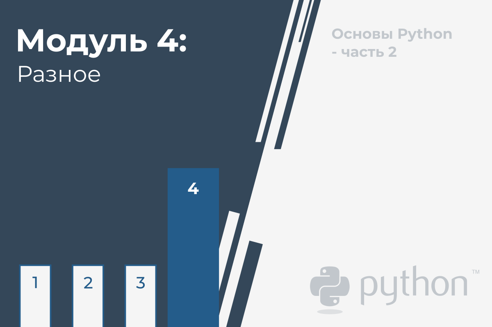

# Разное

В этом модуле Вы познакомитесь с:

*   Генераторами, итераторами и замыканиями;
*   Работой с файловой системой, деревом каталогов и файлами;
*   Выбранными модулями Стандартной Библиотеки Python (_os_, _datetime_, _time_ и _calendar_.)





# Генераторы - где их найти

**Генератор** - с чем Вы ассоциируете это слово? Возможно, это относится к какому-то электронному устройству. Или, возможно, это относится к тяжелой, промышленной машине, предназначенной для производства электричества.

Генератор Python - это **фрагмент специализированного кода, способный генерировать серию значений и управлять процессом итерации**. Вот почему генераторы очень часто называют **итераторами**, и хотя некоторые могут найти очень тонкое различие между этими двумя, мы будем рассматривать их как одно и то же.

Вы можете не осознавать этого, но Вы сталкивались с генераторами много, много раз раньше. Взгляните на очень простой фрагмент:

```python
for i in range(5):
    print(i)

```

Функция `range()`, по сути, является генератором, который (фактически, опять же) является итератором.

В чем разница?

Функция возвращает одно четко определенное значение - оно может быть результатом более или менее сложной оценки, например, полинома, и вызывается один раз - только один раз.

Генератор **возвращает серию значений** и, как правило, (неявно) вызывается более одного раза.

В этом примере генератор `range()` вызывается шесть раз, предоставляя пять последовательных значений от нуля до четырех и, наконец, сигнализируя о завершении серии.

Вышеупомянутый процесс полностью прозрачен. Давайте прольем на него немного света. Покажем Вам **протокол итератора**.

Протокол итератора - это **образ, которым объект должен вести себя в соответствии с правилами, налагаемыми контекстом инструкций `for` и `in`**. Объект, соответствующий протоколу итератора, называется **итератором**.

Итератор должен предоставить два метода:

*   `__iter__()`, который должен **возвращать сам объект** и который вызывается один раз (это необходимо для успешного запуска итерации в Python);
*   `__next__()`, который предназначен для **возврата следующего значения** (первого, второго и т. д.) нужной серии - он будет вызываться `for`/`in`, чтобы пройти следующую итерацию; если больше нет значений для предоставления, метод должен **вызвать исключение StopIteration**.


Звучит странно? Нет. Посмотрите на пример.

```python
class Fib:
    def __init__(self, nn):
        print("__init__")
        self.__n = nn
        self.__i = 0
        self.__p1 = self.__p2 = 1

    def __iter__(self):
        print("__iter__")
        return self

    def __next__(self):
        print("__next__")		
        self.__i += 1
        if self.__i > self.__n:
            raise StopIteration
        if self.__i in [1, 2]:
            return 1
        ret = self.__p1 + self.__p2
        self.__p1, self.__p2 = self.__p2, ret
        return ret


for i in Fib(10):
    print(i)

```

Мы создали класс, способный перебирать значения первых `n` (где `n` - параметр конструктора) чисел Фибоначчи.

Напомним, что числа Фибоначчи (_Fib<sub>i</sub>_) определены следующим образом:

_Fib<sub>1</sub> = 1  
Fib<sub>2</sub> = 1  
Fib<sub>i</sub> = Fib<sub>i-1</sub> + Fib<sub>i-2</sub>_

Другими словами:

*   первые два числа Фибоначчи равны 1;
*   любое другое число Фибоначчи является суммой двух предыдущих (например, Fib<sub>3</sub> = 2, Fib<sub>4</sub> = 3, Fib<sub>5</sub> = 5 и т.д.).

Давайте углубимся в код:

*   строки со 2 по 6: конструктор класса печатает сообщение (мы будем использовать это для отслеживания поведения класса), подготавливает некоторые переменные (`__n` для хранения ограничения серии, `__i` для отслеживания текущего числа Фибоначчи, которое нужно предоставить, и `__p1` вместе с `__p2` для сохранения двух предыдущих чисел);
  
*   строки с 8 по 10: метод `__iter__` обязан возвращать сам объект итератора; его цель может быть немного двусмысленной, но в этом нет никакой тайны; попытайтесь представить объект, который не является итератором (например, это набор объектов), но один из его компонентов является итератором, способным сканировать наборы данных; метод `__iter__` должен **извлечь итератор и поручить ему выполнение протокола итерации**;
 
    как видите, метод начинает свое действие с печати сообщения;
  
*   строки с 12 по 21: метод `__next__` отвечает за создание последовательности; это несколько многословно, но это должно сделать его более читабельным;
     
    сначала он печатает сообщение, затем обновляет количество требуемых значений, и если он достигает конца последовательности, метод прерывает итерацию, вызывая исключение `StopIteration`;
    
    остальная часть кода проста и точно отражает определение, которое мы показали вам ранее;
      
*   строки 23 и 24 используют итератор.

Код дает следующий вывод:

```
__init__
__iter__
__next__
1
__next__
1
__next__
2
__next__
3
__next__
5
__next__
8
__next__
13
__next__
21
__next__
34
__next__
55
__next__
```

Посмотрите:

*   сначала создается объект итератора;
*   затем Python вызывает метод `__iter__`, чтобы получить доступ к фактическому итератору;
*   метод `__next__` вызывается одиннадцать раз - первые десять раз дают полезные значения, а одиннадцатый завершает итерацию.

В предыдущем примере показано решение, в котором объект **итератора является частью более сложного класса**.

Код не очень сложный, но он ясно представляет концепцию.

Посмотрите на код.

```python
class Fib:
    def __init__(self, nn):
        self.__n = nn
        self.__i = 0
        self.__p1 = self.__p2 = 1

    def __iter__(self):
        print("Fib iter")
        return self

    def __next__(self):
        self.__i += 1
        if self.__i > self.__n:
            raise StopIteration
        if self.__i in [1, 2]:
            return 1
        ret = self.__p1 + self.__p2
        self.__p1, self.__p2 = self.__p2, ret
        return ret


class Class:
    def __init__(self, n):
        self.__iter = Fib(n)

    def __iter__(self):
        print("Class iter")
        return self.__iter


object = Class(8)

for i in object:
    print(i)

```

Мы встроили итератор `Fib` в другой класс (можно сказать, что мы провели его композицию в класс `Class`). Он создается вместе с объектом `Class`.

Объект класса может использоваться как итератор, когда (и только когда) он положительно отвечает на вызов `__iter__` - этот класс может это сделать, и если он вызывается таким образом, он предоставляет объект, способный подчиняться протоколу итерации.

Вот почему вывод кода такой же, как и ранее, хотя объект класса `Fib` явно не используется внутри цикла `for`.


# Инструкция yield

Протокол итератора не является особенно трудным для понимания и использования, но также несомненно, что **протокол достаточно неудобен**.

Основной дискомфорт, который он приносит - это **необходимость сохранения состояния итерации между последующими вызовами `__iter__`**.

Например, итератор `Fib` вынужден хранить точное место, в котором был остановлен последний вызов (т.е. оцененное число и значения двух предыдущих элементов). Это делает код более понятным.

Вот почему Python предлагает гораздо более эффективный, удобный и элегантный способ написания итераторов.

Концепция основана на очень специфичном и мощном механизме, предоставляемом ключевым словом `yield`.

Вы можете думать о ключевом слове `yield` как о более умном родственнике оператора `return`, с одним существенным отличием.

Посмотрите на эту функцию:

```python
def fun(n):
    for i in range(n):
        return i
```

Это выглядит странно, не так ли? Понятно, что цикл `for` не имеет шансов завершить свое первое выполнение, так как `return` безвозвратно прервет его.

Более того, вызов функции ничего не изменит - цикл `for` начнется с нуля и будет немедленно прерван.

Можно сказать, что такая функция не может сохранять и восстанавливать свое состояние между последующими вызовами.

Это также означает, что подобную функцию **нельзя использовать в качестве генератора**.

Мы заменили ровно одно слово в коде - видите?

```python
def fun(n):
    for i in range(n):
        [!mark!]yield[!/mark!] i
```

Мы добавили `yield` вместо `return`. Эта небольшая поправка **превращает функцию в генератор**, а выполнение оператора `yield` имеет несколько очень интересных эффектов.

Прежде всего, он возвращает значение выражения, указанного после ключевого слова `yield`, точно так же как `return`, но не теряет состояние функции.

Все значения переменных заморожены и ждут следующего вызова, когда выполнение будет возобновлено (не с нуля, как после `return`).

Есть одно важное ограничение: такую функцию **не следует вызывать явно**, так как на самом деле она больше не является функцией - **это объект генератора**.

Вызов **вернет идентификатор объекта**, а не серию, которую мы ожидаем от генератора.

По тем же причинам предыдущая функция (та, что с оператором `return`) может вызываться только явно и не должна использоваться в качестве генератора.


# Как построить генератор

Давайте покажем Вам новый генератор в действии.

Вот как мы можем это использовать:

```python
def fun(n):
    for i in range(n):
        yield i

for v in fun(5):
    print(v)

```

Можете угадать вывод?

<details><summary>Проверка</summary>

```
0
1
2
3
4
```

</details>

Что если Вам нужен генератор **для получения первых _n_ степеней _2_**?

Нет ничего проще. Просто посмотрите на код ниже.

```python
def powers_of_2(n):
    power = 1
    for i in range(n):
        yield power
        power *= 2


for v in powers_of_2(8):
    print(v)

```

Можете угадать вывод? Запустите код, чтобы проверить свои догадки.


## Составление списков

Генераторы также могут использоваться в **списках**, как здесь:

```python
def powersOf2(n):
    pow = 1
    for i in range(n):
        yield pow
        pow *= 2


t = [x for x in powersOf2(5)]
print(t)

```

Запустите пример и проверьте вывод.

Функция `list()` может переделать серию последовательных выходов генератора в **реальный список**:

```python
def powers_of_2(n):
    power = 1
    for i in range(n):
        yield power
        power *= 2


t = list(powers_of_2(3))
print(t)

```

Снова попытайтесь предсказать вывод и запустите код, чтобы проверить Ваши прогнозы.

Кроме того, контекст, созданный оператором `in`, также позволяет использовать генератор.

В примере показано, как это сделать:

```python
def powers_of_2(n):
    power = 1
    for i in range(n):
        yield power
        power *= 2


for i in range(20):
    if i in powers_of_2(4):
        print(i)

```

Каков вывод кода? Запустите программу и проверьте.

Теперь давайте посмотрим на **генератор чисел Фибоначчи** и убедимся, что он выглядит намного лучше, чем объектная версия, основанная на реализации протокола прямого итератора.

Вот он:

```python
def fibonacci(n):
    p = pp = 1
    for i in range(n):
        if i in [0, 1]:
            yield 1
        else:
            n = p + pp
            pp, p = p, n
            yield n

fibs = list(fibonacci(10))
print(fibs)

```

Угадайте вывод (список), созданный генератором, и запустите код, чтобы проверить, были ли Вы правы.


# Подробнее о составлении списков

Вы должны помнить правила, регулирующие создание и использование особого явления Python под названием **генерирование списков - простой и впечатляющий способ создания списков и их содержимого**.

Если Вам это нужно, мы сделаем быстрое напоминание.

```python
list_1 = []

for ex in range(6):
    list_1.append(10 ** ex)

list_2 = [10 ** ex for ex in range(6)]

print(list_1)
print(list_2)

```

Внутри кода есть две части, каждая из которых создает список, содержащий несколько первых натуральных степеней десяти.

Первый использует обычный способ использования цикла `for`, в то время как второй использует генерирование списка и создает список на месте, не нуждаясь в цикле или любом другом расширенном коде.

Похоже, что список создается внутри себя - это не так, конечно, как Python должен выполнять практически ту же операцию, как и в первом фрагменте, но бесспорно, что вторая форма более элегантна, и позволяет читающему код избегать лишних деталей.

В примере выводятся две идентичные строки, содержащие следующий текст:

```
[1, 10, 100, 1000, 10000, 100000]
[1, 10, 100, 1000, 10000, 100000]
```

Запустите код, чтобы проверить, правы ли вы.

Есть очень интересный синтаксис, который мы хотим показать Вам сейчас. Его удобство использования не ограничивается списочным пониманием, но мы должны признать, что это идеальная среда для него.

Это **условное выражение - способ выбора одного из двух различных значений на основе результата логического выражения**.

Взгляните:

```python
expression_one if condition else expression_two
```

На первый взгляд это может показаться немного удивительным, но Вы должны помнить, что это **не условная инструкция**. Более того, это совсем не инструкция. Это оператор.

Значение, которое оно предоставляет, равно `expression_one`, когда условие имеет значение `True` или `expression_two` в противном случае.

Хороший пример расскажет вам больше.

```python
lst = []

for x in range(10):
    lst.append(1 if x % 2 == 0 else 0)

print(lst)

```

Код заполняет список с `1` и `0` - если индекс определенного элемента нечетный, элемент устанавливается в `0` и `1` в противном случае.

Просто? Может быть, не на первый взгляд. Элегантно? Безусловно.

Можно ли использовать тот же трюк в генерировании списка? Да, можно.

Посмотрите на пример.

```python
lst = [1 if x % 2 == 0 else 0 for x in range(10)]

print(lst)

```

Компактность и элегантность - эти два слова приходят на ум при взгляде на код.

Итак, что у них общего, генераторы и списки? Есть ли какая-то связь между ними? Да. Довольно слабая связь, но однозначная.

Одно изменение может **превратить его в генератор**.

Теперь посмотрите на приведенный ниже код и посмотрите, сможете ли Вы найти детали, которые превращают генерирование списка в генератор:

```python
the_list = [1 if x % 2 == 0 else 0 for x in range(10)]
the_generator = (1 if x % 2 == 0 else 0 for x in range(10))

for v in the_list:
    print(v, end=" ")
print()

for v in the_generator:
    print(v, end=" ")
print()

```

Это **круглые скобки**. Квадратные скобки создают генерирование, круглые - генератор.

Код, однако, при запуске выдает две одинаковые строки:

```
1 0 1 0 1 0 1 0 1 0
1 0 1 0 1 0 1 0 1 0
```

Как узнать, что второй вывод создает генератор, а не список?

Есть некоторые доказательства, которые мы можем Вам показать. Вызовите функцию `len()` для обоих этих объектов.

`len(lst)` оценивается как `10`. Ясно и предсказуемо. `len(genr)` вызовет исключение, и Вы увидите следующее сообщение:

```
TypeError: object of type 'generator' has no len()
```

Конечно, сохранять список или генератор не обязательно - Вы можете создать их именно там, где они Вам нужны - как в примере ниже:

```python
for v in [1 if x % 2 == 0 else 0 for x in range(10)]:
    print(v, end=" ")
print()

for v in (1 if x % 2 == 0 else 0 for x in range(10)):
    print(v, end=" ")
print()

```

Примечание: один и тот же внешний вид вывода не означает, что оба цикла работают одинаково. В первом цикле список создается (и повторяется) целиком - он действительно существует во время выполнения цикла.

Во втором цикле список вообще отсутствует - есть только последующие значения, создаваемые генератором, одно за другим.

Проведите свои собственные эксперименты.
  
  
# Функция `lambda`

Функция `lambda` - это понятие, заимствованное из математики, более конкретно, из части, называемой _лямбда-исчислением_, но эти два явления не одинаковы.

Математики используют _лямбда-исчисление_ во многих формальных системах, связанных с логикой, рекурсией или доказуемостью теорем. Программисты используют функцию `lambda`, чтобы упростить код, сделать его более понятным и простым.

Функция `lambda` - это функция без имени (ее также можно назвать **анонимной функцией**). Конечно, такое утверждение сразу же поднимает вопрос: как использовать то, что не может быть идентифицировано?

К счастью, это не проблема, так как Вы можете назвать такую функцию, если Вам действительно нужно, но на самом деле во многих случаях функция lambda может существовать и работать, оставаясь полностью анонимной.

Объявление функции `lambda` никак не похоже на обычное объявление функции - убедитесь сами:

```python
lambda parameters : expression
```  

Такое предложение **возвращает значение выражения, если принять во внимание текущее значение текущего аргумента `lambda`**.

Как обычно, будет полезен пример. Наш пример использует три функции `lambda`, и дает им имена. Посмотрите на это внимательно:

```python
two = lambda: 2
sqr = lambda x: x * x
pwr = lambda x, y: x ** y

for a in range(-2, 3):
    print(sqr(a), end=" ")
    print(pwr(a, two()))

```

Давайте проанализируем его:

*   первая `lambda` - это анонимная **функция без параметров**, которая всегда возвращает 2. Поскольку мы **присвоили его переменной с именем `two`**, мы можем сказать, что функция больше не является анонимной, и мы можем использовать имя для ее вызова.
  
*   вторая является **анонимной функцией с одним параметром**, которая возвращает значение аргумента в квадрате. Мы назвали ее `sqr`.
  
*   третья `lambda` **принимает два параметра** и возвращает значение первого, возведенное в степень второго. Имя переменной, которая содержит `lambda`, говорит само за себя. Мы не используем `pow`, чтобы избежать путаницы со встроенной функцией с тем же именем и той же целью.


Программа дает следующий вывод:

```
4 4
1 1
0 0
1 1
4 4
```

Этот пример достаточно ясен, чтобы показать, как объявляются `lambda` и как они ведут себя, но он ничего не говорит о том, зачем они нужны, и для чего они используются, поскольку все они могут быть заменены на привычные функции Python.

В чем выгода?


# Как использовать лямбды и для чего?

Наиболее интересная часть использования лямбда-выражений появляется, когда Вы можете использовать их в чистом виде - **как анонимные части кода, предназначенные для оценки результата**.

Представьте, что нам нужна функция (назовем ее `printfunction`), которая печатает значения данной (другой) функции для набора выбранных аргументов.

Мы хотим, чтобы `printfunction` был универсальным - он должен принимать набор аргументов, помещенных в список, и функцию для оценки, оба в качестве аргументов - мы не хотим ничего кодировать жестко.

Посмотрите на пример. Вот как мы реализовали эту идею.

```python
def printfunction(args, fun):
	for x in args:
		print('f(', x,')=', fun(x), sep='')


def poly(x):
	return 2 * x**2 - 4 * x + 2


printfunction([x for x in range(-2, 3)], poly)

```

Давайте проанализируем это. Функция `printfunction()` принимает два параметра:

*   первый, список аргументов, для которых мы хотим напечатать результаты;
*   второй - функция, которая должна вызываться столько раз, сколько значений собирается в первом параметре.

Примечание: мы также определили функцию с именем `poly()` - это функция, значения которой мы собираемся напечатать. Вычисление, которое выполняет функция, не очень сложное - это многочлен (отсюда и название) формы:

<code>f(x) = 2x<sup>2</sup> - 4x + 2</code>

Имя функции затем передается в `printfunction()` вместе с набором из пяти различных аргументов - набор строится с помощью условия понимания списка.

Код печатает следующие строки:

```
f(-2)=18
f(-1)=8
f(0)=2
f(1)=0
f(2)=2
```

Можно ли избежать определения функции `poly()`, поскольку мы не собираемся использовать ее более одного раза? Да, можно - это то преимущество, которое может принести лямбда.

Посмотрите на пример ниже. Вы видите разницу?

```python
def print_function(args, fun):
    for x in args:
        print('f(', x,')=', fun(x), sep='')

print_function([x for x in range(-2, 3)], lambda x: 2 * x**2 - 4 * x + 2)

```

Функция `printfunction()` осталась прежней, но функции `poly()` нет. Нам это больше не нужно, поскольку полином теперь находится непосредственно внутри вызова `printfunction()` в форме лямбды, определенной следующим образом:

```python
lambda x: 2 * x ** 2 - 4 * x + 2
```

Код стал короче, понятнее и разборчивее.

Давайте покажем вам еще одно место, где лямбды могут быть полезны. Мы начнем с описания `map()`, встроенной функции Python. Его название не слишком наглядно, идея проста, а сама функция действительно полезна.


# Лямбды и функция `map()`

В простейшем из всех возможных случаев функция `map()`:

```python
map(function, list)
```  

принимает два аргумента:

*   функцию;
*   список.

Приведенное выше описание чрезвычайно упрощено:

*   второй аргумент `map()` может быть любым объектом, по которому можно итерироваться (например, кортеж или просто генератор);
*   `map()` может принимать более двух аргументов.

Функция **`map()` применяет функцию, переданную ее первым аргументом, ко всем элементам второго аргумента и возвращает итератор, дающий все последующие результаты функции**. Вы можете использовать полученный итератор в цикле или преобразовать его в список с помощью функции `list()`.

Вы можете увидеть роль лямбды здесь?

Посмотрите на код - мы использовали в нем две лямбды.

```python
list1 = [x for x in range(5)]
list2 = list(map(lambda x: 2 ** x, list1))
print(list2)

for x in map(lambda x: x * x, list2):
	print(x, end=' ')
print()

```

Это интрига:

*   создайте список `list1` со значениями от `0` до `4`;
*   затем используйте `map` вместе с первой `lambda`, чтобы создать новый список, в котором все элементы были оценены как 2, возведенные в степень, взятая из соответствующего элемента из списка `list1`;
*   потом выводится список `list2`;
*   на следующем шаге снова используйте функцию `map()`, чтобы использовать возвращаемый генератор и напрямую печатать все значения, которые он выдает; как вы можете видеть, мы задействовали вторую `lambda` здесь - она просто возводит в квадрат каждый элемент из списка `list2`.

Попробуйте представить тот же код без лямбд. Будет лучше? Это маловероятно.


# Лямбды и функции `filter()`

Еще одна функция Python, которая может быть значительно улучшена применением лямбды, - это `filter()`.

Она ожидает того же рода аргументы, что и `map()`, но делает нечто другое - она **фильтрует второй аргумент, руководствуясь указаниями, вытекающими из функции, указанной в качестве первого аргумента** (функция вызывается для каждого элемента списка, как в `map()`).

Элементы, которые возвращают `True` из функции, **проходят фильтр** - остальные отклоняются.

В примере показана функция `filter()` в действии.

```python
from random import seed, randint

seed()
data = [ randint(-10,10) for x in range(5) ]
filtered = list(filter(lambda x: x > 0 and x % 2 == 0, data))

print(data)
print(filtered)

```

Примечание: мы использовали модуль `random`, чтобы инициализировать генератор случайных чисел (не путать с генераторами, о которых мы только что говорили) с помощью `seed()` и для получения пяти случайных целочисленных значений от `-10` до `10` с помощью функции `randint()`.

Затем список фильтруется, и принимаются только числа, которые четные и больше нуля.

Конечно, маловероятно, что Вы получите такие же результаты, но вот как выглядели наши:

```
[6, 3, 3, 2, -7]
[6, 2]
```


# Краткий взгляд на замыкания

Давайте начнем с определения: **замыкание - это метод, который позволяет хранить значения, несмотря на то, что контекст, в котором они были созданы, больше не существует**. Запутанно? Немного.

Давайте проанализируем простой пример:

```python
def outer(par):
    loc = par


var = 1
outer(var)

print(var)
print(loc)

```

Пример явно ошибочный.

Последние две строки вызовут исключение `NameError` - ни `par`, ни `loc` недоступны вне функции. Обе переменные существуют тогда и только тогда, когда выполняется функция `outer()`.

Посмотрите на следующий пример. Мы значительно изменили код.

```python
def outer(par):
    loc = par

    def inner():
        return loc
    return inner


var = 1
fun = outer(var)
print(fun())

```

В нем есть новый элемент - функция (с именем `inner`) внутри другой функции (с именем `external`).

Как это работает? Как и любая другая функция, за исключением того факта, что `inner()` может вызываться только из `outer()`. Мы можем сказать, что `inner()` является частным инструментом `external()` - никакая другая часть кода не может получить к нему доступ.

Посмотрите внимательно:

*   функция `inner()` возвращает значение переменной, доступной внутри своей области видимости, так как `inner()` может использовать любые объекты в распоряжении `outer()`;
*   функция `external()` возвращает саму функцию `inner()`; точнее, он возвращает копию функции `inner()`, которая была заморожена в момент вызова `external()`; замороженная функция содержит полное окружение, включая состояние всех локальных переменных, что также означает, что значение `loc` успешно сохранено, хотя `outer()` перестала существовать давным-давно.

По сути, код полностью корректен и выводит:

```
1
```

Функция, возвращаемая во время вызова `external()`, является **замыканием**.

**Замыкание должно вызываться точно так же, как оно было объявлено**.

В примере ниже:

```python
def outer(par):
    loc = par

    def inner():
        return loc
    return inner


var = 1
fun = outer(var)
print(fun())

```

функция `inner()` не имеет параметров, поэтому нам пришлось вызывать ее без аргументов.

Теперь посмотрите на следующий код. Полностью можно **объявить замыкание, снабженное произвольным числом параметров**, например как и функцией `power()`.

```python
def make_closure(par):
    loc = par

    def power(p):
        return p ** loc
    return power


fsqr = make_closure(2)
fcub = make_closure(3)

for i in range(5):
    print(i, fsqr(i), fcub(i))

```

Это означает, что замыкание не только использует замороженную среду, но и может **изменить свое поведение, используя значения, взятые извне**.

В этом примере показано еще одно интересное обстоятельство - Вы можете **создать столько замыканий, сколько захотите, используя один и тот же кусок кода**. Это делается с помощью функции с именем `make_closure()`.

Примечание:

*   первое замыкание, полученное из `make_closure()`, определяет инструмент, возводящий в квадрат свой аргумент;
*   второй предназначен для возведения в куб аргумента.

Вот почему код производит следующий вывод:

```
0 0 0
1 1 1
2 4 8
3 9 27
4 16 64
```

Проведите свои собственные тесты.

  
# Основные тезисы

1. **Итератор** - это объект класса, предоставляющий как минимум **два** метода (не считая конструктора).:

   *   `__iter__()` вызывается один раз при создании итератора и возвращает **сам** объект итератора;
   *   `__next__()` вызывается для предоставления **значения следующей итерации** и вызывает исключение `StopIteration`, когда итерация **подходит к концу и заканчивается**.


2. Оператор `yield` может использоваться только внутри функций. Оператор `yield` приостанавливает выполнение функции и заставляет функцию возвращать аргумент `yield` в качестве результата. Такую функцию нельзя вызвать обычным способом - ее единственное назначение - использовать в качестве **генератора** (т.е. В контексте, требующем серии значений, например в цикле `for`).


3. **Условное выражение** - это выражение, построенное с использованием оператора `if-else`. Например:
    
    ```python
    print(True if 0 >= 0 else False)
    ```  
    
    выводит `True`.


4. **Генерирование списка** становится **генератором** при использовании его внутри **круглых скобок** (внутри квадратных скобок оно создает обычный список). Например:

```python
for x in (el * 2 for el in range(5)):
    print(x)

```

выводит `02468`.


5. **лямбда-функция** - это инструмент для создания **анонимных функций**. Например:
    
    ```python
    def foo(x, f):
        return f(x)
    
    print(foo(9, lambda x: x ** 0.5))
    
    ```
    
    выводит `3.0`.

6. Функция `map(fun, list)` создает **копию** аргумента `list` и применяет функцию `fun` ко всем его элементам, возвращающим **генератор**, который предоставляет новое содержимое списка элемент за элементом. Например:
    
    ```python
    short_list = ['mython', 'python', 'fell', 'on', 'the', 'floor']
    new_list = list(map(lambda s: s.title(), short_list))
    print(new_list)
    
    ```
    
    выводит `['Mython', 'Python', 'Fell', 'On', 'The', 'Floor']`.

7. функция `filter(fun, list)` создает **копию** тех элементов `list`, которые заставляют функцию `fun` вернуть `True`. Результатом функции является **генератор**, возвращающий новый список элемент за элементом. Например:
    
    ```python
    short_list = [1, "Python", -1, "Monty"]
    new_list = list(filter(lambda s: isinstance(s, str), short_list))
    print(new_list)
    
    ```
    
    выводит `['Python', 'Monty']`.

8. Замыкание - это метод, который позволяет **сохранять значения**, несмотря на то, что **контекст**, в котором они были созданы, **больше не существует**. Например:

```python
def tag(tg):
    tg2 = tg
    tg2 = tg[0] + '/' + tg[1:]

    def inner(str):
        return tg + str + tg2
    return inner


b_tag = tag('<b>')
print(b_tag('Monty Python'))

```

выводит `Monty Python`

---

**Упражнение 1**

Каков ожидаемый вывод следующего кода?

```python
class Vowels:
    def __init__(self):
        self.vow = "aeiouy "  # Да, мы знаем, что y не всегда считается гласной.
        self.pos = 0

    def __iter__(self):
        return self

    def __next__(self):
        if self.pos == len(self.vow):
            raise StopIteration
        self.pos += 1
        return self.vow[self.pos - 1]


vowels = Vowels()
for v in vowels:
    print(v, end=' ')

```

<details><summary>Проверка</summary>

```
a e i o u y
```

</details>

---

**Упражнение 2**

Напишите функцию **лямбда**, задав младший значащий бит ее целочисленного аргумента, и примените ее к функции `map()`, чтобы получить строку `1 3 3 5` в консоли.

```python
any_list = [1, 2, 3, 4]
even_list = # завершите эту строку.
print(even_list)

```
  
<details><summary>Проверка</summary>

```python
list(map(lambda n: n | 1, any_list))
```

</details>

---

**Упражнение 3**

Каков ожидаемый вывод следующего кода?

```python
def replace_spaces(replacement='*'):
    def new_replacement(text):
        return text.replace(' ', replacement)
    return new_replacement


stars = replace_spaces()
print(stars("And Now for Something Completely Different"))

```

<details><summary>Проверка</summary>

```
And*Now*for*Something*Completely*Different
```

</details>

* * *

**Примечание**

[PEP 8](https://www.python.org/dev/peps/pep-0008/#programming-recommendations), руководство по стилю для кода Python рекомендует не присваивать **лямбда-выражения переменным, а определять их как функции**.

Это означает, что лучше использовать оператор `def` и избегать использования оператора присваивания, который связывает лямбда-выражение с идентификатором. Проанализируйте код ниже:

```python
# Рекомендуется:
def f(x): return 3*x


# Не рекомендуется:
f = lambda x: 3*x

```

Привязка лямбда-выражений к идентификаторам обычно дублирует функционал оператора `def`. С другой стороны, использование операторов `def` генерирует больше строк кода.

Важно понимать, что реальность часто любит рисовать свои собственные сценарии, которые необязательно соответствуют конвенциям или формальным рекомендациям. Решите Вы следовать им или нет, будет зависеть от многих вещей: Ваших предпочтений, других принятых соглашений, внутренних правил компании, совместимости с существующим кодом и т.д. Помните об этом.

