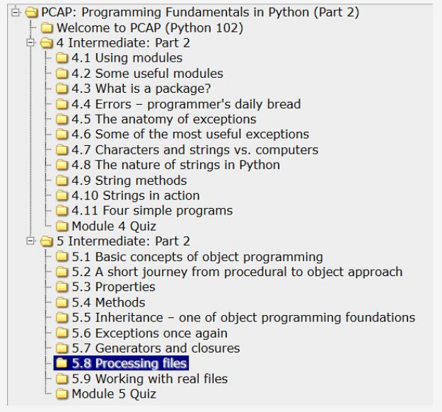

# Доступ к файлам из кода Python

Одной из наиболее распространенных проблем в работе разработчика является **обработка данных, хранящихся в файлах**, в то время как файлы обычно физически хранятся с использованием устройств хранения - жестких, оптических, сетевых или твердотельных дисков. 

Легко представить программу, которая сортирует 20 чисел, и так же легко представить пользователя этой программы, который вводит эти двадцать чисел непосредственно с клавиатуры.

Гораздо сложнее представить ту же задачу, когда нужно отсортировать 20 000 чисел, и нет ни одного пользователя, который мог бы ввести эти числа без ошибок.

Гораздо проще представить, что эти числа хранятся в файле на диске, который читается программой. Программа сортирует числа и не отправляет их на экран, а создает новый файл и сохраняет там отсортированную последовательность чисел.

Если мы хотим реализовать простую базу данных, единственный способ сохранить информацию между запусками программы - сохранить ее в файл (или файлы, если ваша база данных более сложна).

В принципе, любая непростая проблема программирования зависит от использования файлов, независимо от того, обрабатывает ли она изображения (хранятся в файлах), умножает матрицы (хранятся в файлах) или рассчитывает заработную плату и налоги (считывая данные, хранящиеся в файлах).

  


Вы можете спросить, почему мы ждали до сих пор, чтобы показать Вам эти проблемы.

Ответ очень прост - способ доступа и обработки файлов в Python реализован с использованием согласованного набора объектов. Нет лучшего момента, чтобы говорить об этом.


## Имена файлов

Различные операционные системы могут обрабатывать файлы по-разному. Например, в Windows используется не такая конвенция имен, как в системах Unix/Linux.

Если мы используем понятие канонического имени файла (имя, которое однозначно определяет местоположение файла независимо от его уровня в дереве каталогов), мы можем понять, что эти имена выглядят по-разному в Windows и в Unix/Linux:


Как видите, системы, производные от Unix/Linux, не используют букву диска (например, `C:`), и все каталоги растут из одного корневого каталога с именем `/`, в то время как системы Windows распознают корневой каталог как `\`.

Кроме того, имена системных файлов Unix/Linux чувствительны к регистру. Системы Windows хранят регистр букв, используемых в имени файла, но вообще не различают их регистры.

Это означает, что эти две строки: `ThisIsTheNameOfTheFile` и `thisisthenameofthefile` описывают два разных файла в системах Unix/Linux, но это одно и то же имя для одного файла в системах Windows.

Главное и самое разительное отличие заключается в том, что Вам необходимо использовать **два разных разделителя для имен каталогов**: `\` в Windows и `/` в Unix/Linux.

Это различие не очень важно для обычного пользователя, но **очень важно при написании программ на Python**.

Чтобы понять почему, попробуйте вспомнить очень специфическую роль, которую `\` играет внутри строк Python.

Предположим, Вас интересует определенный файл, расположенный в каталоге `dir` с именем `file`.

Предположим также, что Вы хотите присвоить строку, содержащую имя файла.

В системах Unix/Linux это может выглядеть следующим образом:

```python
name = "/dir/file"
```  

Но если Вы попытаетесь закодировать его для системы Windows:

```python
name = "\dir\file"
```  

Вы получите неприятный сюрприз: либо Python выдаст ошибку, либо программа будет вести себя странно, как будто имя файла каким-то образом искажено.

На самом деле это совсем не странно, но вполне очевидно и естественно. Python использует `\` в качестве escape-символа (например, `\n`).

Это означает, что имена файлов Windows должны быть записаны следующим образом:

```python
name = "\\dir\\file"
```  

К счастью, есть и еще одно решение. Python достаточно умен, чтобы иметь возможность преобразовывать косые черты в обратную косую черту каждый раз, когда обнаруживает, что это требуется для ОС.

Это означает, что любые следующие присваивания:

```python
name = "/dir/file"
name = "c:/dir/file"
```  

будут работать и с Windows.

Любая программа, написанная на Python (и не только на Python, поскольку это соглашение применяется практически ко всем языкам программирования), не взаимодействует с файлами напрямую, а через некоторые абстрактные объекты, которые по-разному называются в разных языках или средах - наиболее используемые термины - это **дескрипторы** или **потоки** (здесь мы будем использовать их как синонимы).

Программист, имеющий более или менее богатый набор функций/методов, может выполнять определенные операции над потоком, которые влияют на реальные файлы, используя механизмы, содержащиеся в ядре операционной системы.

Таким образом, Вы можете реализовать процесс доступа к любому файлу, даже если имя файла неизвестно на момент написания программы.




Операции, выполняемые с абстрактным потоком, отражают действия, связанные с физическим файлом.

Чтобы связать поток с файлом, необходимо выполнить явную операцию.

Операция соединения потока с файлом называется **открытием файла**, а отключение этой ссылки называется **закрытием файла**.

Следовательно, вывод заключается в том, что самая первая операция, выполняемая в потоке, всегда `open`, а последняя - `close`. По сути, программа может свободно управлять потоком между этими двумя событиями и обрабатывать связанный файл.

Эта свобода, конечно, ограничена физическими характеристиками файла и способом его открытия.

Скажем еще раз, что открытие потока может быть неудачным, и это может произойти по нескольким причинам: наиболее распространенной является отсутствие файла с указанным именем.

Может также случиться, что физический файл существует, но программе не разрешено его открывать. Существует также риск того, что программа открыла слишком много потоков, и конкретная операционная система может не допустить одновременного открытия более чем `n` файлов (например, `200`).

Хорошо написанная программа должна обнаруживать эти неудачные открытия и реагировать соответствующим образом.


## Файловые потоки

Открытие потока не только связано с файлом, но также должно объявлять способ обработки потока. Это объявление называется **режимом открытия**.

Если открытие прошло успешно, программе **будет разрешено выполнять только те операции, которые соответствуют объявленному режиму открытия**.

В потоке выполняются две основные операции:

*   **чтение** из потока: части данных извлекаются из файла и помещаются в область памяти, управляемую программой (например, переменная);
*   **запись** в поток: части данных из памяти (например, переменная) переносятся в файл.

Для открытия потока используются три основных режима:

*   **режим чтения**: поток, открытый в этом режиме, разрешает **только операции чтения**; попытка записи в поток вызовет исключение (исключение называется UnsupportedOperation, которое наследует OSError и ValueError и поступает из модуля io);
*   **режим записи**: поток, открытый в этом режиме, позволяет **только операции записи**; попытка прочитать поток вызовет исключение, упомянутое выше;
*   **режим обновления**: поток, открытый в этом режиме, позволяет **как писать, так и читать**.


Прежде чем мы обсудим, как управлять потоками, мы должны Вам кое-что объяснить. **Поток ведет себя почти как магнитофон**.

Когда Вы читаете что-либо из потока, виртуальная головка перемещается по потоку в соответствии с количеством байтов, переданных из потока.

Когда Вы записываете что-то в поток, одна и та же головка движется вдоль потока, записывая данные из памяти.

Всякий раз, когда мы говорим о чтении и записи в поток, попытайтесь представить эту аналогию. В книгах по программированию этот механизм называется **текущей позицией файла**, и мы также будем использовать этот термин.


Теперь необходимо показать вам объект, отвечающий за представление потоков в программах.


## Файловые дескрипторы

Python предполагает, что **каждый файл скрыт за объектом соответствующего класса**.

Конечно, трудно не спросить, как интерпретировать слово _"соответствующего"_.

Файлы можно обрабатывать разными способами - некоторые из них зависят от содержимого файла, другие - от намерений программиста.

В любом случае разные файлы могут требовать разных наборов операций и вести себя по-разному.

Объект соответствующего класса **создается, когда Вы открываете файл и уничтожаете его во время закрытия**.

Между этими двумя событиями Вы можете использовать объект, чтобы указать, какие операции должны выполняться в конкретном потоке. Операции, которые Вам разрешено использовать, навязываются **способом, которым вы открыли файл**.

В общем, объект происходит из одного из классов, показанных здесь:


Примечание: Вы никогда не используете конструкторы для создания этих объектов. Единственный способ **создать их - это вызвать функцию с именем `open()`**.

Функция анализирует предоставленные Вами аргументы и автоматически создает необходимый объект.

Если Вы хотите **избавиться от объекта, вы вызываете метод с именем `close()`**.

Вызов разорвет соединение с объектом/файлом и удалит объект.

В наших целях мы будем касаться только потоков, представленных объектами `BufferIOBase` и `TextIOBase`. Вы скоро поймете, почему.

В зависимости от типа содержимого потока, **все потоки делятся на текстовые и бинарные потоки**.

Текстовые потоки структурированы в строки; то есть они содержат типографские символы (буквы, цифры, знаки пунктуации и т.д.), расположенные в строках (строках), как видно невооруженным глазом при просмотре содержимого файла в редакторе.

Этот файл записывается (или читается) в основном символ за символом или строка за строкой.

Бинарные потоки содержат не текст, а последовательность байтов любого значения. Эта последовательность может быть, например, исполняемой программой, изображением, аудио- или видеоклипом, файлом базы данных и т.д.

Поскольку эти файлы не содержат строк, операции чтения и записи относятся к частям данных любого размера. Следовательно, данные считываются/записываются побайтово или блочно, блок за блоком, где размер блока обычно варьируется от одного до произвольно выбранного значения.

Затем возникает проблема. В системах Unix/Linux концы строки отмечены одним символом с именем `LF` (код 10 ASCII), обозначенным в программах Python как `\n`.

Другие операционные системы, особенно те, которые получены из доисторической системы CP/M (которая также применяется к системам семейства Windows), используют другое соглашение: конец строки отмечен парой символов, `CR` и `LF` (коды ASCII 13 и 10), которые могут быть закодированы как `\r\n`.


Эта двусмысленность может вызвать различные неприятные последствия.

Если Вы создаете программу, отвечающую за обработку текстового файла, и она написана для Windows, вы можете распознать концы строк, найдя символы `\r\n`, но запуск той же программы в среде Unix/Linux будет абсолютно бесполезным, и наоборот: программа, написанная для систем Unix/Linux, может быть бесполезна в Windows.

Такие нежелательные функции программы, которые препятствуют использованию программы в различных средах, называются **непереносимостью**.

Аналогичным образом, черта программы, позволяющей выполнять ее в разных средах, называется **переносимостью**. Программа, наделенная такой чертой, называется **переносимой программой.**

Поскольку проблемы переносимости были (и остаются) очень серьезными, было принято решение определенно решить проблему таким образом, чтобы не привлекать внимание разработчика.


Это было сделано на уровне классов, которые отвечают за чтение и запись символов в и из потока. Это работает следующим образом:

*   когда поток открыт и рекомендуется, чтобы данные в связанном файле были обработаны как текст (или таких рекомендаций вообще нет), он **переключается в текстовый режим**;
  
*   во время чтения/записи строк из/в связанный файл ничего особенного не происходит в среде Unix, но когда те же операции выполняются в среде Windows, этот процесс называется **переводом символов новой строки**, он происходит, когда Вы читаете строку из файла, каждая пара символов `\r\n` заменяется одним символом `\n`, и наоборот; во время операций записи каждый символ `\n` заменяется парой символов `\r\n`;
  
*   механизм полностью **прозрачен** для программы, который можно записать так, как если бы он предназначался только для обработки текстовых файлов Unix/Linux; исходный код, работающий в среде Windows, также будет работать правильно;
  
*   когда поток открыт и рекомендуется это сделать, его содержимое принимается как есть, **без преобразования** - байты не добавляются и не опускаются.


## Открытие потока

**Открытие потока** выполняется функцией, которая может быть вызвана следующим образом:

```python
stream = open(file, mode = 'r', encoding = None)

```  

Давайте проанализируем ее:

*   имя функции (`open`) говорит само за себя; если открытие прошло успешно, функция возвращает объект потока; в противном случае возникает исключение (например, `FileNotFoundError`, **если файл, который Вы собираетесь прочитать, не существует**);
  
*   первый параметр функции (`file`) указывает имя файла, который будет связан с потоком;
  
*   второй параметр (`mode`) указывает режим открытия, используемый для потока; это строка, заполненная последовательностью символов, и у каждого из них есть свое особое значение (более подробная информация скоро);
  
*   третий параметр (`encoding`) указывает тип кодировки (например, UTF-8 при работе с текстовыми файлами);
  
*   открытие должно быть самой первой операцией, выполняемой в потоке.

Примечание: аргументы режима и кодирования могут быть опущены - тогда принимаются значения по умолчанию. Режим открытия по умолчанию - чтение в текстовом режиме, а кодировка по умолчанию зависит от используемой платформы.

Давайте теперь представим Вам самые важные и полезные режимы открытия. Готовы?


## Открытие потоков: режимы


`r` Режим открытия: чтение

*   поток будет открыт в **режиме чтения**;
*   файл, связанный с потоком, **должен существовать** и должен быть читаемым; в противном случае функция `open()` вызывает исключение.

`w` Режим открытия: запись

*   поток будет открыт в **режиме записи**;
*   файл, связанный с потоком, **не обязан существовать**; если он не существует, он будет создан; если он существует, он будет обрезан до нулевой длины (стерт); если создание невозможно (например, из-за системных разрешений), функция `open()` вызывает исключение.

`a` Режим открытия: добавление

*   поток будет открыт в **режиме добавления**;
*   файл, связанный с потоком, **не обязан существовать**; если он не существует, он будет создан; если он существует, виртуальная записывающая головка будет установлена в конце файла (предыдущее содержимое файла останется нетронутым.)

`r+` Режим открытия: чтение и добавление

*   поток будет открыт в **режиме чтения и добавления**;
*   файл, связанный с потоком, **должен существовать и должен быть доступен для записи**, в противном случае функция open() вызывает исключение;
*   для потока разрешены как операции чтения, так и записи.

`w+` Режим открытия: запись и добавление

*   поток будет открыт в режиме **записи и добавления**;
*   файл, связанный с потоком, **не обязан существовать**; если он не существует, он будет создан; предыдущее содержимое файла остается нетронутым;
*   для потока разрешены как операции чтения, так и записи.


## Выбор текстового или двоичного режима

Если в конце строки режима есть буква `b`, это означает, что поток должен быть открыт в **двоичном режиме**.

Если строка режима заканчивается буквой `t`, поток открывается в **текстовом режиме**.

Текстовый режим - это поведение по умолчанию, предполагаемое, когда не используется спецификатор двоичного/текстового режима.

Наконец, успешное открытие файла установит текущую позицию файла (виртуальную головку чтения/записи) перед первым байтом файла, **если режим не `a`** и после последнего байта файла, **если установлен режим `a`**.

| Текстовый режим | Двоичный режим | Описание            |
|-----------------|----------------|---------------------|
| `rt`            | `rb`           | чтение              |
| `wt`            | `wb`           | запись              |
| `at`            | `ab`           | добавление          |
| `r+t`           | `r+b`          | чтение и обновление |
| `w+t`           | `w+b`          | запись и обновление |


**Дополнение**

Вы также можете открыть файл для его эксклюзивного создания. Вы можете сделать это, используя открытый режим `x`. Если файл уже существует, функция `open()` вызовет исключение.


## Открытие потока в первый раз

Представьте, что мы хотим разработать программу, которая читает содержимое текстового файла с именем: `C:\Users\Пользователь\Desktop\file.txt`.

Как открыть этот файл для чтения? Вот соответствующий фрагмент кода:

```python
try:
    stream = open("C:\Users\User\Desktop\file.txt", "rt")
    # Processing goes here.
    stream.close()
except Exception as exc:
    print("Cannot open the file:", exc)

```

Что здесь происходит?

*   мы открываем блок `try-except`, поскольку хотим мягко обрабатывать ошибки выполнения;
*   мы используем функцию `open()`, чтобы попытаться открыть указанный файл (обратите внимание, как мы указали имя файла);
*   открытый режим определяется как текст для чтения (так как **текст является настройкой по умолчанию**, мы можем пропустить `t` в строке режима);
*   в случае успеха мы получаем объект из функции `open()` и присваиваем его переменной потока;
*   если `open()` не удается, мы обрабатываем исключение, выводя полную информацию об ошибке (определенно полезно знать, что именно произошло).


## Предварительно открытые потоки

Ранее мы говорили, что любой потоковой операции должен предшествовать вызов функции `open()`. Есть три четко определенных исключения из правила.

Когда наша программа запускается, три потока уже открыты и не требуют дополнительной подготовки. Более того, ваша программа может использовать эти потоки явно, если вы позаботитесь об импорте модуля `sys`:

```python
import sys
```  

потому что там размещены декларации этих трех потоков.


Названия этих потоков: `sys.stdin`, `sys.stdout`, and `sys.stderr`.

Давайте проанализируем:

*   `sys.stdin`

    *   `stdin` (как _стандартный ввод_);
    *   поток `stdin` обычно связан с клавиатурой, предварительно открыт для чтения и рассматривается как основной источник данных для работающих программ;
    *   широко известная функция `input()` считывает данные из `stdin` по умолчанию.

  
*   `sys.stdout`

    *   `stdout` (как _стандартный вывод_ );
    *   поток stdout обычно связан с экраном, предварительно открытым для записи, рассматриваемым как основная цель для вывода данных запущенной программой;
    *   хорошо известная функция `print()` выводит данные в поток `stdout`.

  
*   `sys.stderr`

    *   `stderr` (как _стандартный вывод ошибок_);
    *   поток `stderr` обычно связан с экраном, предварительно открытым для записи, который рассматривается как основное место, куда работающая программа должна отправлять информацию об ошибках, возникших в ходе ее работы;
    *   мы не представили какой-либо метод отправки данных в этот поток (мы обещаем, что скоро это будет сделано);
    *   отделение `stdout` (полезные результаты, полученные по программе) от `stderr` (сообщения об ошибках, несомненно, полезно, но не дает результатов) дает возможность перенаправлять эти два типа информации для разных целей. Более подробное обсуждение этого вопроса выходит за рамки нашего курса. Руководство по операционной системе предоставит больше информации по этим вопросам.


## Закрытие потока

Последняя операция, выполненная над потоком (это не включает потоки `stdin`, `stdout` и `stderr`, которые не требуют этого), должна быть **закрытием**.

Это действие выполняется методом, вызываемым из объекта открытого потока: `stream.close()`.

*   имя функции определенно комментируется (`close()`);
*   функция не ожидает точно никаких аргументов; поток не нужно открывать;
*   функция ничего не возвращает, но вызывает `IOError` в случае ошибки;
*   большинство разработчиков считают, что функция `close()` всегда выполняется успешно, поэтому нет необходимости проверять, правильно ли она выполнила свою задачу.  
      
    Это убеждение только частично оправдано. Если поток был открыт для записи, а затем была выполнена серия операций записи, может случиться, что данные, отправленные в поток, еще не были перенесены на физическое устройство (из-за механизма, называемого **кэшированием** или **буферизацией**). Поскольку закрытие потока вынуждает буферы сбрасывать данные, может случиться так, что сбой завершится неудачей, и поэтому close() тоже не удастся.

Мы уже упоминали о сбоях, вызванных функциями, работающими с потоками, но не упомянули ни слова о том, как именно мы можем определить причину сбоя.

Возможность поставить диагноз существует и обеспечивается одним из компонентов исключения потоков, о котором мы собираемся рассказать вам прямо сейчас.


## Диагностика проблем с потоками

Объект `IOError` оснащен свойством с именем `errno` (имя происходит от фразы _error number_), и Вы можете получить к нему доступ как следующим образом:

```python
try:
    # Some stream operations.
except IOError as exc:
    print(exc.errno)

```

Значение атрибута `errno` можно сравнить с одной из предопределенных символических констант, определенных в модуле `errno`.

Давайте посмотрим на некоторые выбранные **константы, полезные для обнаружения потоковых ошибок**:

*   `errno.EACCES` → в доступе отказано.  
      
    Ошибка возникает, например, при попытке открыть файл с атрибутом _только для чтения_ для записи.
  
*   `errno.EBADF` → неверный номер файла.  
      
    Ошибка возникает, когда Вы пытаетесь, например, работать с неоткрытым потоком.
  
*   `errno.EEXIST` → файл существует.  
      
    Ошибка возникает, например, при попытке изменить имя файла на такое же.
  
*   `errno.EFBIG` → файл слишком большой.  
      
    Ошибка возникает при попытке создать файл, размер которого превышает максимально допустимый операционной системой.
  
*   `errno.EISDIR` → это каталог.  
      
    Ошибка возникает при попытке трактовать имя каталога как имя обычного файла.
  
*   `errno.EMFILE` → слишком много открытых файлов.  
      
    Ошибка возникает при попытке одновременно открыть больше потоков, чем приемлемо для вашей операционной системы.
  
*   `errno.ENOENT` → нет такого файла или каталога.  
      
    Ошибка возникает при попытке доступа к несуществующему файлу/каталогу.
  
*   `errno.ENOSPC` → на устройстве не осталось места.  
      
    Ошибка возникает, когда на носителе нет свободного места.


Полный список намного длиннее (он также включает некоторые коды ошибок, не связанные с обработкой потока).

Если Вы очень осторожный программист, Вы можете почувствовать необходимость использовать последовательность утверждений, аналогичную приведенной:

```python
import errno

try:
    s = open("c:/users/user/Desktop/file.txt", "rt")
    # Фактическая обработка происходит здесь.
    s.close()
except Exception as exc:
    if exc.errno == errno.ENOENT:
        print("The file doesn't exist.")
    elif exc.errno == errno.EMFILE:
        print("You've opened too many files.")
    else:
        print("The error number is:", exc.errno)

```

К счастью, есть функция, которая может значительно **упростить код обработки ошибок**. Ее имя - `strerror()`, она находится в модуле `os` и **принимает только один аргумент - номер ошибки**.

Ее роль проста: Вы даете номер ошибки и получаете строку, описывающую значение ошибки.

Примечание. Если Вы передадите несуществующий код ошибки (число, которое не связано с какой-либо действительной ошибкой), функция вызовет исключение `ValueError`.

Теперь мы можем упростить наш код следующим образом:

```python
from os import strerror

try:
    s = open("c:/users/user/Desktop/file.txt", "rt")
    # Фактическая обработка происходит здесь.
    s.close()
except Exception as exc:
    print("The file could not be opened:", strerror(exc.errno))

```

Хорошо. Теперь пришло время разобраться с текстовыми файлами и ознакомиться с некоторыми основными приемами, которые Вы можете использовать для их обработки.
  
  
# Основные тезисы

1. Файл должен быть **открыт**, прежде чем он может быть обработан программой, и должен быть **закрыт** по завершении обработки.

    Открытие файла связывает его с **потоком**, который является абстрактным представлением физических данных, хранящихся на носителе. Способ обработки потока называется **режимом открытия**. **Существуют три** режима открытия:

    *   **read mode** – разрешены только операции чтения;
    *   **write mode** – разрешены только операции записи;
    *   **update mode** – разрешены как запись, так и чтение.


2. В зависимости от физического содержимого файла для обработки файлов могут использоваться разные классы Python. В общем, `BufferedIOBase` может обрабатывать любой файл, а `TextIOBase` - это специализированный класс, предназначенный для обработки текстовых файлов (т.е. Файлов, содержащих видимые человеку тексты, разделенные на строки с использованием маркеров новой строки). Таким образом, потоки можно разделить на **бинарные** и **текстовые**.


3. Для открытия файла используется следующий синтаксис функции `open()`:  
    
    ```python
    open(file_name, mode=open_mode, encoding=text_encoding)
    ```  

    Вызов создает объект потока и связывает его с файлом с именем file_name, используя указанный open_mode и задав указанный text_encoding, либо **вызывает исключение в случае ошибки**.


4. При запуске программы уже открыты три **предопределенных** потока:

   *   `sys.stdin` – стандартный ввод;
   *   `sys.stdout` – стандартный вывод;
   *   `sys.stderr` – стандартный вывод ошибок.


5. Объект исключения `IOError`, создаваемый при сбое любых файловых операций (включая операции открытия), содержит свойство с именем `errno`, которое содержит код завершения неудачного действия. Используйте это значение для диагностики проблемы.

---

**Упражнение 1**

Как Вы закодируете значение аргумента `mode` функции `open()`, если Вы собираетесь создать новый текстовый файл, чтобы заполнить его только статьей?

<details><summary>Проверка</summary>

`wt` или `w`

</details>

---

**Упражнение 2**

Что означает значение, представленное `errno.EACCES`?

<details><summary>Проверка</summary>

**В доступе отказано:** вам не разрешен доступ к содержимому файла.

</details>

---

**Упражнение 3**

Каков ожидаемый вывод следующего кода, если предположить, что файла с именем _file_ не существует?

```python
import errno

try:
    stream = open("file", "rb")
    print("exists")
    stream.close()
except IOError as error:
    if error.errno == errno.ENOENT:
        print("absent")
    else:
        print("unknown")

```

<details><summary>Проверка</summary>

```
absent
```

</details>


