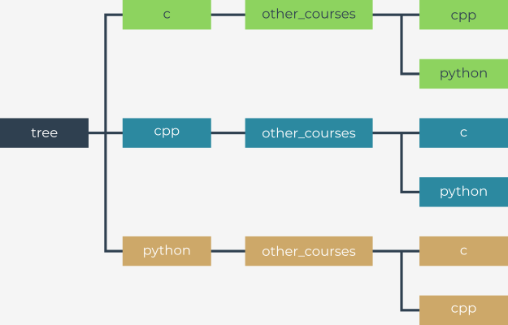

## Цели

*   совершенствование навыков учащегося по взаимодействию с операционной системой;
*   практическое использование известных функций, предоставляемых модулем `os`.

## Сценарий

Само собой разумеется, что операционные системы позволяют искать файлы и каталоги. Изучая эту часть курса, Вы узнали о функциях модуля `os`, в котором есть все необходимое для написания программы, которая будет искать каталоги в заданном месте.

Чтобы облегчить Вашу задачу, мы подготовили для Вас тестовую структуру каталогов:





Ваша программа должна соответствовать следующим требованиям:

1.  Напишите функцию или метод с именем `find`, который принимает два аргумента с именами `path` и `dir`. Аргумент `path` должен принимать относительный или абсолютный путь к каталогу, в котором должен начинаться поиск, а аргумент `dir` должен быть именем каталога, в котором Вы хотите найти данный путь. Ваша программа должна отображать абсолютные пути, если она находит каталог с заданным именем.

2.  Поиск в каталоге должен выполняться рекурсивно. Это означает, что поиск также должен включать все подкаталоги по заданному пути.

**Пример ввода:**

```
path="./tree", dir="python"
```

**Пример вывода:**

```
.../tree/python
.../tree/cpp/other_courses/python
.../tree/c/other_courses/python
```
