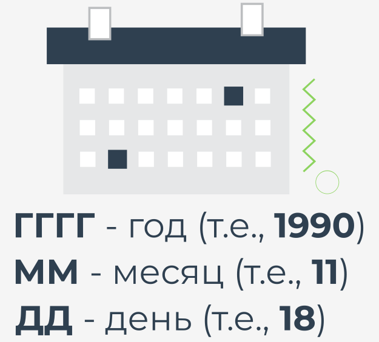
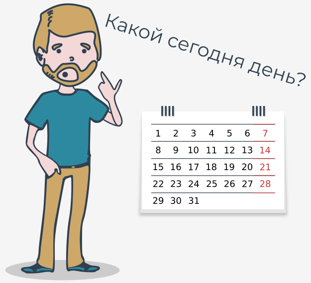

# Введение в модуль `datetime`


В этом разделе Вы узнаете о модуле Python под названием `datetime`.

Как Вы понимаете, он предоставляет **классы для работы с датой и временем**. Если Вы думаете, что Вам не нужно углубляться в эту тему, давайте поговорим о примерах использования даты и времени в программировании.

Дата и время имеют бесчисленное множество применений, и, вероятно, трудно найти производственное приложение, которое их не использует. Вот несколько примеров:

*   **регистрация событий** - благодаря знанию даты и времени мы можем определить, когда именно в нашем приложении возникает критическая ошибка. При создании журналов вы можете указать формат даты и времени;
*   **отслеживание изменений в базе данных** - иногда необходимо сохранить информацию о том, когда запись была создана или изменена. Модуль `datetime` идеально подходит для этого случая;
*   **проверка данных** - скоро Вы научитесь читать текущую дату и время в Python. Зная текущую дату и время, Вы сможете проверять различные типы данных, например, действителен ли купон на скидку, введенный пользователем в нашем приложении;
*   **хранение важной информации** - можете ли Вы представить себе банковские переводы без сохранения информации о том, когда они были сделаны? Дата и время определенных действий должны сохраняться, и мы должны с этим работать.


Дата и время используются почти во всех сферах нашей жизни, поэтому важно ознакомиться с модулем Python `datetime`. Готовы ли Вы к новой дозе знаний?


# Получение текущей местной даты и создание объектов даты

Один из классов, предоставляемых модулем `datetime`, - это класс с именем `date`. Объекты этого класса представляют собой дату, состоящую из года, месяца и дня. Посмотрите на код, чтобы увидеть, как он выглядит на практике, и получите текущую местную дату с помощью метода `today`.

```python
from datetime import date

today = date.today()

print("Today:", today)
print("Year:", today.year)
print("Month:", today.month)
print("Day:", today.day)

```

Запустите код, чтобы узнать, что происходит.

Метод `today` возвращает объект `date`, представляющий текущую местную дату. Обратите внимание, что объект date имеет три атрибута: `year`, `month` и `day`.

Будьте осторожны, потому что эти атрибуты доступны только для чтения. Чтобы создать объект `date`, Вы должны передать параметры `year`, `month` и `day` следующим образом:

```python
from datetime import date

my_date = date(2019, 11, 4)
print(my_date)

```

Запустите код, чтобы посмотреть, что получится

При создании объекта `date` помните о следующих ограничениях:

| Параметр | Ограничения                                                                                                         |
|----------|---------------------------------------------------------------------------------------------------------------------|
| `year`   | Параметр `year` должен быть больше или равен 1 (константа `MINYEAR`) и меньше или равен 9999 (константа `MAXYEAR`). |
| `month`  | Параметр `month` должен быть больше или равен 1 и меньше или равен 12.                                              |
| `day`    | Параметр `day` должен быть больше или равен 1 и меньше или равен последнему дню данного месяца и года.              |

**Примечание:** позже в этом курсе Вы узнаете, как изменить формат даты по умолчанию.


# Создание объекта даты из отметки времени

Класс `date` дает нам возможность создать объект `date` из _отметки времени_.

В Unix отметка времени выражает количество секунд с 1 января 1970 г., 00:00:00 (UTC). Эта дата называется **эпохой Unix**, потому что именно с нее начался отсчет времени в системах Unix.

Временная отметка - это разница между определенной датой (включая время) и 1 января 1970 года, 00:00:00 (всемирное координированное время), выраженная в секундах.

Чтобы создать объект даты из отметки времени, мы должны передать метку времени Unix методу `fromtimestamp`.

Для этой цели мы можем использовать модуль `time`, который предоставляет функции, связанные со временем. Одна из них - функция под названием `time()`, которая возвращает количество секунд с 1 января 1970 года до текущего момента в виде числа с плавающей запятой. Взгляните на пример.

```python
from datetime import date
import time

timestamp = time.time()
print("Timestamp:", timestamp)

d = date.fromtimestamp(timestamp)
print("Date:", d)

```

Запустите код, чтобы увидеть результат.

Если Вы запустите код несколько раз, то увидите, как увеличивается сама отметка времени. Стоит добавить, что результат функции `time` зависит от платформы, поскольку **в системах Unix и Windows високосные секунды не учитываются**.

**Примечание:** в этой части курса мы также поговорим о модуле `time`.


# Создание объекта даты с использованием формата ISO

Модуль `datetime` предоставляет несколько методов для создания объекта `date`. Один из них - метод `fromisoformat`, который принимает дату в формате **ГГГГ-ММ-ДД**, соответствующем стандарту ISO 8601.

Стандарт ISO 8601 определяет способ представления даты и времени. Он часто используется, поэтому стоит потратить немного времени, чтобы ознакомиться с ним. Взгляните на рисунок, на котором показаны значения, требуемые форматом:





Теперь посмотрите на код и запустите его.

```python
from datetime import date

d = date.fromisoformat('2019-11-04')
print(d)

```

В нашем примере ГГГГ - это 2019 год, ММ - 11 (ноябрь), а ДД - 04 (четвертый день ноября).

При замене даты обязательно добавляйте 0 перед месяцем или днем, который выражается числом меньше 10.

**Примечание:** метод `fromisoformat` доступен в Python с версии 3.7.


# Метод `replace()`

Иногда может потребоваться заменить год, месяц или день другим значением. Вы не можете сделать это с атрибутами года, месяца и дня, потому что они доступны только для чтения. В этом случае Вы можете использовать метод с именем `replace`.

Запустите код.

```python
from datetime import date

d = date(1991, 2, 5)
print(d)

d = d.replace(year=1992, month=1, day=16)
print(d)

```

Результат:

```
1991-02-05
1992-01-16
```

Параметры _год_, _месяц_ и _день_ являются необязательными. Вы можете передать только один параметр методу `replace`, например, `year`, или все три, как в примере.

Метод `replace` возвращает измененный объект `date`, поэтому Вы не должны забыть присвоить его какой-либо переменной.


# Какой это день недели?

Одним из наиболее полезных методов, упрощающих работу с датами, является метод `weekday`. Он возвращает день недели как целое число, где `0` - понедельник, а `6` - воскресенье. Запустите код чтобы проверить.

```python
from datetime import date

d = date(2019, 11, 4)
print(d.weekday())

```

Результат:

```
0
```





Класс `date` имеет аналогичный метод под названием `isoweekday`, который также возвращает день недели в виде целого числа, но `1` - это понедельник, а `7` - воскресенье:

```python
from datetime import date

d = date(2019, 11, 4)
print(d.isoweekday())

```

Результат:

```
1
```

Как видите, для одной и той же даты мы получаем другое целое число, но выражающее один и тот же день недели. Целое число, возвращаемое методом `isodayweek`, соответствует спецификации ISO 85601.


# Создание объектов `time`

Вы уже знаете, как представить дату с помощью объекта `date`. В модуле `datetime` также есть класс, позволяющий отображать время. Вы можете угадать его название? Да, он называется `time`:

```python
time(hour, minute, second, microsecond, tzinfo, fold)
```

Конструктор класса `time` принимает следующие необязательные параметры:

| Параметр      | Ограничения                                                                          |
|---------------|--------------------------------------------------------------------------------------|
| `hour`        | Параметр `hour` должен быть больше или равен 0 и меньше 23.                          |
| `minute`      | Параметр `minute` должен быть больше или равен 0 и меньше 59.                        |
| `second`      | Параметр `second` должен быть больше или равен 0 и меньше 59.                        |
| `microsecond` | Параметр `microsecond` должен быть больше или равен 0 и меньше 1000000.              |
| `tzinfo`      | Параметр `tzinfo` должен быть объектом подкласса `tzinfo` или `None` (по умолчанию). |
| `fold`        | Параметр `fold` должен быть 0 или 1 (по умолчанию 0).                                |

Параметр `tzinfo` связан с часовыми поясами, а параметр `fold` связан с реальным временем. Мы не будем использовать их во время этого курса, но мы рекомендуем Вам ознакомиться с ними.

Давайте посмотрим, как на практике создать объект `time`.

```python
from datetime import time

t = time(14, 53, 20, 1)

print("Time:", t)
print("Hour:", t.hour)
print("Minute:", t.minute)
print("Second:", t.second)
print("Microsecond:", t.microsecond)

```

Результат:

```
Time: 14:53:20.000001
Hour: 14
Minute: 53
Second: 20
Microsecond: 1
```

В этом примере мы передали конструктору класса четыре параметра: `hour`, `minute`, `second` и `microsecond`. К каждому из них можно получить доступ с помощью атрибутов класса.

**Примечание:** скоро мы расскажем Вам, как изменить форматирование времени по умолчанию.


# Модуль `time`

В дополнение к классу `time` стандартная библиотека Python предлагает модуль под названием `time`, который предоставляет функцию, связанную со временем. У Вас уже была возможность изучить функцию под названием `time` при обсуждении класса `date`. Теперь мы рассмотрим еще одну полезную функцию, доступную в этом модуле.

Во время прохождения этого курса Bы должны проводить много часов за компьютером. Иногда Bы можете почувствовать потребность вздремнуть. Почему нет? Напишем программу, имитирующую короткий сон студента. Взгляните на код.

```python
import time

class Student:
    def take_nap(self, seconds):
        print("I'm very tired. I have to take a nap. See you later.")
        time.sleep(seconds)
        print("I slept well! I feel great!")

student = Student()
student.take_nap(5)

```

Результат:

```
I'm very tired. I have to take a nap. See you later.
I slept well! I feel great!
```

Самая важная часть примера кода - это использование функции `sleep` (да, Bы можете вспомнить ее из одной из предыдущих лабораторных работ ранее в курсе), которая приостанавливает выполнение программы на заданное количество секунд.

В нашем примере это `5` секунд. Вы правы, это очень короткий сон.

Продлите сон учащегося, изменив количество секунд. Обратите внимание, что функция `sleep` принимает только целые числа или числа с плавающей запятой.


# Функция `ctime()`

Модуль `time` предоставляет функцию под названием `ctime`, которая **преобразует время в секундах с 1 января 1970 года (эпоха Unix) в строку**.

Вы помните результат функции `time`? Это то, что Вам нужно передать в `ctime`. Взгляните на пример.

```python
import time

timestamp = 1572879180
print(time.ctime(timestamp))

```

Результат:

```
Mon Nov 4 14:53:00 2019
```

Функция `ctime` возвращает строку для переданной отметки времени. В нашем примере метка времени соответствует 14:53:00 4 ноября 2019 г.

Также можно вызвать функцию `ctime` без указания времени в секундах. В этом случае будет возвращено текущее время:

```python
import time

print(time.ctime())

```


# Функции `gmtime()` и `localtime()`

Некоторые функции, доступные в модуле `time`, требуют знания класса `struct_time`, но прежде чем мы познакомимся с ними, давайте посмотрим, как этот класс выглядит:

```python
time.struct_time:
    tm_year   # Указывает год.
    tm_mon    # Указывает месяц (значение от 1 до 12)
    tm_mday   # Указывает день месяца (значение от 1 до 31)
    tm_hour   # Указывает час (значение от 0 до 23)
    tm_min    # Указывает минуту (значение от 0 до 59)
    tm_sec    # Указывает секунду (значение от 0 до 61 )
    tm_wday   # Указывает день недели (значение от 0 до 6)
    tm_yday   # Указывает день года (значение от 1 до 366)
    tm_isdst  # Указывает, применяется ли переход на летнее время (1 – да, 0 – нет, -1 – не известно)
    tm_zone   # Указывает название часового пояса (значение в сокращенном виде)
    tm_gmtoff # Указывает смещение к востоку от UTC (значение в секундах)

```

Класс `struct_time` также разрешает доступ к значениям с помощью индексов. Индекс `0` возвращает значение в `tm_year`, а `8` возвращает значение в `tm_isdst`.

Исключениями являются `tm_zone` и `tm_gmoff`, к которым нельзя получить доступ с помощью индексов. Давайте посмотрим, как использовать класс `struct_time` на практике.

```python
import time

timestamp = 1572879180
print(time.gmtime(timestamp))
print(time.localtime(timestamp))

```

Результат:

```
time.struct_time(tm_year=2019, tm_mon=11, tm_mday=4, tm_hour=14, tm_min=53, tm_sec=0, tm_wday=0, tm_yday=308, tm_isdst=0)
time.struct_time(tm_year=2019, tm_mon=11, tm_mday=4, tm_hour=14, tm_min=53, tm_sec=0, tm_wday=0, tm_yday=308, tm_isdst=0)
```

В примере показаны две функции, которые преобразуют прошедшее время из эпохи Unix в объект `struct_time`. Разница между ними в том, что функция `gmtime` возвращает объект `struct_time` в формате UTC, а функция `localtime` возвращает местное время. Для функции `gmtime` атрибут `tm_isdst` всегда равен `0`.


# Функции `asctime()` и `mktime()`

Модуль `time` имеет функции, которые ожидают объект `struct_time` или кортеж, в котором хранятся значения в соответствии с индексами, представленными при обсуждении класса `struct_time`.

```python
import time

timestamp = 1572879180
st = time.gmtime(timestamp)

print(time.asctime(st))
print(time.mktime((2019, 11, 4, 14, 53, 0, 0, 308, 0)))

```

Результат:

```
Mon Nov 4 14:53:00 2019
1572879180.0
```

Первая из функций, называемая `asctime`, преобразует объект `struct_time` или кортеж в строку. Обратите внимание, что знакомая функция `gmtime` используется для получения объекта `struct_time`. Если Вы не предоставите аргумент функции `asctime`, будет использоваться время, возвращаемое функцией `localtime`.

Вторая функция, называемая `mktime`, преобразует объект `struct_time` или кортеж, который выражает местное время, в количество секунд, прошедших с эпохи Unix. В нашем примере мы передали ему кортеж, который состоит из следующих значений:

2019 => tm_year  
11 => tm_mon  
4 => tm_mday  
14 => tm_hour  
53 => tm_min  
0 => tm_sec  
0 => tm_wday  
308 => tm_yday  
0 => tm_isdst


# Создание объектов `datetime`

В модуле `datetime` дата и время могут быть представлены либо как отдельные объекты, либо как один объект. Класс, объединяющий дату и время, называется `datetime`.

```python
datetime(year, month, day, hour, minute, second, microsecond, tzinfo, fold)
```

Конструктор принимает следующие параметры:

| Параметр      | Ограничения                                                                                                     |
|---------------|-----------------------------------------------------------------------------------------------------------------|
| `year`        | Параметр `year` должен быть больше или равен 1 (константа `MINYEAR`) и меньше или равен 9999 (константа `MAXYEAR`). |
| `month`       | Параметр `month` должен быть больше или равен 1 и меньше или равен 12.                                          |
| `day`         | Параметр `day` должен быть больше или равен 1 и меньше или равен последнему дню данного месяца и года.          |
| `hour`        | Параметр `hour` должен быть больше или равен 0 и меньше 23.                                                     |
| `minute`      | Параметр `minute` должен быть больше или равен 0 и меньше 59.                                                   |
| `second`      | Параметр `second` должен быть больше или равен 0 и меньше 59.                                                   |
| `microsecond` | Параметр `microsecond` должен быть больше или равен 0 и меньше 1000000.                                         |
| `tzinfo`      | Параметр `tzinfo` должен быть объектом подкласса `tzinfo` или `None` (по умолчанию).                            |
| `fold`        | Параметр `fold` должен быть 0 или 1 (по умолчанию 0).                                                           |


Теперь давайте посмотрим на код, чтобы увидеть, как мы создаем объект `datetime`.

```python
from datetime import datetime

dt = datetime(2019, 11, 4, 14, 53)

print("Datetime:", dt)
print("Date:", dt.date())
print("Time:", dt.time())

```

Результат:

```
Datetime: 2019-11-04 14:53:00
Date: 2019-11-04
Time: 14:53:00
```

В этом примере создается объект `datetime`, представляющий 4 ноября 2019 года в 14:53:00. Все параметры, переданные конструктору, переходят в атрибуты класса только для чтения. Это `year`, `month`, `day`, `hour`, `minute`, `second`, `microsecond`, `tzinfo` и `fold`.

В примере показаны два метода, возвращающие два разных объекта. Метод с именем date возвращает объект `date` с заданными годом, месяцем и днем, а метод с именем `time` возвращает объект `time` с заданными часом и минутой.


# Методы, возвращающие текущую дату и время

Класс `datetime` имеет несколько методов, которые возвращают текущую дату и время. Вот эти методы:

*   `today()` - возвращает текущую местную дату и время с атрибутом `tzinfo`, инициализированным `None`;
*   `now()` - возвращает текущую локальную дату и время так же, как метод `today`, если мы не передадим необязательный аргумент `tz` в него. Аргумент этого метода должен быть объектом подкласса `tzinfo`;
*   `utcnow(`) - возвращает текущую дату и время в формате UTC с атрибутом `tzinfo`, инициализированным `None`.

Запустите код, чтобы увидеть все на практике. Что Вы можете сказать о результатах?

```python
from datetime import datetime

print("today:", datetime.today())
print("now:", datetime.now())
print("utcnow:", datetime.utcnow())

```

Как видите, результат всех трех методов одинаков. Небольшие различия вызваны временем, прошедшим между последующими вызовами.

**Примечание:** Подробнее об объектах `tzinfo` можно прочитать в документации.


# Получение метки времени

В Интернете доступно множество конвертеров, которые могут вычислять метку времени на основе заданной даты и времени, но как это сделать в модуле `datetime`?

Это возможно благодаря методу `timestamp`, предоставленному классом `datetime`.

```python
from datetime import datetime

dt = datetime(2020, 10, 4, 14, 55)
print("Timestamp:", dt.timestamp())

```

Результат:

```
Timestamp: 1601823300.0
```

Метод `timestamp` возвращает значение с плавающей запятой, выражающее количество секунд, прошедших между датой и временем, указанными объектом `datetime`, и 1 января 1970 г., 00:00: 00 (UTC).


# Форматирование даты и времени

Все представленные классы модулей `datetime` имеют метод под названием `strftime`. Это очень важный метод, поскольку он позволяет нам возвращать дату и время в указанном нами формате.

Метод `strftime` принимает только один аргумент в виде строки, определяющей формат, который может состоять из директив.

Директива - это строка, состоящая из символа `%` (процент) и строчной или прописной буквы. Например, директива `%Y` означает год с веком в виде десятичного числа. Посмотрим на это на примере.

```python
from datetime import date

d = date(2020, 1, 4)
print(d.strftime('%Y/%m/%d'))

```

Результат:

```
2020/01/04
```

В этом примере мы передали методу `strftime` формат, состоящий из трех директив, разделенных `/` (косая черта). Конечно, символ-разделитель можно заменить другим символом или даже строкой.

Вы можете поместить в формат любые символы, но только узнаваемые директивы будут заменены соответствующими значениями. В нашем формате мы использовали следующие директивы:

*   `%Y` - возвращает год со столетием в виде десятичного числа. В нашем примере это `2020`.
*   `%m` - возвращает месяц в виде десятичного числа с нулями. В нашем примере это `01`.
*   `%d` - возвращает день в виде десятичного числа с нулями. В нашем примере это `04`.

**Примечание:** Вы можете найти все доступные директивы [здесь](https://docs.python.org/3/library/datetime.html#strftime-and-strptime-format-codes ).

Форматирование времени работает так же, как форматирование даты, но требует использования соответствующих директив. Давайте подробнее рассмотрим некоторые из них.

```python
from datetime import time
from datetime import datetime

t = time(14, 53)
print(t.strftime("%H:%M:%S"))

dt = datetime(2020, 11, 4, 14, 53)
print(dt.strftime("%y/%B/%d %H:%M:%S"))

```

Результат:

```
14:53:00
20/November/04 14:53:00
```

Первый из используемых форматов касается только времени. Как Вы могли догадаться, `%H` возвращает час как десятичное число с дополнением нулями, `%M` возвращает минуту как десятичное число с дополнением нулями, а `%S` возвращает секунду как десятичное число с нулями. В нашем примере `%H` заменяется на `14`, `%M` на `53` и `%S` на `00`.

Второй используемый формат объединяет директивы даты и времени. Есть две новые директивы: `%Y` и `%B`. Директива `%Y` возвращает год без века в виде десятичного числа с нулями (в нашем примере это `20`). Директива `%B` возвращает месяц в качестве полного названия языкового стандарта (в нашем примере это ноябрь).

В общем, Вы можете свободно создавать форматы, но не забывайте правильно использовать директивы. В качестве упражнения Вы можете проверить, что произойдет, если, например, Вы попытаетесь использовать директиву `%Y` в формате, переданном методу `strftime` объекта времени. Попробуйте сами выяснить, почему Вы получили такой результат. Удачи!


# Функция `strftime()` из модуля `time`

Вы, вероятно, не удивитесь, узнав, что функция `strftime` доступна в модуле `time`. Он немного отличается от методов `strftime` в классах, предоставляемых модулем `datetime`, потому что, помимо аргумента формата, он также может принимать (необязательно) кортеж или объект `struct_time`.

Если Вы не передадите кортеж или объект `struct_time`, форматирование будет выполнено с использованием текущего местного времени. Взгляните на пример.

```python
import time

timestamp = 1572879180
st = time.gmtime(timestamp)

print(time.strftime("%Y/%m/%d %H:%M:%S", st))
print(time.strftime("%Y/%m/%d %H:%M:%S"))

```

Наш результат выглядит следующим образом:

```
2019/11/04 14:53:00
2020/10/12 12:19:40
```

Создание формата выглядит так же, как для методов `strftime` в модуле `datetime`. В нашем примере мы используем `%Y`, `%m`, `%d`, `%H`, `%M` и `%S`, которые Вам уже известны.

В первом вызове функции мы форматируем объект `struct_time`, а во втором вызове (без необязательного аргумента) мы форматируем местное время. Вы можете найти все доступные директивы в модуле `time` [здесь](https://docs.python.org/3/library/time.html#time.strftime).


# Метод `strptime()`

Знание того, как создать формат, может быть полезным при использовании метода `strptime` в классе `datetime`. В отличие от метода `strftime`, он создает объект `datetime` из строки, представляющей дату и время.

Метод `strptime` требует, чтобы Вы указали формат, в котором Вы сохранили дату и время. Посмотрим на это на примере.

```python
from datetime import datetime
print(datetime.strptime("2019/11/04 14:53:00", "%Y/%m/%d %H:%M:%S"))

```

Результат:

```
2019-11-04 14:53:00
```

В этом примере мы указали два обязательных аргумента. Первый - это дата и время в виде строки: `"2019/11/04 14:53:00"`, а второй - это формат, упрощающий синтаксический анализ до объекта `datetime`. Будьте осторожны, потому что, если указанный Вами формат не соответствует дате и времени в строке, это вызовет ошибку `ValueError`.

**Примечание:** в модуле `time` Вы можете найти функцию с именем `strptime`, которая анализирует строку, представляющую время, на `struct_time` объект. Ее использование аналогично методу `strptime` в классе `datetime`:

```python
import time

print(time.strptime("2019/11/04 14:53:00", "%Y/%m/%d %H:%M:%S"))

```

Вывод кода будет следующим:

```
time.struct_time(tm_year=2019, tm_mon=11, tm_mday=4, tm_hour=14, tm_min=53, tm_sec=0, tm_wday=0, tm_yday=308, tm_isdst=-1)
```


# Операции с датой и временем

Рано или поздно Вам придется произвести некоторые вычисления с датой и временем. К счастью, в модуле `datetime` есть класс под названием `timedelta`, который был создан именно для этой цели.

Чтобы создать объект `timedelta`, просто выполните вычитание для объектов `date` или `datetime`, как мы это сделали в примере.

```python
from datetime import date
from datetime import datetime

d1 = date(2020, 11, 4)
d2 = date(2019, 11, 4)

print(d1 - d2)

dt1 = datetime(2020, 11, 4, 0, 0, 0)
dt2 = datetime(2019, 11, 4, 14, 53, 0)

print(dt1 - dt2)

```

Результат:

```
366 days, 0:00:00
365 days, 9:07:00
```

В примере показано вычитание для объектов `date` и `datetime`. В первом случае мы получаем разницу в днях, которая составляет 366 дней. Обратите внимание, что также отображается разница в часах, минутах и секундах. Во втором случае мы получаем другой результат, потому что мы указали время, которое было учтено в расчетах. В результате мы получаем 365 дней, 9 часов и 7 минут.

Через мгновение вы узнаете больше о создании объектов `timedelta` и об операциях, которые Вы можете с ними делать.


# Создание объектов timedelta

Вы уже узнали, что объект `timedelta` может быть возвращен в результате вычитания двух объектов `date` или `datetime`.

Конечно, Вы также можете создать объект самостоятельно. Для этого познакомимся с аргументами, принимаемыми конструктором класса, а именно: `days`, `seconds`, `microseconds`, `milliseconds`, `minutes`, `hours` и `weeks`. Каждый из них является необязательным и по умолчанию равен `0`.

Аргументы должны быть целыми числами или числами с плавающей запятой и могут быть как положительными, так и отрицательными. Давайте посмотрим на простой пример.

```python
from datetime import timedelta

delta = timedelta(weeks=2, days=2, hours=3)
print(delta)

```

Результат:

```
16 days, 3:00:00
```

Результат в 16 дней получается путем преобразования аргумента `weeks` в дни (2 недели = 14 дней) и добавления аргумента `days` (2 дня). Это нормальное поведение, поскольку объект `timedelta` хранит внутри себя только дни, секунды и микросекунды. Аналогичным образом аргумент `hour` преобразуется в минуты. Взгляните на пример ниже:

```python
from datetime import timedelta

delta = timedelta(weeks=2, days=2, hours=3)
print("Days:", delta.days)
print("Seconds:", delta.seconds)
print("Microseconds:", delta.microseconds)

```

Результат:

```
Days: 16
Seconds: 10800
Microseconds: 0
```

Результат 10800 получается путем преобразования 3 часов в секунды. Таким образом, объект `timedelta` сохраняет аргументы, переданные во время его создания. Недели конвертируются в дни, часы и минуты - в секунды, а миллисекунды - в микросекунды.

Вы уже знаете, как объект `timedelta` сохраняет переданные аргументы внутри. Посмотрим, как это можно применить на практике.

Посмотрите на некоторые операции, поддерживаемые классами модуля `datetime`.

```python
from datetime import timedelta
from datetime import date
from datetime import datetime

delta = timedelta(weeks=2, days=2, hours=2)
print(delta)

delta2 = delta * 2
print(delta2)

d = date(2019, 10, 4) + delta2
print(d)

dt = datetime(2019, 10, 4, 14, 53) + delta2
print(dt)

```

Результат:

```
16 days, 2:00:00
32 days, 4:00:00
2019-11-05
2019-11-05 18:53:00
```

Объект `timedelta` можно умножить на целое число. В нашем примере мы умножаем объект, представляющий 16 дней и 2 часа, на 2. В результате мы получаем объект `timedelta`, представляющий 32 дня и 4 часа.

Обратите внимание, что дни и часы были умножены на 2. Еще одна интересная операция с использованием объекта `timedelta` - это добавление. В этом примере мы добавили объект `timedelta` к объектам `date` и `datetime`.

В результате этих операций мы получаем объекты `date` и `datetime`, увеличенные на дни и часы, хранящиеся в объекте `timedelta`.

Представленная операция умножения позволяет быстро увеличить значение объекта `timedelta`, а умножение также может помочь Bам получить дату из будущего.

Конечно, классы `timedelta`, `date` и `datetime` поддерживают гораздо больше операций. Мы рекомендуем Bам ознакомиться с ними в документации.

  
# Основные тезисы


1. Чтобы создать объект `date`, Вы должны передать аргументы года, месяца и дня следующим образом:
    
    ```python
    from datetime import date
    
    my_date = date(2020, 9, 29)
    print("Year:", my_date.year) # год: 2020
    print("Month:", my_date.month) # месяц: 9
    print("Day:", my_date.day) # день: 29
    
    ```
    
    Объект `date` имеет три атрибута (только для чтения): `year`, `month` и `day`.


2. Метод `today` возвращает объект даты, представляющий текущую местную дату:
   
   ```python
   from datetime import date
   print("Today:", date.today()) # Отображает: Today: 2020-09-29
   
   ```


3. В Unix отметка времени выражает количество секунд с 1 января 1970 г., 00:00:00 (UTC). Эту дату называют "эпохой Unix", потому что с нее начался отсчет времени в системах Unix. Временная метка на самом деле представляет собой разницу между определенной датой (включая время) и 1 января 1970 года, 00:00:00 (UTC), выраженную в секундах. Чтобы создать объект даты из метки времени, мы должны передать метку времени Unix методу `fromtimestamp`:
   
   ```python
   from datetime import date
   import time
   
   timestamp = time.time()
   d = date.fromtimestamp(timestamp)
   
   ```
   
   Примечание: функция `time` возвращает количество секунд с 1 января 1970 г. до текущего момента в виде числа с плавающей запятой.


4. Конструктор класса `time` принимает шесть аргументов (`hour`, `minute`, `second`, `microsecond`, `tzinfo` и `fold`). Каждый из этих аргументов является необязательным.
   
   ```python
   from datetime import time
   
   t = time(13, 22, 20)
   
   print("Hour:", t.hour) # часы: 13
   print("Minute:", t.minute) # минуты: 22
   print("Second:", t.second) # секунды: 20
   
   ```


5. Модуль `time` содержит функцию `sleep`, которая приостанавливает выполнение программы на заданное количество секунд, например:
   
   ```python
   import time
   
   time.sleep(10)
   print("Hello world!") # Этот текст будет отображаться через 10 секунд.
   
   ```


6. В модуле `datetime` дата и время могут быть представлены либо как отдельные объекты, либо как один объект. Класс, объединяющий дату и время, называется `datetime`. Все аргументы, переданные конструктору, переходят в атрибуты класса только для чтения. Это `year`, `month`, `day`, `hour`, `minute`, `second`, `microsecond`, `tzinfo` и `fold`:
   
   ```python
   from datetime import datetime
   
   dt = datetime(2020, 9, 29, 13, 51)
   print("Datetime:", dt) # Отображает: Datetime: 2020-09-29 13:51:00
   
   ```


7. Метод `strftime` принимает только один аргумент в виде строки, определяющей формат, который может состоять из директив. Директива - это строка, состоящая из символа `%` (процент) и буквы нижнего или верхнего регистра. Ниже приведены некоторые полезные директивы:

   *   `%Y` - возвращает год со столетием в виде десятичного числа;
   *   `%m` - возвращает месяц в виде десятичного числа с нулями;
   *   `%d` - возвращает день в виде десятичного числа с нулями;
   *   `%H` - возвращает час в виде десятичного числа с нулями;
   *   `%M` - возвращает минуты в виде десятичного числа с нулями;
   *   `%S` - возвращает секунду как десятичное число с нулевым дополнением.
   
   Пример:
   
   ```python
   from datetime import date
   
   d = date(2020, 9, 29)
   print(d.strftime('%Y/%m/%d')) # Выводит: 2020/09/29
   
   ```


8. Можно выполнять вычисления для объектов `date` и `datetime`, например:
   
   ```python
   from datetime import date
   
   d1 = date(2020, 11, 4)
   d2 = date(2019, 11, 4)
   
   d = d1 - d2
   print(d) # Отображает: 366 days, 0:00:00.
   print(d * 2) # Отображает: 732 days, 0:00:00.
   
   ```
   
   Результат вычитания возвращается как объект `timedelta`, который выражает разницу в днях между двумя датами в примере выше.
   
   Обратите внимание, что также отображается разница в часах, минутах и секундах. Объект `timedelta` можно использовать для дальнейших вычислений (например, Вы можете умножить его на `2`).


---

**Упражнение 1**

Что выведет следующий код?

```python
from datetime import time

t = time(14, 39)
print(t.strftime("%H:%M:%S"))

```

<details><summary>Проверка</summary>

```
14:53:00
```

</details>

---

**Упражнение 2**

Что выведет следующий код?

```python
from datetime import datetime

dt1 = datetime(2020, 9, 29, 14, 41, 0)
dt2 = datetime(2020, 9, 28, 14, 41, 0)

print(dt1 - dt2)

```

<details><summary>Проверка</summary>

```
1 day, 0:00:00
```

</details>


