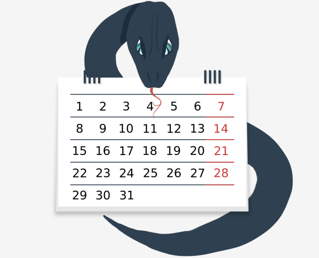
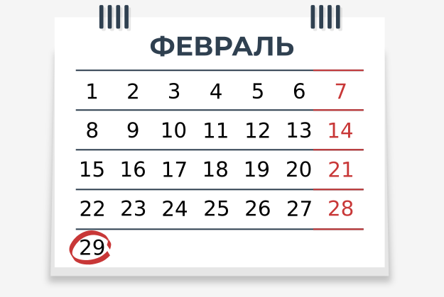
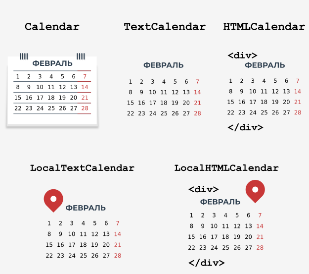

# Введение в модуль `calendar`


В дополнение к модулям `datetime` и `time` Стандартная Библиотека Python предоставляет модуль под названием `calendar`, который, как следует из названия, предлагает **функции, связанные с календарем**.

Однa из них, конечно, отображает календарь. Важно, чтобы дни недели отображались с понедельника по воскресенье, и каждый день недели имел свое представление в виде целого числа:

| День недели | Целое число | Константа            |
|-------------|-------------|----------------------|
| Понедельник | 0           | `calendar.MONDAY`    |
| Вторник     | 1           | `calendar.TUESDAY`   |
| Среда       | 2           | `calendar.WEDNESDAY` |
| Четверг     | 3           | `calendar.THURSDAY`  |
| Пятница     | 4           | `calendar.FRIDAY`    |
| Суббота     | 5           | `calendar.SATURDAY`  |
| Воскресенье | 6           | `calendar.SUNDAY`    |


В таблице выше показано представление дней недели в модуле `calendar`. Первый день недели (понедельник) представлен значением `0` и константой `calendar.MONDAY`, а последний день недели (воскресенье) представлен значением значение `6` и константой `calendar.SUNDAY`.





Для месяцев целочисленные значения индексируются от 1, т.е. январь представлен 1, а декабрь - 12. К сожалению, нет констант, выражающих месяцы.

Приведенная выше информация будет полезна вам при работе с модулем `calendar` в этой части курса, но сначала давайте начнем с нескольких простых примеров календаря. .


# Ваш первый календарь

Вы начнете свое приключение с модуля `calendar` с простой функцией под названием `calendar`, которая позволяет **отображать календарь на весь год**. Давайте посмотрим, как использовать его для отображения календаря на 2022 год.

```python
import calendar
print(calendar.calendar(2022))

```

Отображаемый результат аналогичен результату команды `cal`, доступной в Unix. Если Вы хотите изменить форматирование календаря по умолчанию, Вы можете использовать следующие параметры:

*   `w` - ширина столбца даты (по умолчанию 2).
*   `l` - количество строк в неделю (по умолчанию 1).
*   `c` - количество пробелов между столбцами месяцев (по умолчанию 6).
*   `m` - количество столбцов (по умолчанию 3)

Функция `calendar` требует указать год, а другие параметры, отвечающие за форматирование, являются необязательными. Мы рекомендуем Bам поработать с этими параметрами самостоятельно.

Хорошей альтернативой указанной выше функции является функция `prcal`, которая принимает те же параметры, что и функция `calendar`, но не требует использования `print` для отображения календаря. Ее использование выглядит так:

```python
import calendar

calendar.prcal(2022)

```
  

# Календарь на определенный месяц

В модуле `calendar` есть функция `month`, которая позволяет отображать календарь на определенный месяц. Его использование действительно простое, Вам просто нужно указать год и месяц.

```python
import calendar

print(calendar.month(2022, 11))

```

В примере отображается календарь на ноябрь 2022 года. Как и в функции `calendar`, Вы можете изменить форматирование по умолчанию, используя следующие параметры:

*   `w` - ширина столбца даты (по умолчанию 2).
*   `l` - количество строк в неделю (по умолчанию 1).

**Примечание:** Вы также можете использовать функцию `prmonth`, которая имеет те же параметры, что и функция `month`, но не требует от Вас использовать функцию `print` для отображения календаря.


# Функция `setfirstweekday()`


Как Вы уже знаете, по умолчанию в модуле `calendar` первый день недели - понедельник. Однако это поведение можно изменить с помощью функции `setfirstweekday`.

Вы помните таблицу с указанием дней недели и их представления в виде целых чисел? Пришло время использовать его, потому что метод `setfirstweekday` требует параметра, выражающего день недели в виде целочисленного значения. Взгляните на пример.

```python
import calendar

calendar.setfirstweekday(calendar.SUNDAY)
calendar.prmonth(2022, 12)

```

В примере используется константа `calendar.SUNDAY`, которая содержит значение `6`. Конечно, Вы можете передать это значение напрямую в функцию `setfirstweekday`, но версия с константой более элегантна.

В результате мы получаем календарь, показывающий декабрь 2022 года, в котором первым днем для каждой недели является воскресенье.


# Функция `weekday()`

Еще одна полезная функция, предоставляемая модулем `calendar`, - это функция с именем `weekday`, которая возвращает день недели в виде целого числа для заданного года, месяца и день. Посмотрим на практике.

```python
import calendar

print(calendar.weekday(2022, 12, 24))

```

Запустите код, чтобы узнать день недели, выпадающий на 24 декабря 2022 г.

Результат:

```
5
```


Функция `weеkday` возвращает 5, что означает, что 24 декабря 2022 г. - суббота.


# Функция `weekheader()`

Вы, наверное, заметили, что в календаре есть сокращенные заголовки на неделю. При необходимости Вы можете получить короткие названия дней недели с помощью метода `weekheader`.

Метод `weekheader` требует, чтобы Вы указали ширину в символах для одного дня недели. Если предоставленная вами ширина больше 3, Вы все равно получите сокращенные названия дней недели, состоящие из трех символов.

Итак, давайте посмотрим, как получить заголовок меньшего размера.

```python
import calendar

print(calendar.weekheader(2))

```

Результат:

```
Mo Tu We Th Fr Sa Su
```


**Примечание:** если Вы измените первый день недели, например, с помощью функции `setfirstweekday`, это повлияет на результат функции.


# Как проверить, является ли год високосным?

Модуль `calendar` предоставляет две полезные функции для проверки того, являются ли годы високосными.





Первый, называемый `isleap`, возвращает `True`, если прошел високосный год, или `False` в противном случае. Второй, называемый `leapdays`, возвращает количество високосных годов в заданном диапазоне.

Запустите код.

```python
import calendar

print(calendar.isleap(2020))
print(calendar.leapdays(2010, 2021))  # До 2021 года, но не включая 2021 год.

```

Результат:

```
True
3
```


В примере мы получаем результат 3, потому что в период с 2010 по 2020 год всего три високосных года (примечание: 2021 год не включен). Это 2012, 2016 и 2020 годы.


# Классы для создания календарей

Функции, которые мы показали Вам, - это не все, что предлагает модуль `calendar`. В дополнение к ним мы можем использовать следующие классы:

*   `calendar.Calendar` - предоставляет методы для подготовки данных календаря к форматированию;
*   `calendar.TextCalendar` - используется для создания обычных текстовых календарей;
*   `calendar.HTMLCalendar` - используется для создания календарей HTML;
*   `calendar.LocalTextCalendar` - это подкласс класса `calendar.TextCalendar`. Конструктор этого класса принимает параметр `locale`, который используется для возврата соответствующих названий месяцев и дней недели.
*   `calendar.LocalHTMLCalendar` - это подкласс класса `calendar.HTMLCalendar`. Конструктор этого класса принимает параметр `locale`, который используется для возврата соответствующих названий месяцев и дней недели.

Во время этого курса у Вас уже была возможность создавать текстовые календари при обсуждении функций модуля `calendar`.

Пора попробовать что-то новое. Давайте подробнее рассмотрим методы класса `calendar`.





# Создание объекта `Calendar`

Конструктор класса `Calendar` принимает один необязательный параметр с именем `firstweekday`, по умолчанию равный `0` (понедельник).

Параметр `firstweekday` должен быть целым числом от 0 до 6. Для этого можно использовать уже известные константы - посмотрите код.

```python
import calendar  

c = calendar.Calendar(calendar.SUNDAY)

for weekday in c.iterweekdays():
    print(weekday, end=" ")

```

Программа выдаст следующий результат:

```
6 0 1 2 3 4 5
```

В коде используется метод класса `Calendar` с именем `iterweekdays`, который возвращает итератор для номеров дней недели.

Первое возвращаемое значение всегда равно значению свойства `firstweekday`. Поскольку в нашем примере первое возвращаемое значение - 6, это означает, что неделя начинается в воскресенье.


# Метод `itermonthdates()`

Класс `Calendar` имеет несколько методов, возвращающих итератор. Один из них - метод `itermonthdates`, который требует указания года и месяца.

В результате возвращаются все дни в указанном месяце и году, а также все дни до начала или конца месяца, которые необходимы для получения полной недели.

Каждый день представлен объектом `datetime.date`. Взгляните на пример.

```python
import calendar  

c = calendar.Calendar()

for date in c.itermonthdates(2019, 11):
    print(date, end=" ")

```

Год отображает все дни ноября 2019 г. Поскольку первый день ноября 2019 г. был пятницей, для получения полной недели также возвращаются следующие дни: 28.10.2019 (понедельник), 29.10.2019 (вторник) 30.10.2019 (среда) 31.10.2019 (четверг).

Последний день ноября 2019 года был субботой, поэтому для сохранения полной недели возвращается еще один день 12.01.2019 (пятница).


# Другие методы, возвращающие итераторы

Еще один полезный метод в классе Calendar - это метод `itermonthdates`, который принимает в качестве параметров год и месяц, а затем возвращает итератор для дней недели представленных по номерам.

Взгляните на код.

```python
import calendar  

c = calendar.Calendar()

for iter in c.itermonthdays(2019, 11):
    print(iter, end=" ")

```

Вы наверняка заметили, что в результате выполнения кода возвращается большое количество нулей. Это дни за пределами указанного диапазона месяцев, которые добавляются для сохранения полной недели.

Первые четыре нуля представляют 28.10.2019 (понедельник) 29.10.2019 (вторник) 30.10.2019 (среда) 31.10.2019 (четверг). Остальные числа - это дни месяца, за исключением последнего значения 0, которое заменяет дату 01.12.2019 (воскресенье).

В классе `Calendar` есть еще четыре похожих метода, которые отличаются возвращаемыми данными:

*   `itermonthdates2` - возвращает дни в виде кортежей, состоящих из номера дня месяца и номера дня недели;
*   `itermonthdates3` - возвращает дни в виде кортежей, состоящих из года, месяца и дня месяца. Этот метод доступен начиная с версии Python 3.7;
*   `itermonthdates4` - возвращает дни в виде кортежей, состоящих из номеров года, месяца, дня месяца и дня недели. Этот метод доступен начиная с версии Python 3.7.

В целях тестирования используйте приведенный выше пример и посмотрите, как на практике выглядят возвращаемые значения описанных методов.


# Метод `monthdays2calendar()`

Класс Calendar имеет несколько других полезных методов, о которых Вы можете узнать больше в документации ([https://docs.python.org/3/library/calendar.html](https://docs.python.org/3/library/calendar.html )).

Одним из них является метод `monthdays2calendar`, который принимает год и месяц, а затем возвращает список недель в конкретном месяце. Каждая неделя представляет собой кортеж, состоящий из номеров дней и дней недели. Посмотрите на код.

```python
import calendar  

c = calendar.Calendar()

for data in c.monthdays2calendar(2020, 12):
    print(data)

```

Обратите внимание, что номера дней вне месяца представлены 0, а номера дней недели - числами от 0 до 6, где 0 - понедельник, а 6 - воскресенье.

Этот метод может пригодиться вам при выполнении лабораторного задания. Вы готовы?

  
# Основные тезисы


1. В модуле `calendar` дни недели отображаются с понедельника по воскресенье. Каждый день недели представлен в виде целого числа, где первый день недели (понедельник) представлен значением `0`, а последний день недели (воскресенье) представлен значением `6`.


2. Чтобы отобразить календарь на любой год, вызовите функцию `calendar` с годом, переданным в качестве аргумента, например:
    
    ```python
    import calendar
    
    print(calendar.calendar(2020))
    
    ```
    
    Примечание. Хорошей альтернативой указанной выше функции является функция `prcal`, которая также принимает те же параметры, что и функция `calendar`, но не требует использования `print` для отображения календаря.


3. Чтобы отобразить календарь на любой месяц года, вызовите функцию `month`, передав ей год и месяц. Например:
   
   ```python
   import calendar
   
   print(calendar.month(2020, 9))
   
   ```
   
   Примечание. Вы также можете использовать функцию `prmonth`, которая имеет те же параметры, что и функция `month`, но не требует использования `print` для отображения календаря.


4. Функция `setfirstweekday` позволяет изменить первый день недели. Принимает значение от `0` до `6`, где `0` - воскресенье, а `6` - суббота.


5. Результатом функции `weekday` является день недели в виде целого числа для заданного года, месяца и дня.:
   
   ```python
   import calendar
   
   print(calendar.weekday(2020, 9, 29)) # Выводит 1, что означает Вторник.
   
   ```


6. Функция `weekheader` возвращает названия дней недели в сокращенной форме. Метод `weekheader` требует, чтобы Вы указали ширину в символах для одного дня недели. Если предоставленная Вами ширина больше 3, Вы все равно получите сокращенные названия дней недели, состоящие всего из трех символов. Например:
   
   ```python
   import calendar
   
   print(calendar.weekheader(2)) # Выводит: Mo Tu We Th Fr Sa Su
   
   ```


7. Очень полезная функция, доступная в модуле `calendar`, - это функция под названием `isleap`, которая, как следует из названия, позволяет Вам проверить, является ли год високосным или нет:
   
   ```python
   import calendar
   
   print(calendar.isleap(2020)) # Выводит: True
   
   ```


8. Вы можете создать объект `calendar` самостоятельно, используя класс `Calendar`, который при создании своего объекта позволяет Вам изменить первый день недели с помощью необязательного параметра `firstweekday`, например:
   
   ```python
   import calendar  
   
   c = calendar.Calendar(2)
   
   for weekday in c.iterweekdays():
       print(weekday, end=" ")
       
   # Результат: 2 3 4 5 6 0 1
   
   ```
   
   `iterweekdays` возвращает итератор для номеров дней недели. Первое возвращаемое значение всегда равно значению свойства `firstweekday`.


---

**Упражнение 1**

Что выведет следующий код?

```python
import calendar

print(calendar.weekheader(1))

```

<details><summary>Проверка</summary>

```
M T W T F S S
```

</details>

---

**Упражнение 2**

Что выведет следующий код?

```python
import calendar  

c = calendar.Calendar()

for weekday in c.iterweekdays():
    print(weekday, end=" ")

```

<details><summary>Проверка</summary>

```
0 1 2 3 4 5 6
```

</details>


# Поздравляем! Вы завершили _Основы Python 2: Модуль 4_ .

Хорошая работа! Вы достигли конца Модуля 4 и завершили важный этап в своем образовании по программированию на Python. Вот краткое изложение задач, которые Вы рассмотрели и с которыми ознакомились в Модуле 4:

*   генераторы и итераторы;
*   генерирование списка;
*   функции `lambda`, `map` и `filter`;
*   замыкания;
*   работа с файлами (файловые потоки, обработка файлов, диагностика проблем с потоками)
*   обработка текстовых и бинарных файлов;
*   выбранные модули Python STL: `os`, `datetime`, `time` и `calendar`.


Теперь Вы готовы пройти тест по модулю и выполнить последнее задание: экзамен по Модулю 4, который поможет Вам проверить, чему Вы научились.


