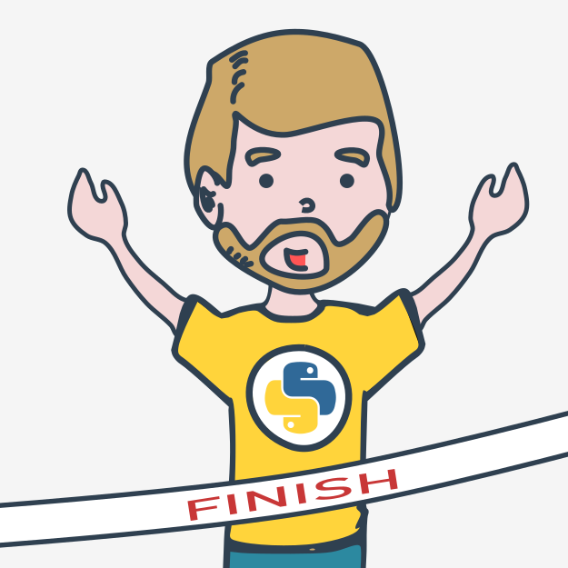
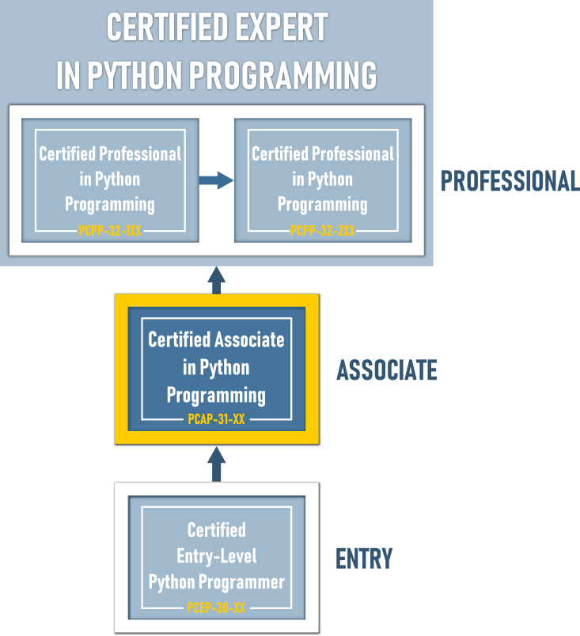

# Поздравляем!

## Вы завершили _Основы Python 2_

Отличная работа! Вы дошли до конца курса **Основы Python 2** и завершили важный этап в своем образовании по программированию на Python.

 Теперь Вы готовы к последнему испытанию - **Итоговому тесту PE2**, он поможет Вам проверить наиболее важную информацию, которую Вы прочитали, и оценить свои навыки и знания, полученные в ходе курса.  
  
Завершив курс, Вы также готовы попытаться получить сертификат [PCAP - Certified Associate in Python Programming](https://pythoninstitute.org/certification/pcap-certification-associate/), который гарантирует, что Вы полностью знакомы со всеми основными средствами, предоставляемыми Python 3, чтобы позволить Вам начать собственное обучение и открыть путь к карьере разработчика, а также является промежуточным шагом к экзамену _PCPP1 - Certified Professional in Python Programming_.  
  
Готовы?

