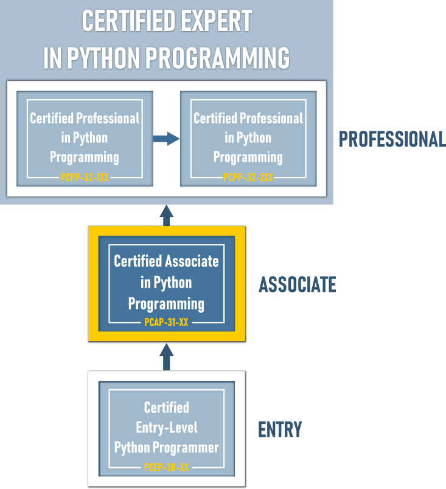

# Получите сертификат PCAP - Certified Associate in Python Programming

По завершении всей серии из двух курсов Основы Python Вы готовы пройти сертификационный экзамен [PCAP - Certified Associate in Python Programmer](https://pythoninstitute.org/pcap-certification-associate/).

Сертификация позволяет Вам поддерживать свои навыки в актуальном состоянии и демонстрировать эти навыки другим. Это дает Вам возможность проверить, доказать и подтвердить свои способности программирования на Python. Самое главное, это может открыть двери к лучшей работе и лучшей зарплате, и это отличный мотиватор для самосовершенствования и саморазвития.

Развивайте свою карьеру с помощью сертификата _PCAP - Certified Associate in Python Programming_ - ценных и мощных документов, которые помогут Вам вывести свою карьеру на новый уровень.

# Что делать сейчас? Получить сертификат!

Используйте промокод, чтобы уменьшить плату за экзамен, и приобретите ваучер на экзамен PCAP-31-03 со скидкой 50%:

*   Перейдите на [OpenEDG Voucher Store](https://ums.edube.org/store);
*   Добавьте ваучер PCAP-31-03 в корзину (нажмите _+Add to Order_)
*   Нажмите _Add Promo Code_ и введите Ваш промокод;
*   Нажмите _Next Step_, введите информацию о счете и доставке и разместите заказ;
*   Совершите платеж. Ваш ваучер будет отправлен на адрес электронной почты, который Вы указали в поле "Информация о доставке".
 
    Квитанция будет отправлена на адрес электронной почты, указанный в разделе "Платежная информация".

Вы можете оплатить экзаменационный ваучер PCAP-31-03 всеми основными кредитными картами (например, Visa, MasterCard, American Express), дебетовыми картами или через учетную запись PayPal. Вы также можете запросить счет-проформу и произвести оплату банковским переводом.

# Зарегистрируйтесь на экзамен!

Вы можете сдать экзамен PCAP-31-03, не выходя из дома (OnVue Online Proctoring), или сдать его в учреждении физического тестирования (Центр тестирования Pearson VUE).

Вы можете зарегистрироваться и запланировать экзамен:

*   Посетив [OpenEDG Python Institute Candidate Website](https://home.pearsonvue.com/pythoninstitute) (каналы сдачи экзаменов: Pearson VUE Testing Centers/OnVUE Online Proctoring)
*   Позвонив в [Службу поддержки клиентов контактного центра Pearson VUE:](https://home.pearsonvue.com/python/contact) (каналы сдачи экзаменов: центры тестирования Pearson VUE/OnVUE Online Proctoring)
*   Обратившись в авторизованный центр тестирования Pearson VUE по вашему выбору (канал сдачи экзаменов: центры тестирования Pearson VUE) - [Найти центр тестирования](https://wsr.pearsonvue.com/testtaker/find/testcenter/CPPINSTITUTE?locale=en_US).

Сервис OnVUE Online Proctoring доступен 24 часа в сутки 7 дней в неделю в течение всего года.

**Экзамен PCAP-31-03 - полезные ссылки**:

*   Подробнее об экзамене PCAP-31-03 см. [Политика тестирования](https://pythoninstitute.org/pcap-31-03-testing-policies/).
*   Ознакомьтесь с [программой и целями экзамена PCAP-31-03](https://pythoninstitute.org/certification/pcap-certification-associate/pcap-exam-syllabus/).
*   Просмотрите [учебные пособия и справочные руководства](https://pythoninstitute.org/support/) (прокрутите страницу вниз), которые мы подготовили, чтобы Ваше тестирование был положительным и успешным.

  
