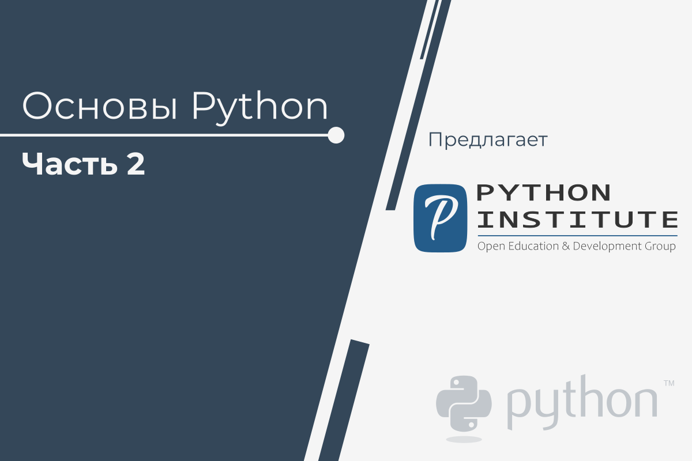

# Основы Python 2

Этот курс **является вторым из двух курсов**, которые подготовят Вас к сертификационному экзамену [PCAP: Certified Associate in Python Programming](https://pythoninstitute.org/certification/pcap-certification-associate/) в Pearson VUE

Курс начинается там, где заканчивается _Основы Python 1_. Его основная цель - научить Вас навыкам, связанным с более **продвинутым программированием на Python**, а также **общими методами кодирования** и **объектно-ориентированным программированием** (ООП).

Курс рекомендуется для начинающих разработчиков, которые заинтересованы в карьере, связанной с **разработкой программного обеспечения**, **безопасностью**, **сетевыми технологиями** и **Интернетом Вещей** (IoT).

